---
title: "腾讯云 ADP 前沿部署工程师 (FDE) 认证课程"
source: "https://cloud.tencent.com/edu/learning/course-4742-84528-84534"
site_name: "cloud.tencent.com"
date: "2026-09-14T06:01:46.740Z"
---

# 腾讯云 ADP 前沿部署工程师 (FDE) 认证课程

从平台定位出发，系统认识应用、模型、知识、连接、编排与运营能力，并串联从开发到上线的完整使用路径。

### 2.1ADP 是什么：企业级智能体开发平台

**腾讯云智能体开发平台****（Tencent Cloud Agent Development Platform，下文简称 Tencent Cloud ADP）** **是面向企业的智能体开发平台****，可以****帮助企业构建、上线和持续运营智能体应用。它把大模型、知识、工具、流程和企业治理连接起来，让智能体真正进入业务场景。**

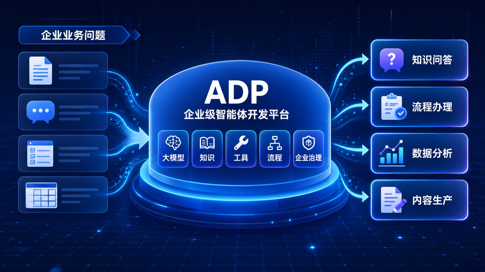

图・ADP 企业级智能体开发平台概览

### **2.1.1 ADP 的产品定位**

ADP 是面向企业的智能体开发平台。它围绕大模型能力，整合应用构建、知识库、工具连接、Workflow、多 Agent、权限发布、调试评测和运营分析，帮助企业把 AI 能力变成可使用、可管理、可上线、可持续优化的智能体应用。

一句话理解 ADP

ADP 不是普通 Chatbot，也不是单一大模型接口，而是企业构建智能体应用的生产与运营平台。

ADP 面向的不是单一角色，而是企业内围绕 AI 应用建设协同工作的多类人群。例如，业务团队关心能不能解决问题，IT 团队关心能不能安全接入和管理，售前与交付团队关心能不能快速搭建可复用方案。

| **业务负责人：**   关注业务价值、效率提升、成本降低和服务体验。 | **业务运营人员：**   关注重复问答、文档处理、流程办理能否被助手承接。 |
| **IT / 平台团队：**   关注权限控制、系统接入、版本管理和安全运维。 | **售前 / 交付团队：**   关注可复用方案的搭建效率。 |

### **为了避免把 ADP 理解窄，需要先区分它和几类常见产品的关系。**

| **容易混淆的对象** | **它通常解决什么** | **ADP 的不同之处** |
| --- | --- | --- |
| 普通 Chatbot | 提供一个对话入口，回答用户问题。 | ADP 不只提供对话，还能接入知识、工具、流程、权限、发布和运营体系。 |
| 单一大模型接口 | 提供理解、生成、推理等模型能力。 | ADP 可以使用模型，但重点是把模型组织成企业可上线的应用。 |
| 传统知识库系统 | 管理文档、FAQ、制度和内容资产。 | ADP 的知识库服务于智能体，可与检索、引用、Prompt、工具和 Workflow 联动。 |
| 传统 RPA | 按固定规则执行流程或模拟人工操作。 | ADP 可以通过 Workflow 固化流程，也能结合模型理解、知识检索和工具调用处理更开放的任务。 |

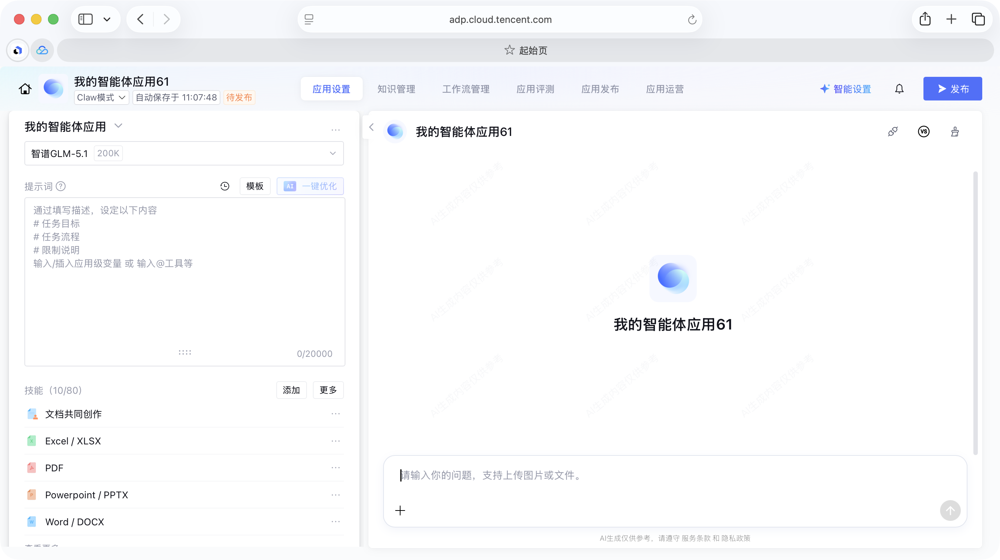

图・ADP 智能体搭建页面。可以进行应用设置、知识管理、工作流管理、发布运营、工具设置等

QUIZ2.1・多选

下面哪些说法更接近 ADP？这是多选题，选好后提交，看看你是否抓住了 ADP 的产品定位。

**答案** B、C、D。ADP 不是单一聊天入口，而是把模型、知识、工具、流程、治理、发布和运营组织起来的企业级智能体开发平台；“只是一个聊天机器人” 的说法不正确。

### **2.1.2** **ADP 的智能体范式**

理解 ADP 的定位之后，再看企业为什么需要这样的平台。大模型让机器具备了理解、生成和推理能力，这是智能体能够工作的基础。但在企业场景里，“能回答” 只是第一步。真正进入业务时，还需要继续追问：回答依据来自哪里？能不能查企业内部资料？能不能调用业务系统？能不能按固定流程执行？谁可以使用？上线之后怎么评测、监控和优化？

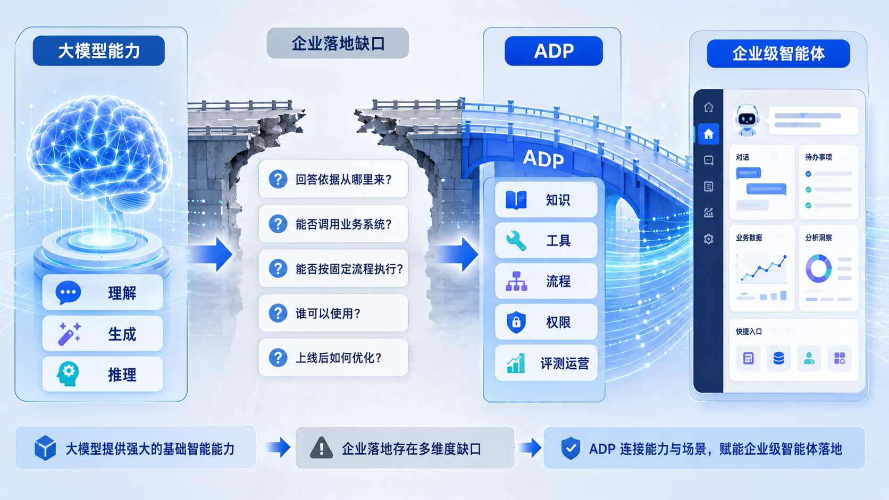

图・大模型到 ADP 能力补足

| **如果只有大模型** | **企业落地时****可能****会遇到的问题** | **ADP 提供的补足能力** |
| --- | --- | --- |
| 模型可以生成答案 | 企业需要答案有依据、可追溯，不能靠模型 “猜”。 | 知识库、RAG 检索、引用展示、知识命中调试。 |
| 模型可以理解意图 | 业务任务往往需要调用系统、读取数据、创建记录或触发通知。 | 工具、API、数据库、MCP、Skills、企业系统连接器。 |
| 模型可以自由推理 | 审批、分派、报表、投诉处理等任务需要稳定流程和可验收结果。 | Workflow、条件分支、变量流转、结构化输出。 |
| 模型可以多轮对话 | 企业用户、组织、渠道、数据权限都需要被管理。 | 应用权限、发布范围、渠道接入、版本管理。 |
| 模型可以快速试用 | 上线后需要知道效果如何、哪里出错、怎样持续优化。 | 对话调试、应用评测、日志、运营分析、持续迭代。 |

大模型是智能体的能力基础，但企业级智能体不是 “模型接口 + 聊天框”。企业真正需要的是一套能把模型、知识、工具、流程和治理能力组合起来的平台。ADP 可以把大模型能力包装成不同智能体范式：有的负责稳定问答，有的负责按流程办事，有的负责多角色协同，有的负责处理更开放的复杂任务，也有的帮助用户用自然语言快速创建和辅助搭建应用。这与我们上一章介绍的当前已有的智能体范式是一致的。

| **标准模式｜稳定问答**   以单个智能体为核心，结合 Prompt、模型、知识库和工具，适合企业知识问答、产品 FAQ、客服问答等稳定场景。 | **单工作流模式｜流程执行**   以固定流程为核心，把任务拆成节点、变量、条件分支和工具调用，适合审批、通知、信息收集、报告生成等标准化任务。 |
| **Multi-Agent 模式｜多角色协作**   由多个 Agent 分工协作，适合复杂分析、方案生成、交叉复核、多步骤决策等需要协同处理的任务。 | **Claw 模式｜开放任务**   更适合文件、网页、表格、代码和开放式任务处理，像一个能够动手完成复杂任务的数字同事。 |
| **智能工作台｜自然语言辅助创建入口**   通过自然语言创建应用初稿、辅助配置能力或处理临时任务。 |

阅读提示

这里的几种范式用于帮助你理解 ADP 如何把大模型能力变成不同类型的智能体应用。本节不会展开具体的操作教程，**第三章****会再详细讲每种模式的适用边界、搭建方式和实战案例。**

#### 只靠大模型，还缺什么？

点击卡片翻面，查看 ADP 为企业落地补足的能力。

请用鼠标点击卡片翻面。

翻卡对比从大模型到企业级智能体，还缺什么？

### **2.1.3 ADP 的产品能力****地图**

理解 ADP 的产品能力，不需要先陷入复杂的后台菜单。我们可以把 ADP 看成 “构建模式、核心能力组件和 AI Model” 的灵活组合：不同业务场景，可以选择不同构建模式，接入不同能力组件，再结合合适的大模型能力，最终形成面向业务的 AI 应用。

阅读提示

能力地图中的构建模式、核心能力组件、模型能力和底部场景都是代表性示例，并不是 ADP 的完整能力清单。这里的目标不是穷举所有功能，而是帮助你理解 ADP 如何通过 “模式 + 能力组件 + 模型” 的组合构建不同业务场景。

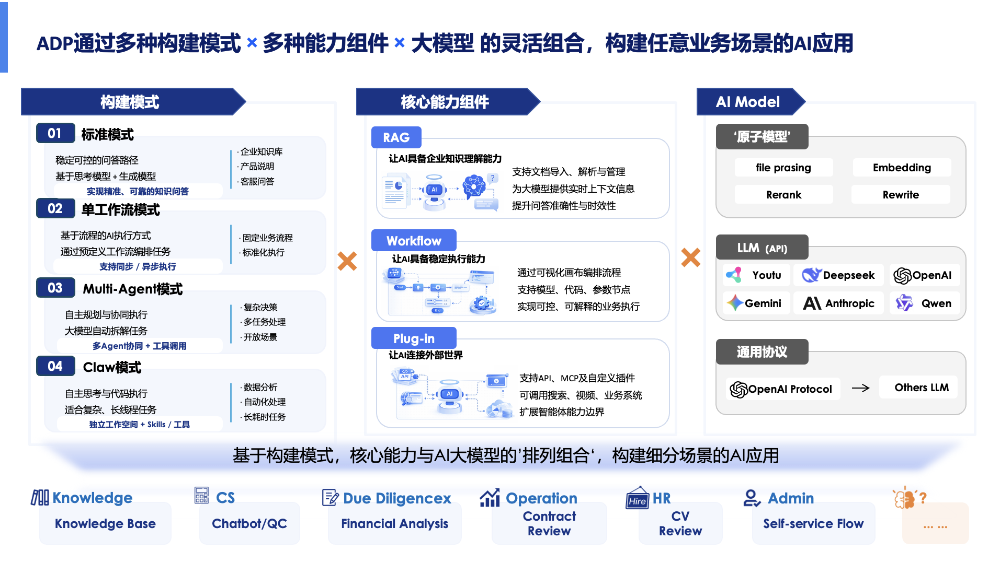

图・ADP 能力地图：构建模式 × 核心能力组件 × AI Model 的灵活组合

ADP 能力地图

一句话理解 ADP 的产品能力地图

ADP 通过多种构建模式 × 多种能力组件 × 大模型的灵活组合，构建不同业务场景的 AI 应用。

### **（1）****如何阅读这张能力地图**

第一步：看构建模式

构建模式决定应用怎么运行。图中示例包括标准模式、单工作流模式、Multi-Agent 模式，分别对应稳定问答、固定流程和多 Agent 协作。

第二步：看核心能力组件

核心能力组件决定应用能做什么。图中示例包括 RAG、Workflow、Plug-in，分别补齐知识理解、流程执行和外部连接能力。

第三步：看 AI Model

AI Model 提供底层智能能力。图中示例包括原子模型、LLM API 和通用协议，用于支撑文档解析、检索、生成、推理和模型接入。

构建模式负责承载应用形态，核心能力组件负责补齐知识、流程和工具，AI Model 负责提供底层智能。三者组合起来，就可以面向不同业务场景构建不同类型的 AI 应用。例如：

| **组合方式示例** | **可以形成的应用** | **适合的业务场景** |
| --- | --- | --- |
| 标准模式 + RAG + LLM | 知识问答助手 | 企业知识库、产品说明、客服 FAQ、制度问答。 |
| 单工作流模式 + Workflow + Plug-in | 流程办理助手 | 审批流、任务分派、自动通知、自助服务流程。 |
| Multi-Agent + RAG + Workflow | 分析与复核助手 | 尽调分析、合同审阅、财务分析、复杂报告生成。 |
| 任一构建模式 + 合适模型能力 | 面向特定场景的 AI 应用 | HR 简历评审、Admin 自助服务、运营分析、内容生产等。 |

### **（2）ADP 的实际应用**

ADP 的能力可以应用在各类业务场景中。只要业务中存在大量知识问答、重复咨询、文档处理、流程办理、系统查询、数据分析或内容生产，或者其他复杂的、多步骤的任务，就可以进一步判断是否适合用 ADP 构建智能体。例如：

| **Knowledge**   企业知识库、制度问答、产品 FAQ、员工助手。 | **CS**   智能客服、售前咨询、售后问答、质检分析。 | **Due Diligence**   财务分析、尽调分析、资料归纳、风险初筛。 |
| **Operation**   合同审阅、流程办理、任务分派、自动通知。 | **HR**   简历筛选、候选人评审、员工自助问答。 | **Admin**   行政自助流程、材料生成、内部服务台。 |

### **（3）ADP 的****部署形态：公有云和私有化**

**公有云部署**：腾讯云 ADP 提供的标准服务，用户通过云端账户直接使用，无需自建基础设施，按使用量计费，快速上手。

**私有化部署**：适合对数据隐私、合规性、网络隔离有严格要求的客户，支持在客户专有的云环境或本地部署，保证数据完全由企业自主管理。

### **2.1.****4** **ADP 的四大产品优势**

为什么企业选 ADP，而不是自己拿开源框架从头拼？因为 ADP 在四个方面提供了 “企业级” 的保障。

### **（1）****优势一：更精准的对话效果。**

在真实业务里，"对话效果好不好" 不只取决于大模型本身，更取决于系统能不能**准确看懂企业文档、高效检索、给出可靠答案**。ADP 在这方面积累深厚：

-   **企业级文档理解**：依托腾讯优图实验室多年的 OCR 与文档解析技术积累，支持 10+ 文档文件类型、200MB 单文档处理，对复杂图文混排、表格、公式等版面进行智能识别与结构化处理。在说明书、规章制度等场景中，能够准确提取文档中的文本和图片内容，为后续问答提供高质量的知识底座，同时支持对图片内容的直接理解与回答。
-   **自研向量（Embedding）模型**：还记得第一章介绍的 Embedding 吗？ADP 基于多阶段训练管线和精细化数据工程，自研的 2B 级 Embedding 模型在 C-MTEB 基准测试中达到 SOTA 水平。结合基于 LLM 的 Reranker 模型 (支持 8k+ 长文本、分层知识蒸馏)，实现高召回、高精准的检索效果。
-   **智能 RAG（Agentic RAG）与结构化数据问答**：不仅能 “匹配一段文本”，还可以通过多轮检索、跨文档推理和多工具协同，回答跨知识源的复杂问题。结合 Text-to-SQL 能力，支持对上万行表格或数据库执行条件筛选并聚合问答，让 "问文档、问表格、问数据库" 可以在同一应用中统一完成。

### **（2）****优势二：完整的一站式开发与运营框架。**

-   **多种智能体架构**：支持 LLM+RAG、Multi-Agent、Workflow 等主流范式，兼顾简单问答和复杂任务代理。
-   **贯穿应用全生命周期**：从配置、开发、调试、评测、发布到运营，全链路都有配套能力，一套平台承载从试点到规模化。
-   **企业级评测体系**：内置裁判模型、规则、代码等多种评估方式，支持一键批量对比不同模型、提示词和工作流版本，生成量化效果报告。
-   **运营与用量管理**：提供用量、数据分析、对话记录日志等管理后台，便于精细化运营和查看使用成本。
-   **零代码 / 低代码优先**：绝大部分功能通过可视化配置完成，复杂场景再补少量代码，兼顾业务和技术团队。
-   **丰富模板与最佳实践**：预置教育、传媒、医疗、金融等多行业模板，以及多场景 Demo 与 "应用开发要点"，降低试错成本。
-   **可解释与持续优化**：每条回答附带命中文档片段、相似度评分和检索路径。配合应用日志分析和评测能力，帮助业务与运营人员了解大模型 "为什么这么答"，基于实际效果持续调整知识组织与检索策略。

### **（3）****优势三：灵活的模型与开放生态。**

-   **多模型统一接入**：支持主流大模型与自建模型一键导入 Tencent Cloud ADP。
-   **企业级连接器与工具生态**：内置 200+ 高质量连接器和工具，覆盖知识问答、检索、图片/音视频处理、数据分析等场景，全面支持 MCP 协议和自定义扩展。
-   **多种集成方式**：智能体 API 提供 RESTful API、SDK 等集成方式，支持发布至企业微信以及小程序等常用渠道，适配不同技术栈与接入场景。

### **（4）****优势四：企业级安全、性能与可观测性。**

-   **高性能架构**：流式响应，首字时间 < 1 秒，支持高并发和扩缩容。
-   **安全可靠**：多租户数据强隔离，内容安全审核，细粒度权限体系与操作审计。
-   **精细化权限体系**：平台 / 空间 / 应用 / 知识库等多层级权限，数据权限与功能权限解耦，适配集团型企业复杂组织结构。
-   **完善的监控与告警**：实时监控请求量、成功率、延迟、Token 消耗等核心指标。
-   **智能体数据洞察能力**：智能体对话记录分析、热点问题挖掘、问答效果标注，效果趋势分析。

### **2.1****.5** **小结**

ADP 是企业级 Agent 开发平台。它不是单独的大模型，也不是普通 Chatbot，而是通过构建模式、核心能力组件和大模型能力的灵活组合，支持公有云和私有化两种部署形态，让智能体能够进入企业业务并持续运行。

-   ADP 的定位是企业级 Agent 开发平台，帮助企业把模型能力转化为可上线的智能体应用。
-   企业不能只靠一个大模型，因为真实业务还需要知识、工具、流程、权限、评测和运营。
-   ADP 的产品能力可以理解为：构建模式 × 核心能力组件 × AI Model。
-   ADP 的四大优势。

进入下一节

本节内容已经回答了 “ADP 是什么”。接下来，我们会进一步拆开看：一个智能体在 ADP 中究竟由哪些核心模块搭建起来。你将看到应用、模型、Prompt、变量、记忆、知识库、工具、Workflow 等之间如何协同工作。

### 2.2 上基础能力：应用、模型、角色指令、变量与长期记忆

**本节主要了解****一个智能体在 ADP 中是如何被 “定义出来” 的：它叫什么、面向谁、使用哪些模型、遵循什么角色指令、如何使用变量传递信息，以及是否通过长期记忆形成个性化体验。**

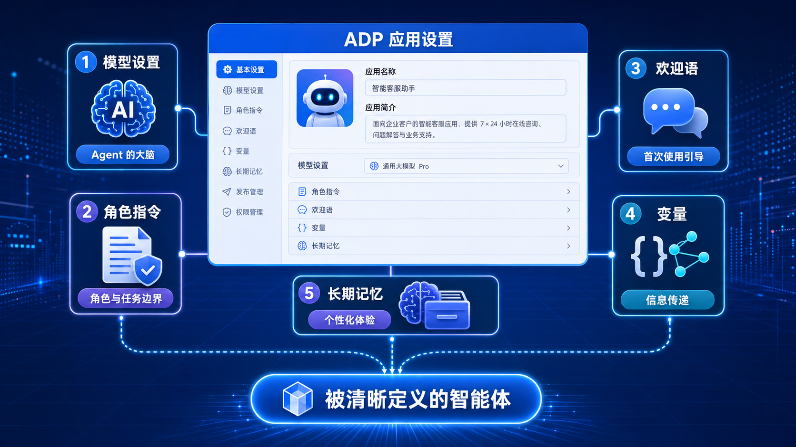

图・ADP 应用设置基础能力概览

一个智能体如何被搭建出来？首先，需要给 Agent 一个 “大脑” 和任务边界。这个智能体是谁？要完成什么任务？怎么说话？用哪个模型？记住什么？接下来我们将回答这些问题。

### **2.2.1** **创建应用**

通过智能体开发平台新建智能体应用，可利用大模型技术，实现可自主编排与决策，或按固定工作流高效执行流程完成任务。创建应用时，可以配置应用的基础信息、应用模式等。

基础信息

应用名称、图标、描述等，用于定义用户看到的智能体身份。

**应用模式**

可根据场景选择标准模式、单工作流模式、Multi-Agent 模式、Claw 模式或智能工作台。

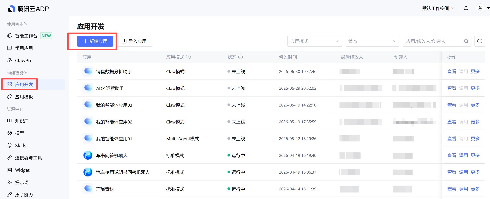

图・应用开发新建应用入口

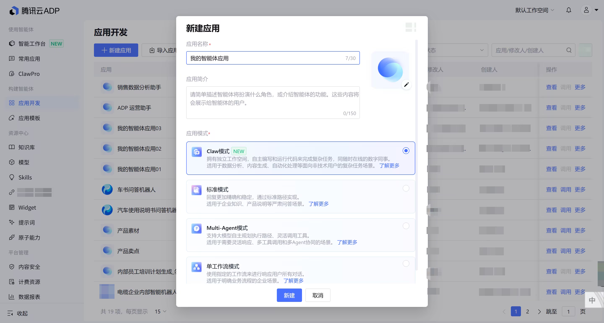

图・“新建应用” 界面

Tips：

应用设置解决的是 “智能体以什么身份存在”。它不会自动保证回答准确，也不会自动完成业务动作；回答准确依赖模型、Prompt 和知识库，业务动作依赖工具、Workflow 和权限配置。

创建应用后，进入应用设置页面，**可对应用模型、知识库、输出配置等进行设置**。以标准模式应用为例，应用设置页承载了大量应用配置能力。创建应用后，单击左上角应用图标，支持在 “编辑应用” 弹窗中修改应用图标、应用名称、应用简介等信息。

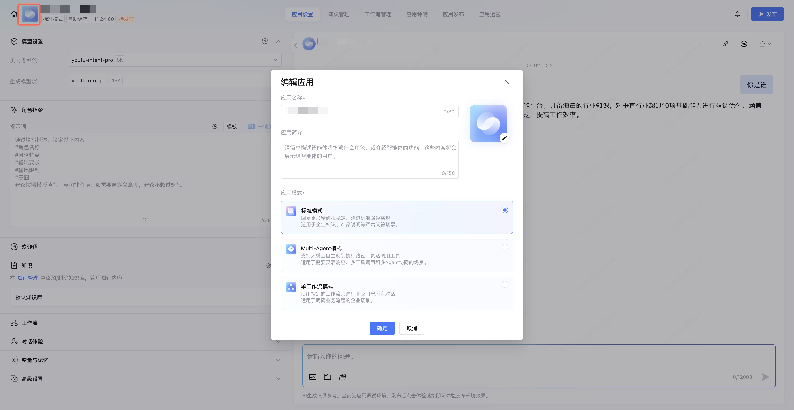

图・“应用设置” 界面

**应用本身是一个可管理的智能体单位。**应用图标、名称和简介决定用户如何识别这个智能体，也影响后续运营、交付和复用。对于标准模式、单工作流模式、Multi-Agent 模式三种应用，编辑应用弹窗中的 “模式” 区域会展示模式卡片，并支持切换至其他非 Claw 模式；Claw 模式应用不支持模式切换，编辑应用弹窗中的 “模式” 区域仅展示当前 Claw 模式卡片。

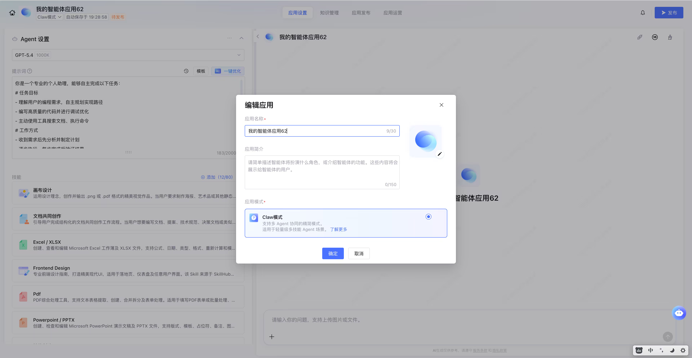

图・“应用设置” 界面：Claw 模式。Claw 模式应用不支持模式切换

Tips：

编辑应用可以修改应用身份信息，也能在部分模式间切换；但具体业务能力仍然取决于后续模型、角色指令、知识库、工具、变量、记忆、工作流和发布配置。

### **2.2.2 模型设置**

**在模型设置中，ADP 支持对应用运行中的模型进行模型配置。**不同模型在应用运行链路中的作用不同，不是所有模型都只负责 “回答问题”。有的用于意图识别，有的用于生成回复，有的用于图片理解，有的用于知识库片段解析，有的用于 Prompt 改写和 AI 一键优化。

| **模型类型** | **作用说明** |
| --- | --- |
| 思考模型 | 用于意图识别（标准模式）、任务规划和选择连接器与工具（Multi-Agent 模式）。 |
| 生成模型 | 用于阅读理解、总结并生成回复结果。 |
| 多模态问答模型 | 用于对应用对话中用户上传的图片进行理解。 |
| 多模态阅读理解模型 | 用于对知识库检索召回的多文多图片段进行解析。 |
| Prompt 改写模型 | 用于解决多轮对话中的 “上下文割裂” 问题，将模糊、省略或依赖前文的用户输入，转化为大模型可精准理解的完整语义指令。 |
| AI 一键优化模型 | 用于对提示词、角色指令、工作流描述、工作流各节点提示词进行一键优化，也会用于工作流代码节点 AI 代码生成。 |
| 实时文档解析模型 | 用于对用户在问答中上传的文档进行文档解析。 |

**标准模式、单工作流模式可通过模型设置进行统一设置。**模型设置相关功能包括模型服务、上下文轮数和参数设置。模型服务方面，平台新用户可获得一定量免费额度，可通过选择不同种类的模型进行免费应用调试；根据测试结果，再进一步购买和使用。

图・模型设置功能入口

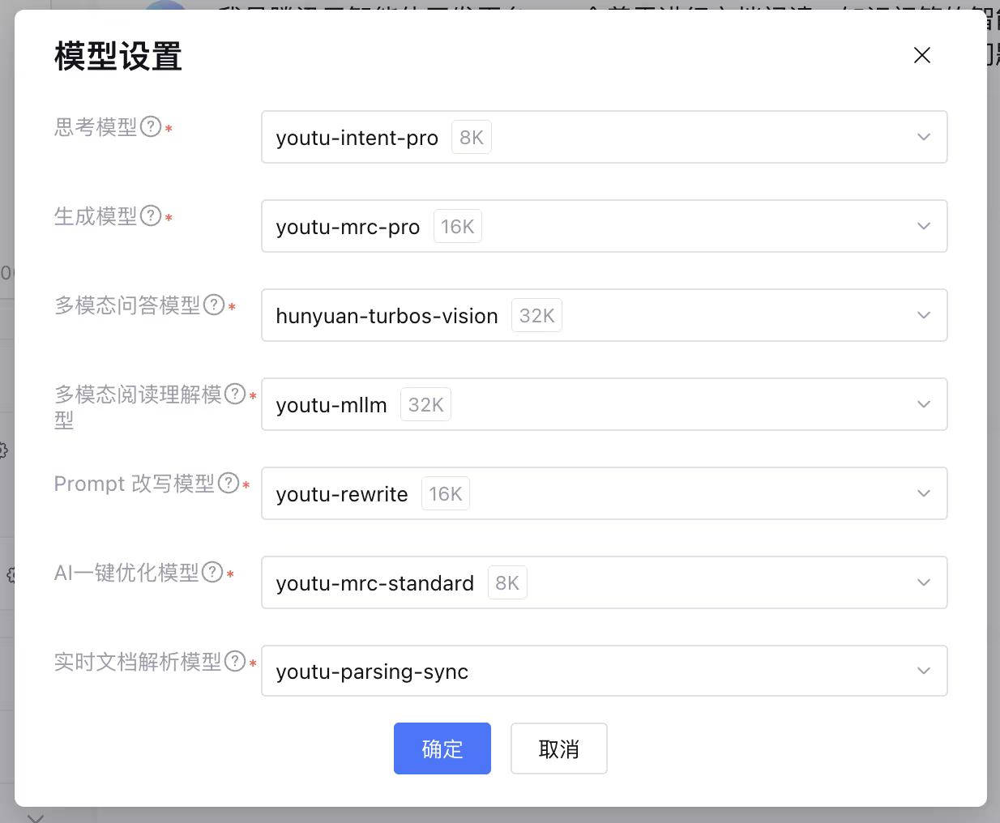

图・模型选择与切换

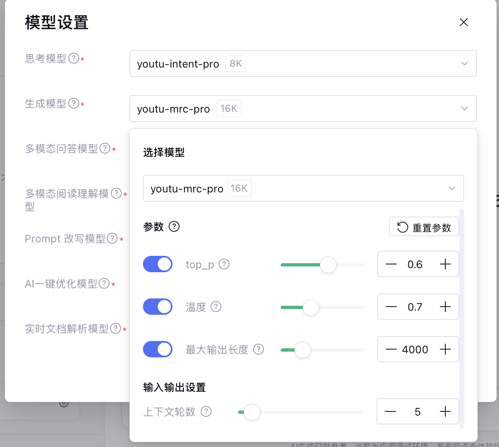

图・模型设置参数详情

| **设置项** | **功能说明** |
| --- | --- |
| 模型选择 | 用于选择不同种类模型进行应用调试和使用，模型调用会影响效果、成本和响应体验。 |
| 上下文轮数 | 设置输入给大模型作为 Prompt 的上下文对话历史轮数。轮数越多，多轮对话相关性越高，但消耗 tokens 也越多。 |
| 温度 | 控制生成文本的随机性和多样性。较高的值会使输出更随机、更有创造性；较低的值会使输出更集中、更确定。 |
| top\_p | 控制模型生成文本的多样性。top\_p 是一种核采样方法，模型会考虑累计概率达到 top\_p 阈值的最可能词汇。 |
| 最大输出长度 | 限制生成模型生成文本的最大长度，有助于控制 API 调用成本和响应时间，并防止生成过长的无意义文本。 |

补充理解｜生成参数与长任务上下文

**温度为什么会影响稳定性：**模型每一步都在多个候选 Token 中采样。较低温度会压低低概率候选被选中的机会，因此同一问题多次生成通常更集中、更稳定；较高温度会保留更多候选，适合创意任务，但不适合要求口径一致的制度问答或结构化输出。

**上下文不只是聊天记录：**回答 “我的报销为何被驳回” 时，只有制度条文仍然不够，还要把该员工的具体单据状态、审批记录和必要身份信息作为实时业务上下文，通过有权限的工具或 API 获取。模型参数不能替代真实业务数据。

**长任务要维护任务状态：**对 “查资料—生成报告—发送通知” 这类多步任务，应持续记录任务目标、输出格式、可用工具及调用约束、已完成步骤、关键中间结果和异常原因。步骤较多时要定期生成状态摘要，避免上下文越来越长后重复早期错误计划；失败时应能从最近的可靠状态继续，而不是从头盲目重跑。

Tips：

多模态问答模型、多模态阅读理解模型、Prompt 改写模型、AI 一键优化模型在新建应用时，ADP 展示的默认模型是平台官方推荐的最佳实践模型，是经过大量场景验证的优选模型，不建议用户随意修改。自行修改后，可能造成端到端问答效果下降，应谨慎更换。

### **2.2.3 角色指令**

用户提问后，应用会以 “角色指令” 中定义的任务角色给出回答。角色指令可以参照模板填写，用于限定模型回复的语种、语气等。目前平台已支持中英文问答输出。对客户来说，角色指令是让智能体从 “通用模型” 变成 “某个业务角色” 的关键配置。

| **能力项** | **功能说明** |
| --- | --- |
| 版本 | 支持将当前提示词草稿保存为一个版本，并填写版本说明。已保存的版本可以在查看版本记录中查看和复制，版本记录仅展示当前所在提示词框下创建的版本。支持在内容对比中选择两个版本，查看提示词内容差异。 |
| 模板 | 提供设定好的角色指令格式模板，建议按照模板填写，指令遵循效果更佳。编写指令后，也可以单击 “模板 > 保存为模板”，将当前指令存为模板。 |
| AI 一键优化 | 初步完成角色设定后，可单击 “一键优化” 对角色设定内容进行优化。模型会基于已输入内容优化设定，使模型更好完成对应要求。AI 一键优化会消耗 tokens 资源。 |

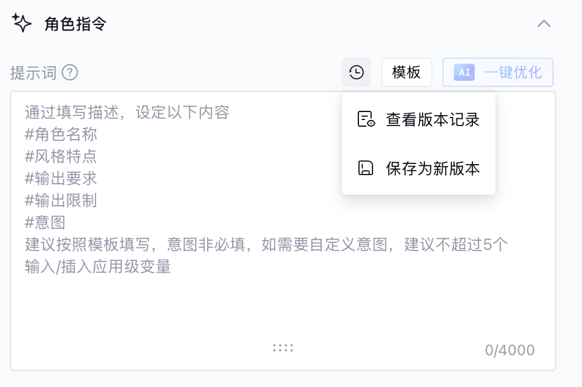

图・角色指令

Tips：

角色指令可以强化角色、语气、回答格式和规则，但不能替代知识库和工具。需要基于企业资料回答的问题，应配合知识库；需要查询或执行的问题，应配合工具、工作流或连接器。

### **2.2.4 欢迎语**

填写欢迎语后，将在客户端侧首页显示，支持插入应用级变量显示。欢迎语不是可有可无的装饰，它影响用户第一次打开应用时是否知道应该怎么问、能获得什么帮助。平台支持使用 AI 一键优化生成欢迎语。

图・欢迎语

### **2.2.5 变量**

智能体开发平台提供了丰富的变量类型，以满足不同业务场景需求。**从变量的使用范围角度，变量分为 “应用级变量” 和 “工作流级变量” 两类**。变量让应用可以读取系统信息、接收 API 参数、保存环境密钥、在应用内传递内容，也可以在工作流内部传递节点输入输出。

应用级变量表示应用全局范围内可见、可使用的变量，具体包括系统变量、环境变量、API 参数和应用变量。

| **应用级变量类型** | **变量描述** | **变量名称及示例** |
| --- | --- | --- |
| 系统变量 | 平台系统默认提供的变量，在应用范围内各模块均可读取，但不支持用户编辑。以 SYS.XXX 方式命名。 | SYS.UserQuery：本轮对话内容；SYS.RewriteQuery：多轮对话中本轮对话改写结果；SYS.ChatHistory：对话历史；SYS.CurrentTime：当前时间；SYS.RequestId：对话请求 ID；SYS.Memory：长期记忆内容。 |
| 环境变量 | 用于保存 API 密钥、数据库密码等敏感数据，提供 secret 数据类型，支持加密存储、传输，并在页面显示为 \*\*\*\*\*。以 ENV.XXX 方式命名。 | 示例：ENV.LLMSecretKey，存储大语言模型调用时的 secretKey，可在工作流或 Agent 工具中使用。 |
| API 参数 | 表示用户调用平台 API 时，通过 custom\_variables 字段传入系统的变量。以 API.XXX 方式命名。 | 示例：API.UserName，通过 API 参数传入用户姓名，在对话时更亲切地称呼用户。 |
| 应用变量 | 表示在应用内各模块中互相传递的变量。例如工作流 A 对应用变量赋值，工作流 B 读取。以 APP.XXX 方式命名。 | 示例：APP.Notes，工作流 A 收集用户笔记内容并赋值给 APP.Notes，工作流 B 获取笔记内容并总结摘要。 |

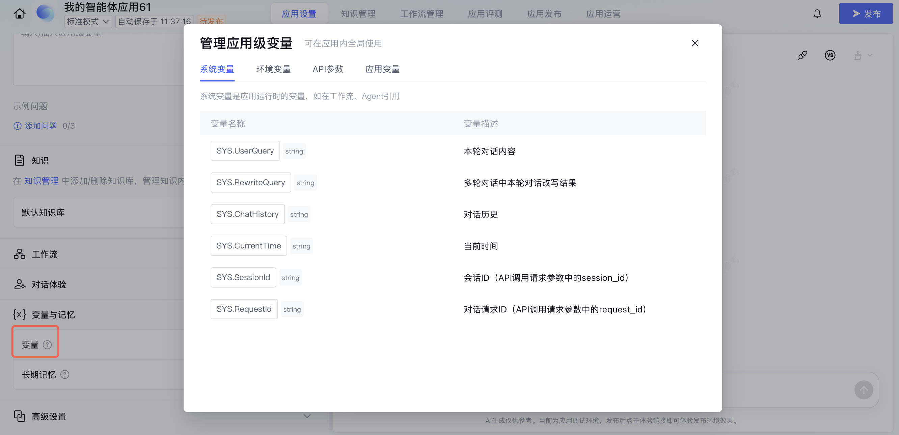

图・应用级变量

工作流级变量表示工作流内部可见、可使用的变量，具体包括工作流变量、节点输入变量和节点输出变量。

| **工作流级变量类型** | **变量描述** | **变量名称及示例** |
| --- | --- | --- |
| 工作流变量 | 表示在工作流范围内传递的变量。例如在工作流分支 A 对变量赋值，在分支 B 读取变量值。工作流变量在开始节点定义，在工作流内各节点均可读取，并仅支持在变量赋值节点中赋值。以 WF.XXX 方式命名。 | 示例：WF.OrderList，分支 A 中整理用户订单内容并赋值给 WF.OrderList，分支 B 中获取订单内容并下单。 |
| 节点输入变量 | 表示当前工作流节点的输入变量，仅在节点内部编辑和使用。 | 用于承接当前节点需要处理的输入内容。 |
| 节点输出变量 | 表示当前工作流节点的输出变量，节点内实现该变量写入，并在后续节点读取和使用。 | 用于把当前节点处理结果传递给后续节点。 |

由于使用场景不同，每种变量的适用范围也存在差异。

-   系统变量（除 SYS.Memory 外）通常用户隔离、Session 隔离；
-   SYS.Memory 用户隔离但不 Session 隔离；
-   环境变量用户和 Session 都不隔离；
-   API 参数和应用变量用户隔离但不 Session 隔离；
-   工作流变量、工作流节点输入变量和工作流节点输出变量均用户隔离、Session 隔离。

具体参考如下表格：

| **变量名称** | **变量名称** | **是否用户隔离** | **是否 Session 隔离** |
| --- | --- | --- | --- |
| 应用级变量 | 系统变量（除 SYS.Memory 外） | 是 | 是 |
| 应用级变量 | SYS.Memory | 是 | 否 |
| 应用级变量 | 环境变量 | 否 | 否 |
| 应用级变量 | API 参数 | 是 | 否 |
| 应用级变量 | 应用变量 | 是 | 否 |
| 工作流级变量 | 工作流变量 | 是 | 是 |
| 工作流级变量 | 工作流节点输入变量 | 是 | 是 |
| 工作流级变量 | 工作流节点输出变量 | 是 | 是 |

变量隔离理解

-   “用户隔离” 指同一个变量对于不同终端用户的变量值不同；“Session 隔离” 指同一个变量在不同 session 下变量值不同。
-   从**隔离范围**上看，**用户隔离 > Session 隔离**。灵活使用变量可以满足复杂业务场景需求。

### **2.2.6 长期记忆**

长期记忆功能是实现个性化对话体验的核心，它如同为应用赋予了 “大脑记忆” 的能力。通过持续识别并精准留存与终端用户相关的各类关键信息，包括**用户的基础画像**（年龄、性别等）以及**重要的记忆点**（如特定时间在特定地点做过的事情等），让应用在后续与用户的每一次互动中，都能快速调用这些信息，从而提供更贴合用户个性化需求的回应，极大地提升用户的使用体验。

**长期记忆的唯一性由两大核心要素共同决定，即终端用户**和**应用**。意味着每一个终端用户在不同的应用中，都会形成独立且唯一的长期记忆。这种独立性能够确保用户在不同应用场景下的信息不会相互混淆，保证了记忆的针对性和准确性。

-   **说明：**

终端用户 A 在应用 1 中的长期记忆为 A1；终端用户 A 在应用 2 中的长期记忆为 A2；终端用户 B 在应用 1 中的长期记忆为 B1，其中 A1、A2、B1 彼此独立，互不相同，这些记忆不会相互干扰。

### **长期记忆的模块构成**

长期记忆主要分为 “**长期记忆总结**” 和 “**长期记忆召回**” 两个步骤，运行流程如下：

-   新用户首次发起对话，系统会根据终端用户 ID 和应用 ID 创建一份唯一的长期记忆，存储在 **SYS.Memory** 中。
-   在用户与系统多轮对话时，系统调用 “**长期记忆总结**” 模块，根据对话历史自动总结长期记忆内容。
-   **长期记忆总结的时效性**：每一轮对话都会运行总结模块并尝试提取长期记忆，并更新 **SYS.Memory** 内容。
-   在用户新的对话中，系统调用 “**长期记忆召回**” 模块，拿到用户的长期记忆内容，帮助大模型了解用户画像及重要记忆点，与用户个性化对话。
-   例如：长期记忆内容为 “用户是一名素食主义者”，那么后续为用户推荐附近的餐厅时，则主要推荐素食餐厅。
-   循环上述 “**长期记忆总结**” 和 “**长期记忆召回**” 过程。

长期记忆运行流程图如下：

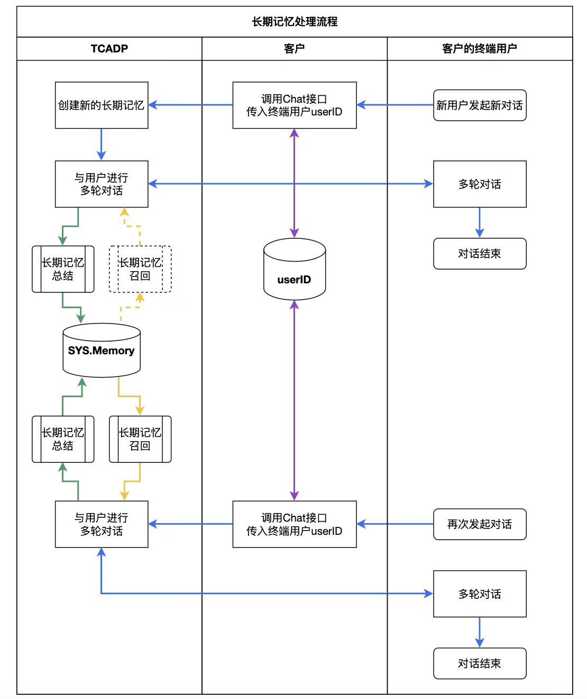

图・长期记忆运行流程图

### **2.2 上小结**

本部分内容聚焦应用设置中的核心配置能力：应用编辑定义应用身份，模型设置决定运行链路中的模型能力，角色指令限定回复角色和规则，欢迎语影响用户入口体验，变量支撑应用和工作流的数据传递，长期记忆支撑个性化对话体验。

进入下一部分

下一节，我们将继续了解 ADP 如何让智能体获得企业知识、连接外部系统，并从 “会回答” 进一步走向 “能办事”。

### 2.2 中知识与连接能力：知识库、工具、连接器与 Skills

**了解了应用的基础配置后，我们继续看 ADP 如何让智能体获得企业知识、连接外部系统，并从 “会回答” 进一步走向 “能办事”。先理解什么是知识库、什么是知识管理，再进入文档、问答、数据库、知识库设置和 Agentic RAG。**

### **2.2 中.1 知识库：ADP 中的 RAG 能力如何落地**

第一章已经讲过 RAG：大模型回答问题前，先从外部知识中检索相关内容，再把检索结果作为上下文交给模型生成答案。ADP 的知识库，就是把这套思路产品化、可配置化、可维护化的能力，是一条完整链路：知识导入、文档解析、Chunk 切分、向量化与索引、检索召回、重排序、引用展示，以及后续的调试和维护。

知识库与 RAG 的关系

RAG 是技术思路，知识库是 ADP 中承载这套思路的产品能力。RAG 解决 “大模型不知道企业私有知识” 的问题；ADP 知识库进一步解决 “企业知识如何进入平台、如何被处理、如何被检索、如何被引用、如何被持续维护” 的问题。

#### 排出正确的 RAG 链路

使用上下按钮调整顺序，再提交答案。

知识导入

解析

引用展示

生成回答

检索

切分

Embedding / 索引

排序练习排出正确的 RAG 处理链路

### **2.2 中.1.1 什么是知识库？**

在 ADP 中，知识库是用于导入、处理、维护和检索企业知识的核心模块。企业可以把产品说明、制度文件、操作手册、FAQ、培训材料、网页内容等资料放入知识库，让智能体在回答问题时优先从这些资料中查找依据。从实际使用角度看，知识库的价值不只是 “让大模型知道更多”，而是让回答更贴近企业真实业务、更可追溯、更容易运营。

在腾讯云智能体开发平台，**知识库**存储的数据称为**知识**，分为以下三种类型：

| **知识类型** | **内容** | **适合放入知识库的情况** |
| --- | --- | --- |
| 文档 | 结构化或非结构化的文件，如 PDF、DOCX、TXT、网页等，通过文档切分与索引，将上下文切片存入知识库，供检索系统召回相关内容。 | 产品说明、制度规范、操作手册、培训资料、合同模板等相对稳定内容 |
| 问答 | 以 “问题 - 答案” 形式成对存在，从文档或人工输入生成问答对，用于快速响应用户常见问题，提高问答覆盖率和效率。 | 高频问题、标准问法、标准答案、客服口径 |
| 数据库 | 结构化的数据源，如内部系统、结构化表格等，可精确信息或作为辅助检索条件，提升系统对具体业务维度的支持能力。 | 结构化表格型知识、可被字段描述的数据资料 |

ADP 中主要有两个层级的知识库：一是**平台级****知识库**，可以在相同主账号下被多个应用关联使用；二是**应用内的默认知识库****（应用级知识库）**，服务于当前应用。**平台级****知识库适合企业级公共资料**，例如产品手册、政策制度、售后规则、行业方案等；**默认知识库适合当前应用的专属资料**，例如某个客服机器人自己的服务口径。

Tips：

当应用评测进行时，无法对知识库内容进行更改，包括新增导入、删除和修改知识设置。

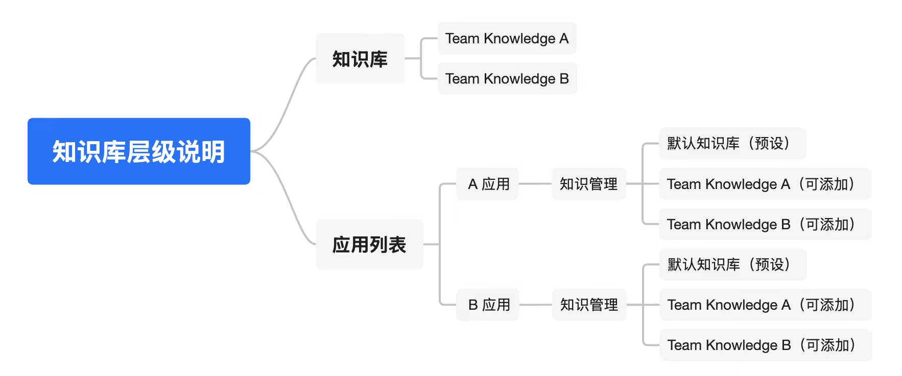

图・知识库层级

### **平台级知识库的创建与引用**

#### **（1）****新建知识库**

单击左侧菜单栏中的**知识库** \> **新建知识库**，填写知识库名称和知识库描述。

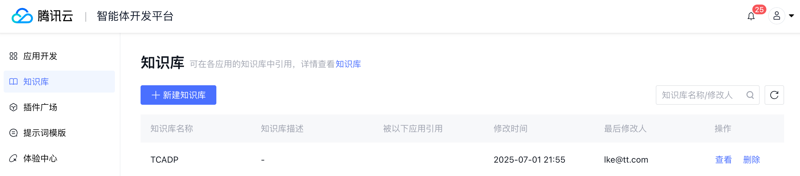

图・新建平台级知识库

#### **（2）修改知识库名称**

**修改知识库名称**：单击知识库左上角即可修改知识库名称。

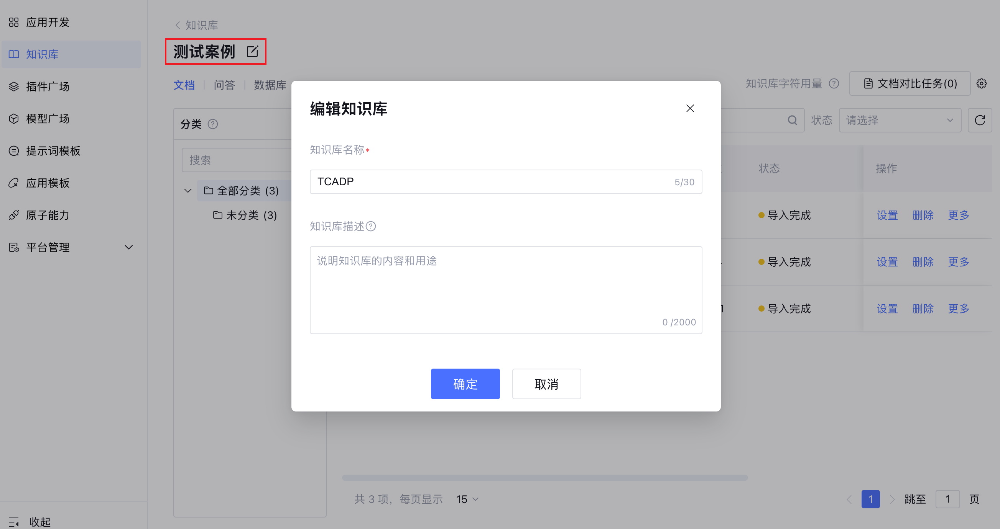

图・修改知识库名称

#### **（3）删除知识库**

如需删除知识库，请确保当前知识库未被任何应用所引用；被应用引用的知识库需要先解除引用关系后删除。

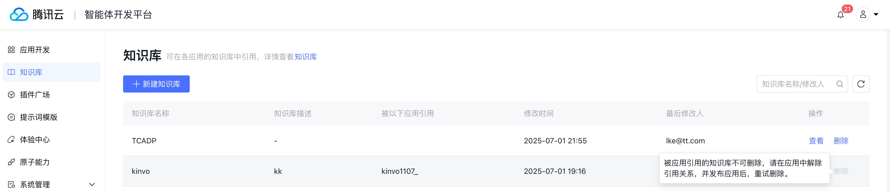

图・删除知识库

#### **（4）在应用内添加知识库**

单击应用，前往**应用 > 知识管理 > 添加知识库**。添加后即成功引用所添加的平台级知识库；若取消勾选，则为取消引用该平台级知识库。调整知识库的引用关系后需要重新发布应用。

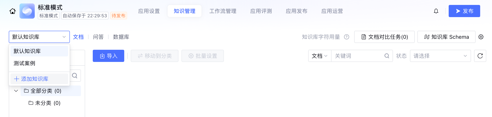

图・在应用内添加知识库

### **2.2 中.1.2 什么是知识管理？**

知识管理是围绕知识导入、知识处理、知识维护和知识效果调试的一组能力。ADP 中，**如果需要复用其他知识内容，可以在知识管理内额外添加****刚刚提到的****平台级知识库。****同时，****每个智能体****应用内设默认知识库****（应用级知识库）****，仅限当前应用使用**，不支持跨应用共享。企业把资料放进平台只是第一步，真正影响效果的是后续管理：资料是否最新、是否重复、是否结构清晰、是否被正确切分、检索结果是否命中、答案是否引用了正确片段。因此，**知识管理可以理解为 “让企业知识变成可被智能体稳定使用的资产” 的过程。**

Tips：

知识库效果不是 “上传越多越好”，而是 “资料质量、解析质量、切分方式、检索策略、更新维护” 共同决定。ADP 把这些环节做成可配置能力，可以持续优化，而不是一次性上传后完全交给模型猜。

### **2.2 中.1.3 文档**

文档是知识库最常见的知识来源，也是最容易上手的部分。ADP 的文档能力覆盖从上传、解析、切分、干预到对比的多个环节，目的是把企业原始资料处理成适合检索的知识片段。下面按照控制台中的顺序展开。

### **2.2 中.1.3.1 文档****导入**

在准备知识文档时，应尽量保证标题层级清楚、段落边界明确、表格字段完整、版本信息可识别。这样平台在解析和切分时更容易保留业务语义，后续检索也更容易命中正确内容。

进入知识库文档页后，选择**知识管理 > 文档**，进入文档管理界面。支持导入文档、下载文档、删除文档及文档分类。可以通过本地文档、网页文件、腾讯文档和腾讯云对象存储（COS）四种方式导入文档。

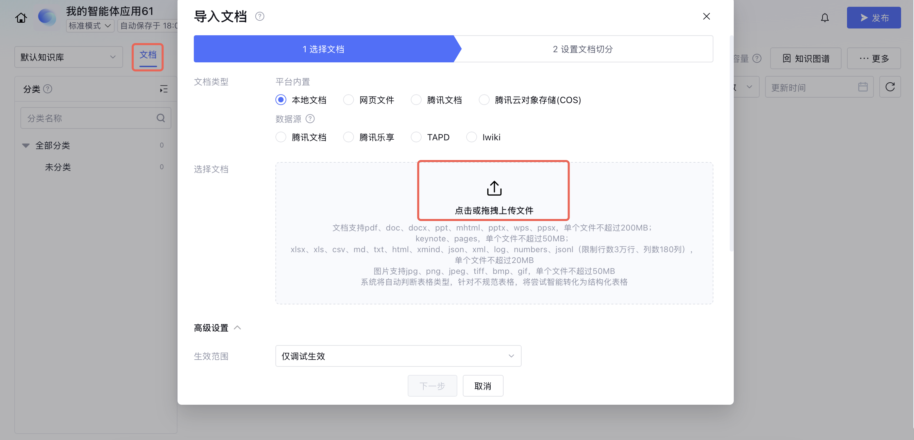

图・导入文档

注意：

**1.** **导入本地文档条件：**

-   支持 pdf、doc、docx、ppt、mhtml、pptx、wps、ppsx 格式，大小限制：200 MB。
-   支持 keynote、pages 格式，大小限制：50 MB。
-   支持 xlsx、xls、csv、md、txt、html、xmind、json、xml、log、numbers（限制行数 3 万行、列数 180 列）格式，大小限制：20 MB。
-   支持导入带文字的图片，包括 jpg、png、jpeg、tiff、bmp、gif 格式，大小限制：50MB，长宽比不超过 1:7。
-   表格文件（ xlsx、xls、csv 格式）最大支持 1 万行、100 列数据，建议一个 sheet 只存放一张表格，表格中出现全空行数据将影响问答效果。
-   支持批量导入文档。

**2\. 网站链接限制：**

-   确保所爬取的网页**无登录授权验证**，即无需验证当前用户身份和授予用户系统访问权限就可访问网页。
-   暂不支持异步加载类型的网站内容爬取。
-   请您确保在法律法规允许的范围内使用本网页解析工具，遵守目标平台管理规范、保障权利人合法权益，您应对此独立承担责任。腾讯云智能体开发平台作为工具提供方不对您的解析或下载行为承担任何责任。

### **2.2 中.1.3.2 文档切分设置**

文档切分指的是系统按照一定规则，将文档内容划分为多个独立的切片。这些切片会被索引并存储在知识库中，是实现 RAG（Retrieval-Augmented Generation，检索增强生成）能力的核心环节。在问答过程中，当用户提出问题时，系统会先从知识库中检索与问题最相关的内容切片，然后将这些切片作为外部知识注入大模型的上下文中，辅助其生成答案。合理的切分大小将直接影响检索和生成的效果：

-   **切片过大**：可能包含过多无关信息，导致检索精度下降，并增加计算与资源消耗。
-   **切片过小**：内容不完整，缺乏上下文连贯性，容易造成召回知识片段碎片化，使生成答案不够全面。

因此，平台在产品层面提供了灵活的文档切分规则，支持用户根据业务需求自定义调整规则，以在检索效率与生成质量之间取得最佳平衡，充分发挥 RAG 技术在知识问答与信息检索中的优势。

文档切分的规则支持**默认切分规则**和**自定义切分规则：**

-   **默认切分规则**：产品使用模型能力进行切分，默认切片规则不支持用户干预。
-   **自定义切分规则**：提供 3 种切分规则支持用户选择，包括通用标识符切分、父子标识符切分、及按行切分。

| **切分规则及对比** | **默认切分** | **通用标识符切分** | **父子标识符切分** | **按行切分** |
| --- | --- | --- | --- | --- |
| 适用文档类型 | 产品上支持导入的全部文档类型。 | 支持非表格类的文档，不包括 xlsx、xls、csv。 | 支持非表格类的文档，不包括 xlsx、xls、csv。 | 支持表格类的文档，包括 xlsx、xls、csv。 |
| 使用场景 | 适用于对文档切分无特殊要求的场景。 | 适用于对切片有特殊业务要求的场景，如按照页数切分、按照自定义的标识切分。 | 适用于对检索切片和召回切片分别都有特殊要求的场景。支持用户自定义设置切分标识符做切分。 | 对表格文档生效，且每行/每几行数据是独立的、无语义关联性，如商品 sku 文档。 |
| 切分逻辑 | 基于切分模型实现切分： 支持语义完整性切分。 支持跨页表格合并。 支持解析表格中的图片信息。 支持解析文档中的表格内容，包括有线及无线表格。 支持数据图、流程图、架构图、思维导图的解析。 支持多栏、公式、子图等复杂元素的解析。 | 支持用户设置标识符、切片最大长度、切片重叠长度以切分文档，切片用于检索和大模型召回使用。 | 父级和子级切片分别支持用户设置标识符、切片最大长度、切片重叠长度。 子级切片用于知识检索，检索到对应的父级片段后用于大模型召回 | 支持用户设置表头范围、数据切分起始行以及切分行数。系统将表格文档按照设置的切分行数切分成片段。 |

### **2.2 中.1.3.****3** **智能结构化解析**

**智能结构化解析是指通过使用结构化表改写模型，自动判断用户导入的表格文件是否为结构化形式。**如当前您上传的表格源文件并非结构化表，也将通过模型自动判断，可能改写成结构化表，以提升表格问答准确率。

**（1）****结构化表格**

-   核心特征：具有严格的二维关系模型，可直接对应关系型数据库结构。
-   数据特征：

-   行列严格对齐，每个单元格对应唯一行列坐标。
-   单级表头（单行且无合并单元格），列名具有唯一性和明确的语义。
-   无数据嵌套，每个单元格存储原子数据。
-   支持数据库导入导出，支持 SQL 查询。

**（2）****非结构化表格**

-   核心特征：以人类阅读优先的视觉呈现方式破坏了机器可读性
-   结构干扰特征：

-   合并单元格（跨行/跨列/多级合并）
-   动态列结构（如：列数随行位置变化）
-   分页重复表头（每页重复列名）

### **2.2 中.1.3.****4** **文档对比任务**

文档对比任务适合处理版本变更和内容差异。企业知识库不是静态的，政策会更新，产品手册会迭代，服务口径会调整。文档对比可以帮助识别不同版本之间的变化，判断哪些内容需要替换、哪些知识片段需要重新处理、哪些答案口径可能受到影响。

触发文档对比任务的方式包括**自动触发对比**和**手动触发对比**

（1）自动触发对比：当满足以下条件时，由系统自动生成的文档对比任务。

-   **文档名称相同**：当客户本地上传的文档与文档列表中的文档名称及文档类型相同、文档内容不相同时，新导入文档（即新文档）的导入状态为待发布状态时，会自动触发文档对比。
-   **网址来源相同**：当客户导入相同网址的文档，新文档导入状态为待发布状态时，会自动触发文档对比。

（2）手动对比：支持客户通过单击**文档对比任务** > 单击**添加对比任务** \> 选择需要进行对比的文档 > 单击**开始对比**手动**添加文档对比任务**。从文档列表中选择 2 个文档（仅支持选择待发布和已发布状态的文档），保存后将生成 1 条文档对比任务。

### **2.2 中.1.4 问答**

问答类知识是以 **“问题—答案” 形式成对存在**的知识。在将相关文档导入腾讯云智能体开发平台后，系统会自动生成对应的问答对。与传统的单纯文档内容分析相比，问答对具有更高的针对性和结构化程度：它能够直接将用户可能提出的问题与准确答案建立对应关系，减少了模型在理解和生成过程中的歧义。

例如，在客服场景下，问答对的优势尤为明显。一方面，它可以覆盖常见问题并快速定位标准答案，从而显著缩短响应时间；另一方面，问答对的结构化特性便于后续维护和扩展，能够随着业务的发展不断完善知识库。

当知识被导入系统后，设定的应用将形成基于问答对的业务知识库，应用可以直接利用该知识库内容对用户问题进行解答，从而实现更高效、更准确的自动化知识服务。

知识库问答应用支持**新建问答、****批量/手动导入****问答、校验问答、问答分类****等操作**。录入问答之后，当客户输入问题时，会将客户问题和问答库中的问题进行检索匹配，相似度达到一定阈值后，会输出对应回答。

| **能力** | 适用场景 | **能力价值** |
| --- | --- | --- |
| 标准问答 | 高频问题、标准答案、客服口径 | 提高回答一致性，降低模型自由发挥空间 |
| 相似问法 | 用户表达不固定、口语化提问较多 | 扩大召回范围，提高命中率 |
| 答案维护 | 政策或口径经常更新 | 便于快速更新重点问题的标准答案 |

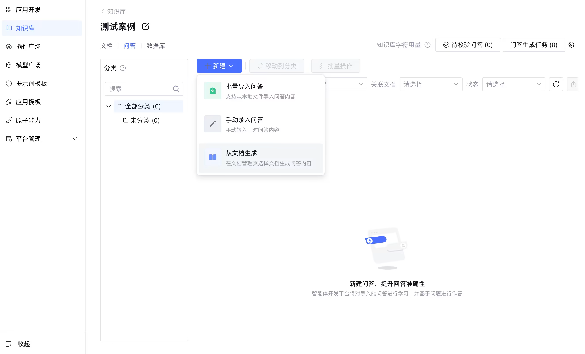

图・新建问答

### **2.2 中.1.5 数据库**

**数据库是用于存储和管理结构化数据格式文件的系统。**将数据库连接至腾讯云智能体开发平台后，可以赋予智能体基于结构化数据进行问答的能力，支持单表查询、多表查询等。

与传统 BI 工具需要依赖专业人员建模、编写 SQL 或配置报表不同，智能体结合数据库的方式能够让业务人员直接通过自然语言进行数据查询与分析。在 **Data+AI** 场景下，这种方式不仅具备更高的交互灵活性，还能够结合上下文进行多维度探索与分析，从而让数据分析从 “专业驱动” 转向 “业务驱动”，有效提升企业的数据利用效率与决策敏捷度。

### **2.2 中.1.****6** **Agentic RAG**

Agentic RAG（智能体检索增强生成）是腾讯云智能体开发平台提供的下一代知识库问答能力。相比传统 RAG 的单次检索 - 生成流程，Agentic RAG 基于 Agent Loop 框架，实现智能体自主反思、智能切换检索策略、多轮迭代检索，在知识场景中提供更广的回答范围和更高的回答准确度。

#### **（1）****传统 RAG 与 Agentic RAG 的区别**

| **对比维度** | **传统 RAG** | **Agentic RAG** |
| --- | --- | --- |
| 检索方式 | 单次检索 | 自主规划检索策略，多轮迭代检索 |
| 回答质量 | 受限于首次检索结果，检索不准确则回答不准 | 自我反思检索结果，不准确时自动调整策略重新检索 |
| 适用场景 | 简单的单一文档问答 | 多文档整合、复杂条件筛选、需要交叉验证的知识问答 |
| 检索策略 | 固定策略，无法动态调整 | 智能切换检索策略（混合、关键词等），按需适配 |
| 工具 | 知识库问答 / KnowledgeRetrievalAnswer | 知识库问答 / AgenticRAGSearch |

#### **（2）****适用场景**

Agentic RAG 适用于以下类型的知识问答场景：

-   **多文档整合问答**：需要综合多个文档信息才能回答的问题，例如 “对比 A 产品和 B 产品的功能差异”。
-   **复杂条件筛选**：需要按时间、地区、类别等条件筛选后生成答案，例如 “2025 年华东区销售政策有哪些变化”。
-   **交叉验证型问答**：答案需要从多个知识源交叉验证，例如 “公司的差旅报销标准是否有最新更新”。
-   **深度推理型问答**：需要理解问题意图并多步推理，例如 “根据公司制度，跨部门协作的审批流程是什么”。

注意：

-   **Agentic RAG 相比传统 RAG 会消耗更多 Token**，建议根据实际场景合理设置反思轮数。
-   对于简单的知识库问答场景，建议使用传统 RAG，响应更快、成本更低。

#### **（3）****使用前提**

使用 Agentic RAG 前，需要满足以下条件：

-   已创建 **Claw 模式**或 **Multi-Agent 模式**应用（需要添加 AgenticRAGSearch 工具）。
-   已完成知识库创建并导入文档。

也就是说，Agentic RAG 不是独立于应用和知识库之外的能力，而是在已有知识库基础上，通过工具方式加入到应用中，让智能体具备更强的检索、反思和多轮查找能力。

### **2.2 中.2 连接器、工具与 Skills：让智能体从回答走向行动**

知识库解决 “智能体能查什么”，连接器、工具和 Skills 解决 “智能体能做什么”。当需要智能体查询订单、读取数据库、创建工单、发送通知、调用企业系统或执行某类文件处理能力时，就需要连接器、工具或 Skills。

#### **（1）****连接器**

连接器用于接入第三方 SaaS、企业系统或腾讯生态产品中的数据与操作能力。通过连接器，智能体可以在获得授权或完成必要配置后，访问外部系统中的业务数据，并根据用户指令完成查询、创建、更新、通知等操作。例如，您可以使用 TAPD 连接器查询项目需求、缺陷和任务信息；使用腾讯乐享连接器查询知识库内容；使用 GitHub 连接器查询 Issue、PR 或代码仓库信息。连接器更适合以下场景：

-   需要访问外部系统或企业内部系统中的数据；
-   需要对接账号、权限、授权或密钥配置；
-   需要让智能体在业务系统中执行查询、写入、通知等操作；
-   希望通过标准化方式将企业已有系统接入智能体应用。

#### **（2）****自定义连接器**

当平台预置连接器无法满足企业接入需求时，您可以创建自定义连接器，将企业自有系统、内部服务或第三方 SaaS 接入平台。

**支持的接入方式：**

MCP：MCP（Model Context Protocol，模型上下文协议） 是专为大语言模型（LLM）应用设计的开放协议，旨在实现 LLM 与外部数据源、工具的无缝集成。它通过统一的接口规范，将原本分散 API 工具集成简化为 "即插即用" 模式，解决传统 API 工具集成中存在的多协议适配、高开发成本等问题。

#### **（3）****工具**

工具用于为智能体提供独立的通用处理能力。工具通常不强调与某个业务系统的长期连接，而是面向某类具体任务提供原子能力。例如，文档抽取工具可以帮助智能体从文件中提取结构化信息；图片理解工具可以帮助智能体识别图片内容；内容安全工具可以帮助智能体对输入或输出内容进行安全检测。工具更适合以下场景：

-   需要完成某个独立任务或通用处理能力；
-   希望在智能工作台、工作流、Multi-Agent 中复用标准能力；
-   希望将复杂任务拆解为可被智能体调用的原子能力。

#### **（4）Skills**

Skills（又称 "技能"）可以为智能体应用扩展专业能力，例如通过文档翻译、图像识别、语音合成等 Skills 增强智能体的能力边界，让智能体具备更多实用场景下的专业处理能力。在 Skills 广场内，您可以浏览和安装平台预置的内置 Skills，也可以导入自定义的 Skills 包来满足个性化需求；同时，您还可以将自己上架的优秀自定义 Skill 提交企业共享，审批通过后沉淀为企业共享 Skills，供本企业下所有空间的成员复用，让团队的优秀经验在企业内高效流转。

#### 接入前检查：Skills、连接器与工具的安全五层

| 检查层 | 必须确认的内容 | 推荐控制 |
| --- | --- | --- |
| 可信来源 | 能力用途是否清楚，Skill 或工具由谁维护，版本是否可追溯，是否包含外部通信、敏感数据外发或供应链风险。 | 优先平台内置或企业审核通过的能力；第三方能力先测试、再审批，保留版本和维护方信息。 |
| 最小权限 | 工具究竟只需查询，还是需要创建、修改、删除；能访问哪些租户、部门和数据范围。 | 默认不给管理员权限；查询与写入分开授权，按用户身份和部门传入权限变量。 |
| 凭证保护 | API Key、Secret、数据库密码等是否可能出现在前端代码、提示词或对话中。 | 使用加密的环境变量或后端凭证管理，限制可用范围，定期轮换，不把密钥交给模型输出。 |
| 执行控制 | 入参是否经过类型、范围和业务规则校验；高风险动作是否可能被误触发。 | 删除、付款、改价、赔付、改配置等操作增加权限校验、二次确认或人工审批，并准备回滚或补救方案。 |
| 审计与异常 | 是否能够追踪谁在何时调用了什么能力、输入输出是什么、是否失败。 | 记录调用日志、异常和人工确认结果；对超时、限流、错误码设计重试或降级，但避免无上限重试。 |

**部门知识隔离同样属于权限治理：**应用端先校验用户身份，再按部门或角色限定知识范围；检索时传入权限变量，避免不同租户或部门的文档被越权召回；定期审查权限配置和访问日志。仅在提示词中写 “不要查看其他部门资料” 不能替代真实的权限控制。

**2.2 中** **小结**

知识库承载企业知识，文档/问答/数据库提供不同形态的知识来源，解析和切分决定知识能否被正确处理，检索设置决定知识能否被准确召回，连接器和工具则让智能体从 “回答问题” 进一步走向 “执行任务”。下一部分将了解 workflow、multi-agent 和 claw。

### 2.2 下任务执行与编排能力：Workflow、Multi-Agent 与 Claw

**上一部分已经讲清楚 ADP 如何通过知识库、工具、连接器与 Skills 为智能体补充 “知识” 和 “能力”。当任务进一步变复杂，智能体就不只是回答问题，还需要按照流程办事、在多个工具之间选择、拆解复杂目标，甚至在独立工作空间中持续处理文件、运行代码和生成结果。本节聚焦 ADP 的三类任务执行与编排能力：Workflow、Multi-Agent 与 Claw。**

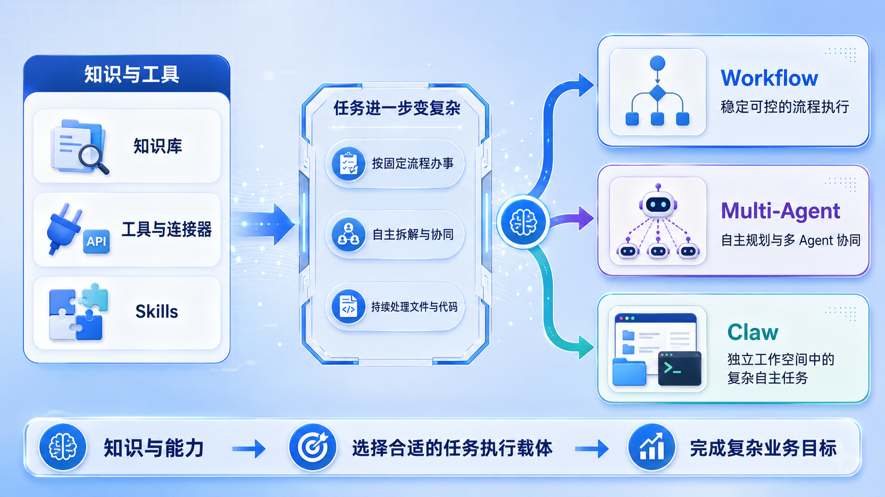

图・任务执行与编排能力进阶

### **2.2 下.1 Workflow：把业务流程编排成稳定可控的执行链路**

Workflow 为用户提供了直观的可视化画布，支持通过大模型、代码、参数提取等多种节点来编排复杂的业务流程。工作流旨在实现稳定且可控的业务效果，确保每个流程节点的准确性和可解释性。

Workflow 的核心价值是把开放式对话转化为可验证、可复用的流程。当一个任务有明确步骤、明确输入输出、明确判断条件时，就适合用 Workflow 承载。例如开票、售后处理、工单流转、审批办理、信息收集、报告生成等场景，都可以拆解成节点、变量、条件分支和工具调用。

### **（1）****可视化画布：用拖拽和连线搭建流程**

工作流画布支持通过拖拽和连接节点构建业务流程，画布支持鼠标和触控板操作，并提供多种快捷键，提高工作流配置效率。节点列表、画布、节点详情分类展现，使页面内容更简洁清晰。

在画布中，连线用于连接两个工作流节点，描述工作流执行流向，并在约束条件下连接节点。一个完整工作流通常从开始节点进入，经过信息收集、信息处理、变量处理和逻辑判断，最后通过回复节点或结束节点输出结果。

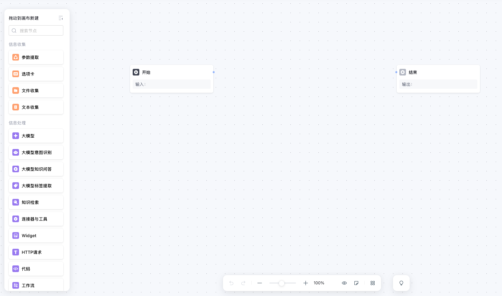

图・工作流画布

### **（2）****节点设计：每个节点负责一类明确动作**

节点是工作流中的基本构建单元，每个节点代表一个特定操作或功能。节点通过互相连接形成完整业务流程。ADP 工作流节点可以分为信息收集类节点、信息处理类节点、变量处理类节点和基础节点。

| **节点类型** | **定位** | **常见节点示例** |
| --- | --- | --- |
| 信息收集类节点 | 基于多轮对话、页面 UI 等方式收集信息，并将信息向后传递 | 参数提取节点、选项卡节点、文件收集节点、文本收集节点 |
| 信息处理类节点 | 对收集到的信息进行加工和处理，不再收集新的信息 | 大模型节点、大模型意图识别节点、大模型知识问答节点、知识检索节点、连接器与工具节点、Widget 节点、代码节点、Agent 节点 |
| 变量处理类节点 | 支持对变量进行转换、赋值、聚合等操作 | 变量聚合节点、变量赋值节点、变量转换节点 |
| 基础节点 | 工作流运行的基础，负责进入或退出工作流、条件分支判断、串行/并行执行、回复内容输出等功能 | 条件判断节点、回复节点、数据库节点、循环节点、批处理节点、开始节点、结束节点 |

### **（3）****变量与连线：让每一步结果能继续被后续节点使用**

变量用于承载工作流运行中可流转的数据。**工作流支持使用应用级变量和工作流级变量，也可以通过节点的输入变量引用前序节点变量、应用级变量或工作流级变量**。变量让流程中的信息不只停留在自然语言层面，而是可以被后续节点读取、判断、转换和传递。（对变量的介绍见 2.2 上）

工作流的连线也有明确约束。工作流中至少要有一个结束回复节点，整个工作流才可以正常执行；当前节点的输入一定要连接前一个节点的输出，节点的输入之间、输出之间不能连接；信息收集类节点、信息处理类节点之间没有固定前后顺序关系；开始节点、信息收集类节点、信息处理类节点的输出都可以连接多个后续节点，从而支持并行处理。

### **（4）****灵活对话：既能多轮澄清，也能稳定执行**

工作流的运行机制支持与用户进行多轮对话交互。在信息收集过程中，系统自主分析必填信息是否完整，如果不完整则自动生成反问澄清话术，引导用户提供必填信息。

工作流还**内置 Agent 全局监控节点跳转**，无需区分 “对话流” 和 “工作流”，既能灵活对话又能确保精准执行流程。内置 Agent 负责接管对话、控制节点跳转、识别全局意图，例如识别 “不继续执行工作流” 等退出意图，以及 “好的”“没问题” 等寒暄意图，并智能回复。

### **2.2 下.2 Multi-Agent：让模型自主规划、调用工具和协同执行**

“Multi-Agent 模式” 是智能体开发平台支持创建的应用类别之一。该模式的应用由大模型自主规划执行路径、灵活调用工具，其核心特点在于将对话的主动权更多地交由模型，充分发挥模型的主动性。此模式适用于需要灵活响应、多工具调用以及多 Agent 协同的场景。

在 Multi-Agent 模式中，支持创建单 Agent 应用，同时允许添加多个 Agent，并支持切换不同的多 Agent 协同方式来满足多场景的需要。如果一个 Agent 足以完成任务，可以直接使用系统默认创建的 Agent；如果需要多个专家角色协作，则可以添加多个 Agent 并配置转交关系。

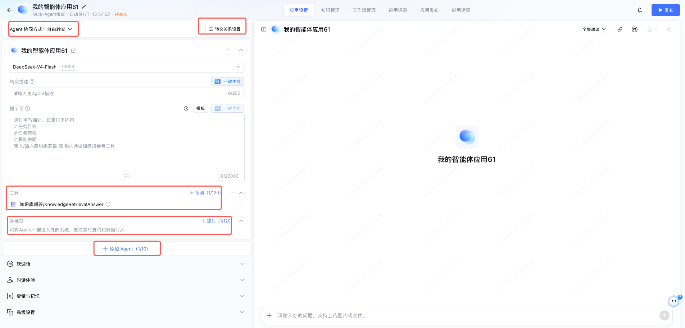

图・Multi-Agent 应用编设置页，可以添加 Agent、配置转交关系和协同方式、添加工具和连接器等

### **（1）核心工作流程：思考规划、工具调用、纠错反思**

Multi-Agent 模式包含思考规划、主动选择调用工具和主动纠错反思三类核心任务：

-   **思考规划**：制定整体任务达成的规划思路，并把整体的复杂任务拆解为细分的子任务。
-   **主动选择和调用工具**：根据拆解后的子任务和工具的描述说明，选择一个或多个合适的工具来解决问题。
-   **主动纠错反思**：模型自主改进优化过去的行为决策，并对行为进行纠正。

以上三类工作可能多次循环执行，最终输出回复的答案。

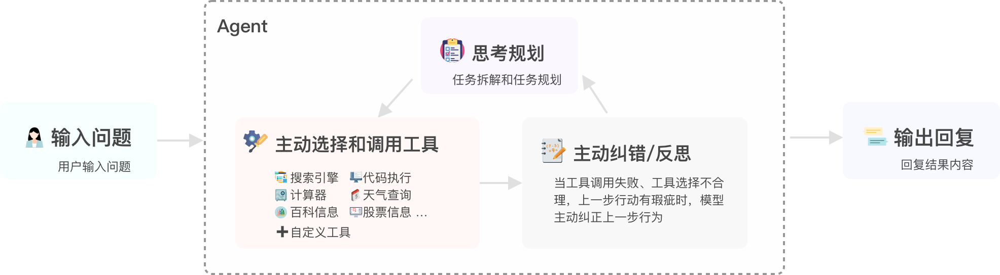

图・Multi-Agent 核心工作流程

### **（2）Agent 配置：让模型知道 “谁负责什么”**

| **概念** | **定义** |
| --- | --- |
| 名称 | 简洁、明确的名称描述 Agent 功能，例如：旅行规划助手、网页分析 Agent、文案优化 Agent 等。 |
| 模型 | 负责思考、任务规划和工具选择的大模型。支持不同的模型选择。 |
| 转交描述 | 简要说明 Agent 的功能和应用场景，帮助其他 Agent 判断何时应转交至该 Agent。 |
| 提示词 | 通过提示词来约束 Agent 执行任务流程和响应方式。与 “ 转交描述” 不同，“提示词” 是给模型理解并执行当前 Agent 的详细工作逻辑。 |
| 连接器与工具 | 支持将连接器与工具或应用内已配置的工作流作为工具添加到当前的 Agent。 |
| 转交关系 | Agent 可以转交给哪些其他 Agent 。 |
| 协同方式 | Agent 的转交方式，包含自由转交、工作流协同和 Plan & Execute 三种方式。 |
| 高级设置 | 澄清询问：控制 **Agent** 是否与用户沟通以收集信息的开关。 思考模式：配置 **Agent** 的思考过程时长，支持选择效果优先或速度优先。效果优先模式，**Agent** 会先进行充分思考再调用工具，表现更稳健；速度优先模式下，**Agent** 将直接执行任务，适合处理简单任务。 最大推理轮数：**Agent** 在执行任务过程中「思考 + 工具调用」循环的最大次数。该数值可根据任务复杂度进行调整，轮数越大表示 **Agent** 的 "思考深度" 越深，但会增加 **token** 消耗。 上下文轮数：设置输入给大模型的上下文轮数。 结构化输出：支持设置按照指定的 JSON 格式输出。 |

Agent 高级设置用于对 Agent 的思考逻辑和输出方式进行精细化调整，用户可以根据不同的业务场景选择合适的策略，从而优化 Agent 表现，提高结果的准确性或响应速度。

### **（3）协同方式：自由转交、工作流编排、Plan & Execute**

当应用中存在多个 Agent 时，需要选择协同方式。系统支持自由转交、工作流编排和 Plan & Execute 三种方式。创建 Multi-Agent 应用时，默认 Agent 协同方式为自由转交；切换为工作流编排时，转交顺序固定，任务执行可控；切换为 Plan & Execute 协同时，任务将被 Planner Agent 拆解，由 Executor Agent 执行，耗时较长，适用于对耗时要求不高的复杂任务。

| 协同方式 | **描述** | **适用任务类型** |
| --- | --- | --- |
| 自由转交 | 基于模型驱动的任务转交方式，操作简便，但转交稳定性取决于 Agent 名称、转交描述的清晰程度 | 需要快速配置的简单任务 |
| 工作流编排 | 通过固定流程编排 Agent 节点，任务执行稳定可控 | 需要稳定执行的固定流程任务 |
| Plan & Execute 协同 | 将任务分解给负责规划（Plan）与执行（Execute）的多个独立 Agent，完成复杂任务，效果完善，但耗时较长 | 对实时性要求较低但对内容丰富度要求较高的任务 |

Tips：

目前 Plan-and-Execute 模式仅支持**单轮对话**，即每次输入（query）都会独立处理，暂不支持基于历史上下文的多轮对话。

### **2.2 下.3 Claw：面向复杂自主任务的独立工作空间**

Claw 模式应用通过自然语言驱动智能体自主思考并解决复杂问题；应用拥有独立工作空间，可自主编写和运行代码、调用 Skills / 工具 / 连接器等多种能力。它适用于数据分析、内容生成、自动化处理等复杂任务场景，就像一位随时在线的数字同事。

### **Claw 的核心差异**

-   **开箱即用**：Claw 模式创建后即可使用平台内置模型（支持自主切换），无需额外配置模型服务与思考 - 生成双模型体系。
-   **Skills 能力扩展**：支持添加最多 **80 个 Skills**（来自 Skills 广场），让 Agent 获得即装即用的专业能力（办公文档、医疗健康、图像处理、音视频等）。
-   **独立工作空间**：Claw 模式应用拥有独立的工作空间，适合长耗时、涉及文件读写的自主任务。
-   **不支持模式切换**：一旦创建为 Claw 模式，不支持切换到其他三种模式；反之，其他三种模式之间仍可互相切换。

### **2.2 下小结**

本节把 ADP 的复杂任务能力拆成三类执行载体：Workflow 用节点和变量把业务流程变得稳定可控；Multi-Agent 让模型能够自主规划、调用工具、进行多 Agent 协同；Claw 通过独立工作空间、Skills、工具和连接器处理更复杂的自主任务。

理解这三类能力后，就能把 ADP 的能力地图进一步落到实际应用上。下一节将从开发到上线的完整生命周期出发，把应用创建、能力配置、执行逻辑搭建、对话调试、发布接入和运营优化串成一条完整路径。

### 2.3 从开发到上线：ADP 应用的完整使用流程

**前面****我们****已经了解了 ADP 的产品定位、核心能力和任务执行方式。接下来****我们来整体梳理一下在 ADP 创建并应用智能体的全流程，****把这些能力放回真实使用路径中：从开通平台、创建应用，到配置知识和工具、搭建智能体逻辑，再到调试评测、发布接入和持续运营。**

本节目标

1\. 理解 ADP 应用从开通工作空间到运营优化的完整路径。

2\. 能判断创建、配置、调试、评测、发布、接入、运营各阶段分别要解决什么问题。

3\. 形成 “上线不是终点，而是进入持续运营与迭代” 的认知。

**完整流程**

ADP 应用的完整使用流程可以概括为七步：开通产品并创建工作空间 → 创建应用并选择模式 → 配置知识库、连接器和工具 → 搭建智能体逻辑 → 对话调试与效果评测 → 发布应用与渠道接入 → 监控运营与持续优化。

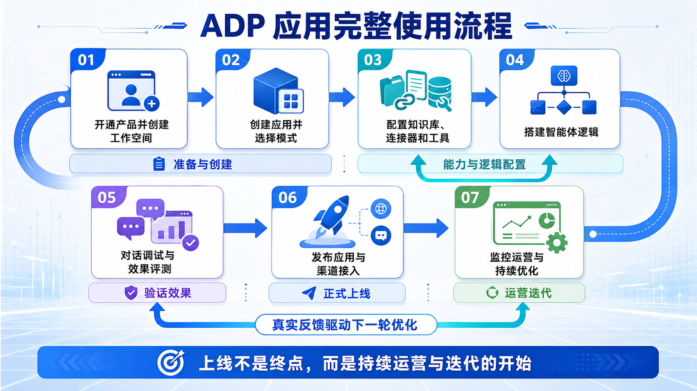

图・ADP 应用完整使用流程

### **2.3.1 第一步：开通产品并创建工作空间**

使用 ADP 前，需要先完成产品开通和工作空间创建。使用腾讯云账号完成实名认证后，首次进入智能体开发平台，系统会自动为主账号创建 1 个 “企业” 和 1 个默认工作空间。

**可以把 “企业” 和 “工作空间” 理解为应用建设的组织边界**。企业用于承载组织级资源和权限，工作空间则用于放置具体的应用、知识库、工作流、工具等内容。后续创建的智能体应用、知识库和工作流，都会在工作空间中进行管理。

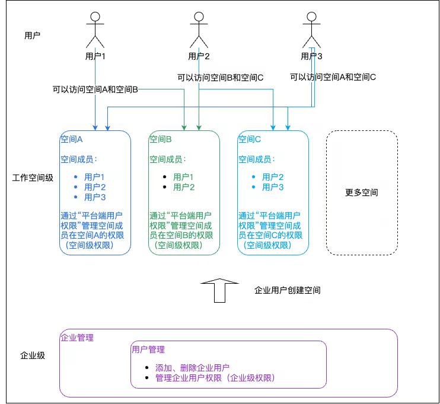

图・权限体系

### **2.3.2 第二步：创建应用并选择模式**

进入工作空间后，可以创建 “应用”。一个应用通常对应一个业务场景，例如售后智能客服、数据分析助手、营销文案生成助手、网页内容总结助手、内部知识问答助手等。创建应用时，需要根据业务复杂度选择合适的应用模式。

| **模式名称** | **模式说明** |
| --- | --- |
| Claw 模式 | 拥有独立工作空间，可自主编写和运行代码、调用 Skills / 连接器 / 工具等多种能力，像一位随时在线的数字同事 |
| 标准模式 | 适合 “从一个简单智能体开始，后续按需扩展能力” 的轻量任务，例如先做基础问答，再逐步加入知识库查询和对话设置能力 |
| Multi-Agent 模式 | 适合 “一个智能体无法完成，需要小团队配合” 的复杂任务，可以为分析问题、查资料、算结果、风控把关、写结论等环节配置各自的智能体 |
| 单工作流模式 | 适合已经固化下来的标准业务流程，可以把判断是否符合条件、调用接口查数据、根据结果给出处理建议等步骤拖拽编排成一条可复用流程 |

模式选择决定后续搭建方式。标准模式更适合快速开始，单工作流模式更适合固定流程，Multi-Agent 模式更适合复杂任务中的分工协作，Claw 模式则更适合需要独立工作空间和自主处理能力的任务。请注意，**标准模式、单工作流模式、Multi-Agent 模式**三者之间，支持根据应用落地场景的需要进行模式切换：点击**头像**或者**模式** tag，即可在**编辑应用**中进行应用模式的切换；claw 模式下不支持切换到其他模式。

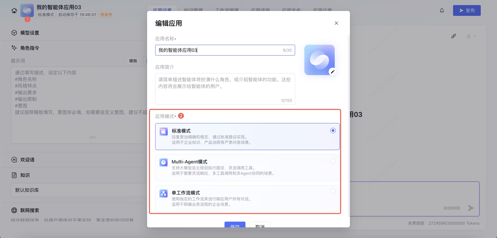

图・应用模式切换

模式切换时，应用下知识库和工作流范围保持不变，但不同模式之间应用配置项，如提示词、模型配置等在模式切换时不会相互继承，在切换模式时的配置更新原则的示意图如下：

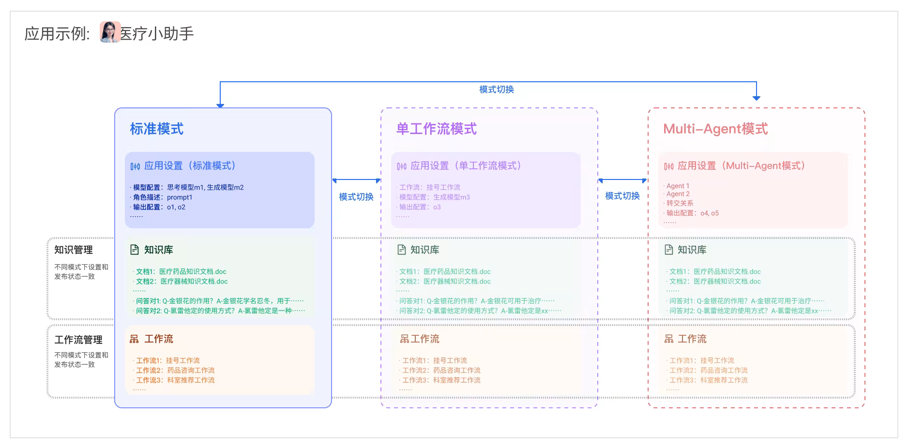

图・应用模式切换的配置更新示意图

### **2.3.3 第三步：配置知识库、连接器和工具**

应用创建完成后，需要为它配置知识来源和行动能力。知识库解决 “智能体知道什么” 的问题；连接器和工具解决 “智能体能连接什么、能调用什么” 的问题。

为应用绑定一个或多个知识库，可以导入业务文档或问答，作为智能体回答问题时可检索、可引用的知识来源。知识库适合承载产品说明、制度文件、售后规则、操作手册、FAQ、培训资料等相对稳定的业务内容。

结合业务需要，还可以启用连接器和工具。例如内部系统 API 可以查询订单、库存、工单、用户状态等实时数据，代码执行可以处理计算、转换、分析或自动化任务。

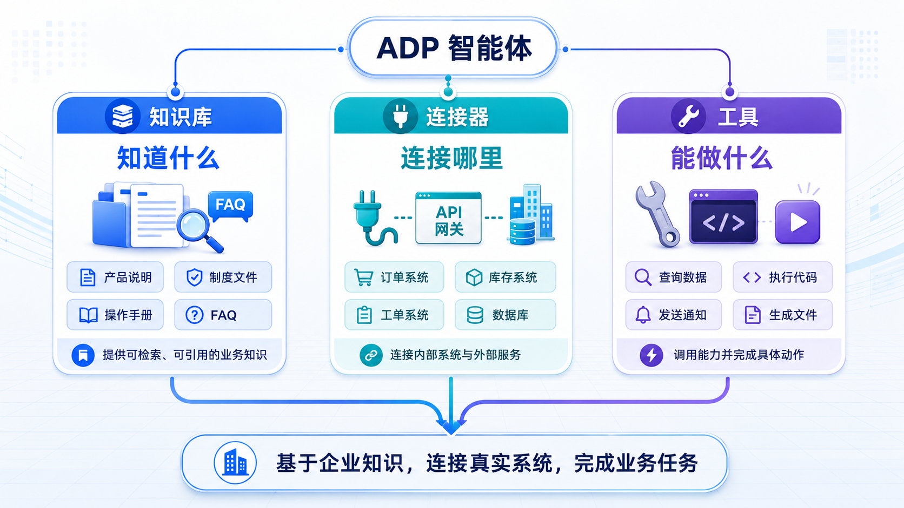

图・知识库连接器与工具配置

### **2.3.4 第四步：搭建智能体逻辑**

完成知识和工具配置后，需要搭建智能体逻辑。智能体逻辑决定应用如何理解用户请求、如何组织回答、何时调用知识库和工具、是否进入工作流、是否调度多个 Agent。例如在应用内设置提示词、模型参数、回复风格，可选串联简单工作流。

例如，使用 "工作流编排" 构建多步骤流程，接入外部系统、数据库等，在工作流中组合大模型、知识检索、条件判断、API 调用、代码执行等节点；使用 Multi-Agent 架构，由主智能体调度多个专家子智能体，各自负责不同子任务……

**详细说明请参见****第三章。**

### **2.3.5 第五步：对话调试与效果评测**

逻辑搭建完成后，需要在控制台内进行对话调试，观察回答是否准确、稳定。调试时可以用真实业务问题进行多轮测试，检查知识是否命中、回答是否完整、变量是否正确传递、工具是否正确调用、工作流节点是否按预期运行。

对话调试窗口能够帮助观察应用在单次对话中的表现；评测能力则适合为关键场景编写测试用例，通过批量方式验证应用效果。评测时可以重点观察知识检索效果，例如召回率、准确率等；也可以观察对话质量，例如相关性、完整性、流畅度等。

**详细说明请参见****第四章。**

### **2.3.6 第六步：发布应用与渠道接入**

当调试和评测结果达到预期后，可以将应用从测试环境发布到正式环境。发布意味着应用不再只是开发阶段的原型，而是进入真实使用场景。

将应用从测试环境发布到正式环境，根据业务需要选择接入方式。例如：

-   在网站或后台系统嵌入组件以连接 ADP
-   接入企业微信、微信公众号、小程序等
-   自研前端通过 API / SDK 调用

#### 应用接入速查：凭证、同步、异步与流式结果

当应用要接入业务系统时，应先完成调试和发布，再进入相应的调用配置获取 AppKey、接口地址或连接所需信息。调用凭证由后端安全保管，不能写入公开前端、URL、提示词或日志明文。发布或调用前还要确认应用版本、凭证、返回格式和前端处理方式一致。

| **方式** | **适合场景** | 客户端要处理什么 | 关键注意点 |
| --- | --- | --- | --- |
| 同步 HTTP | 执行时间短、一次请求即可返回完整结果。 | 等待响应并解析最终结果。 | 设置合理超时；不适合视频分析、批量文件处理等长耗时任务。 |
| 异步调用 | 视频分析、长报告生成等可能超过短连接等待时间的任务。 | 提交任务后保存任务 ID，查询任务状态，完成后获取结果。 | 明确排队、运行中、成功、失败、超时等状态；设计幂等、重试、取消和失败兜底。 |
| HTTP SSE | 客户端发起请求后，服务端持续单向推送文本片段或运行事件。 | 逐条解析流式事件、拼接内容，处理断连重试，并以结束事件或最终状态判断完成。 | SSE 不是双向长连接；网络中断时避免重复展示或遗漏最终结果。 |
| WebSocket | 需要持续、双向通信的实时对话。 | 先获取建连 Token，再建立连接，处理消息、心跳、断线和结束状态。 | 建连 Token 应及时使用且不应长期复用；业务凭证仍需安全保管。 |

**什么时候使用 Widget：**当结果不只是文字，而需要展示订单处理进度、候选项选择、列表、图表或可点击按钮时，可用 Widget 等结构化组件承载。组件负责展示和交互，后端仍要校验用户身份、权限和操作参数，不能因为 “按钮由系统生成” 就默认可信。

### **2.3.7 第七步：监控运营与持续优化**

应用发布后，生命周期并没有结束，而是进入监控运营与持续优化阶段。在平台中可以查看应用的请求量、成功率、响应延迟、Token 消耗等指标，分析常见问题和满意度，并根据真实使用情况持续优化。

运营优化通常会回到前面几个阶段：如果发现知识回答不准，需要补充或清洗知识库；如果发现流程节点不稳定，需要调整工作流和提示词；如果发现成本或延迟过高，需要优化模型选择和路由策略；如果发现某类问题反复出现，可以补充测试集，在下一轮发布前重新评测。

到这里，一个 ADP 应用就从 “创建” 走到了 “运营”。但真实业务中的智能体应用不会一次成型，运营反馈会不断驱动配置、逻辑、评测和发布的下一轮更新。

### **2.3 小结**

一个 ADP 应用从开发到上线可以分为七步：开通产品并创建工作空间，创建应用并选择模式，配置知识库、连接器和工具，搭建智能体逻辑，对话调试与效果评测，发布应用与渠道接入，监控运营与持续优化。

这条流程把前面的内容串了起来。本章中，第一小节讲解了 ADP 为什么是智能体开发平台，第二小节讲解了 ADP 提供哪些核心能力，而本小节说明这些能力如何在真实应用生命周期中被使用。理解这条路径后，后续进入场景设计和实操搭建时，就能更清楚每一步要解决什么问题，以及可以做到什么程度。下一章，我们将进行智能体开发的实战。