---
title: "腾讯云 ADP 前沿部署工程师 (FDE) 认证课程"
source: "https://cloud.tencent.com/edu/learning/course-4742-84529-84542"
site_name: "cloud.tencent.com"
date: "2026-09-28T01:56:54.939Z"
---

# 腾讯云 ADP 前沿部署工程师 (FDE) 认证课程

从方案判断开始，分别完成标准模式、单工作流、Multi-Agent、Claw 与智能工作台实战，把平台能力转化为可交付的业务应用。

### 3.1 方案设计方法

**做智能体方案时，第一步不是打开平台建应用，而是先判断：这个业务问题能不能被 AI 稳定处理，应该用哪一种 ADP 模式承载，落地后用什么结果证明它真的有效。**

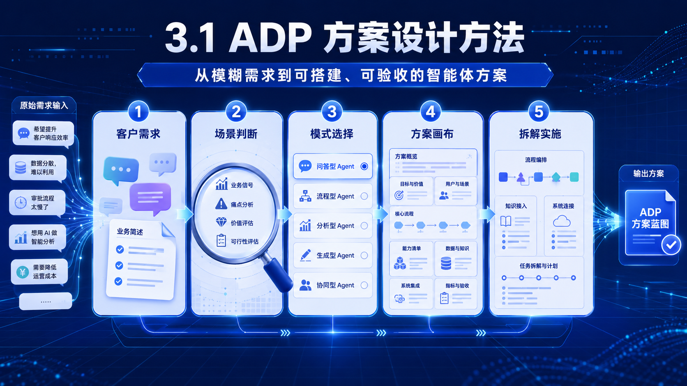

### **3.1.1 先把需求说清楚：从客户描述到方案判断**

客户往往不会直接说 “我要一个标准模式应用” 或者 “我要一个单工作流”。他们通常会用业务语言描述问题，比如：

客户原话示例

“我们客服每天要处理很多重复咨询，员工经常找不到制度文件，领导还希望能看到一线问题统计。能不能用 AI 做一个助手，把这些事情都解决？”

这句话里同时包含了多个问题：**重复咨询、知识检索、问题统计、管理看板。** 方案设计时要先把它拆开，再判断哪些适合第一期做，哪些需要后续迭代。

### **（1）****把客户需求翻译成 7 个维度**

| **维度** | **需要问清楚的问题** | 示例 |
| --- | --- | --- |
| 背景与现状 | 现在谁在处理？处理量多大？主要痛点是慢、不准、成本高，还是体验差？ | 客服团队 200 人，大量问题重复，夜间响应不稳定。 |
| 业务目标 | 要提升什么指标？降本、提效、提升准确率、提升转化率，还是加强合规？ | 降低转人工率，缩短响应时间，提升服务满意度。 |
| 使用对象 | 谁会使用这个智能体？员工、客服、运营、销售、客户、管理层，还是开发人员？ | 一线客服使用回复建议，客户自助咨询，主管查看热点问题。 |
| 任务边界 | 智能体负责到哪一步？只回答问题，还是要生成工单、调用接口、写报告、输出文件？ | 先回答常见问题；涉及退款、投诉升级、身份校验时转人工或进入流程。 |
| 资料与知识 | 是否有制度、FAQ、SOP、话术、产品手册、历史工单、表格数据？质量是否可用？ | 已有客服 FAQ、历史优秀话术、售后 SOP，但格式不统一。 |
| 系统与工具 | 是否需要接入 CRM、工单系统、数据库、企业微信、小程序、API 或插件？ | 需要对接工单系统，后续接入企业微信和小程序。 |
| 限制与验收 | 有哪些不能答、不能做、不能越权的边界？上线后怎么判断达标？ | 敏感问题拒答；准确率、意图识别、转人工率、平均响应时长作为验收指标。 |

REQUIREMENT CHECK

#### 背景与现状

-   当前业务如何完成？主要痛点是什么？
-   哪些环节最耗时、最容易出错？
-   为什么现在需要引入智能体？

需求识别点击维度，展开方案问题清单

### **（2）****第一期先做 “能闭环、可验收” 的部分**

很多客户需求会从一个点扩散成一整套平台：既要问答、又要工单、又要数据分析、又要管理决策。第一期方案不追求一次性覆盖所有愿望，而是选出最容易闭环、最容易验证价值的切口。

-   能找到稳定资料的，优先做知识类能力，例如制度、产品、售后政策、操作手册。
-   流程已经固定的，优先做流程自动化，例如信息收集、条件判断、工单生成、结果通知。
-   需要多角色协同的，先确认每个角色的职责是否清楚，例如资料检索、数据分析、风险复核、结论生成。
-   需要读写文件、跑代码、临时分析的，先用 Claw 或智能工作台验证，再判断是否沉淀成固定应用。

### **3.1.2 用 ADP 模式理解场景适配度**

标准模式、单工作流模式、Multi-Agent 模式、Claw 模式这四种智能体应用构建模式，解决的是 “我要构建一个什么样的智能体应用” 的问题。构建完成后，这个应用可以发布给目标用户使用，也可以通过接口被其他系统调用，所以更偏向应用构建和交付。一个应用搭好以后，往往可以服务多个用户。

而智能工作台解决的是 “我自己怎么直接使用 Agent 来完成工作” 的问题，是开箱即用的。它更像一个面向个人的 AI 工作空间，用户可以在里面直接处理文件、调用工具、使用已有应用或能力来完成任务，也可以辅助进行上述四种智能体构建模式的应用构建与分发。因此它更偏向个人办公协助和应用构建者的工作环境，而不是独立于上述四种模式的新的应用开发模式。

所以如果从 “给谁用” 这个角度来看：

-   **四种应用模式**：主要是 “搭一个应用，再给别人用”，强调可复用、可发布、可被多人或系统调用。
-   **智能工作台**：主要是 “我自己进入一个工作空间，让 AI 帮我完成当前工作”，强调个人使用和任务协作。不局限于技术人员，非技术人员也可以使用智能工作台进行日常的个人办公协助。

标准模式｜稳定问答与可溯源知识服务

**做什么：**搭建稳定的单个智能体应用，适合围绕企业文档、产品资料、政策制度、FAQ 等内容做严肃问答，也可以按需补充工作流能力。

**怎么用：**配置知识库、**Prompt**、模型和会话体验，让用户以问答方式获得稳定、可溯源的答案。

**适合场景：**员工制度助手、产品 FAQ 助手、售后知识助手、金融/医药/法务知识咨询。

**参考案例：**得物内部 IT/HR 知识问答、一汽丰田售后知识助手、东吴人寿保险知识问答。

单工作流模式｜固定流程与标准化办事

**做什么：**承载明确、固定、重复执行的业务流程。每次用户请求都进入同一条流程，强调完整性、标准化和可控性。

**怎么用：**把 “参数提取 → 条件判断 → 知识检索/接口调用 → 结果生成 → 异常兜底” 编排成一条流水线。

**适合场景：**工单流转、证明开具、售后处理、审批辅助、定时报告、固定格式信息处理。

**参考案例：**航班延误证明申请、酒店客需送物工单、投诉分流处理、网页内容总结助手。

Multi-Agent 模式｜多角色协作与复杂任务处理

**做什么：**处理一个智能体难以独立完成、需要多个角色协作的复杂任务。重点不是固定流程，而是让不同 **Agent** 分工协同。

**怎么用：**为不同环节配置 **Agent**，例如需求理解、资料检索、数据分析、风险复核、结论撰写，由主 **Agent** 统筹。

**适合场景：**复杂研究、综合分析、专业报告、跨资料推理、需要复核的高风险内容生成。

**参考案例：**保险方案生成、复杂法律/海商法深问、经营分析报告、投研资料整理与复核。

Claw 模式｜开放探索、文件处理与代码执行

**做什么：**处理开放性、探索性、长耗时或需要读写文件/运行代码/调用 Skills 的任务，更像一个可以动手处理文件和工具的数字同事。

**怎么用：**给它目标、文件和工具范围，让它自主规划、调用 Skills、读写文件、生成交付物。

**适合场景：**Excel 数据分析、报告生成、批量文件处理、内容生产、自动化办公、临时研究任务。

**参考案例：**数据分析助手、销售数据清洗与图表生成、批量文档整理、会议纪要与报告产出。

智能工作台｜自然语言创建与辅助搭建入口

**做什么：**它不是与前四种完全同级的应用模式，更适合作为自然语言创建应用、辅助搭建和临时任务处理入口。

**怎么用：**用自然语言描述需求，让平台辅助生成应用初稿、调整配置、补充提示词或完成一次性任务。

**适合场景：**非技术用户低门槛创建应用、快速把想法变成初稿、临时处理文档或数据。

**参考案例：**“帮我创建一个销售数据分析助手”“帮我把这个客服需求变成应用初稿”。

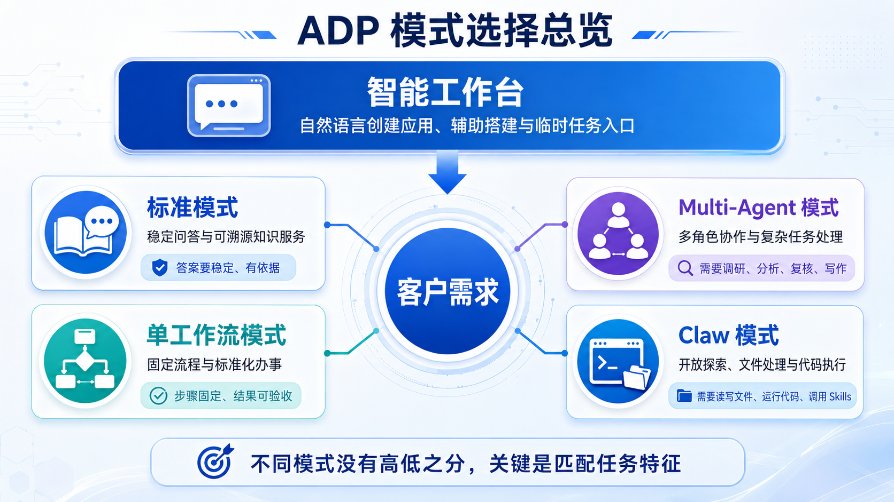

### **（1）****模式选择看四个信号**

不需要把模式选择做成复杂评分。实际项目中，只要抓住几个信号，就能快速判断初始方向。

| **判断信号** | **典型表现** | **优先方向** |
| --- | --- | --- |
| 流程是否固定 | 流程固定、步骤清楚、每次都按同一路径执行 | 单工作流模式 |
| 答案是否需要稳定溯源 | 主要围绕制度、产品、政策、FAQ 提问，答案要可信、可引用、可运营 | 标准模式 |
| 是否需要角色协作 | 任务需要调研、分析、复核、写作、风控等多个角色分工 | Multi-Agent 模式 |
| 是否需要动手处理文件或代码 | 需要读取文件、生成文件、跑代码、处理 Excel、调用 Skills，路径不一定固定 | Claw 模式 |
| 是否还在探索需求 | 只是把想法快速生成应用初稿，或非技术用户希望通过对话辅助搭建 | 智能工作台入口 |

### **（2）****同一个客户需求可以分阶段落地**

很多真实项目不是只选一种模式，而是分阶段组合。例如酒店智能服务助手，第一期可以用标准模式处理酒店信息和服务设施问答；当 “客需送物、修改订单、维修报修” 流程固定后，再用工作流把参数收集、工单生成和结果通知串起来；如果后续要做经营分析、用户声音总结和服务优化方案，可以再引入 Multi-Agent 或 Claw 处理分析任务。

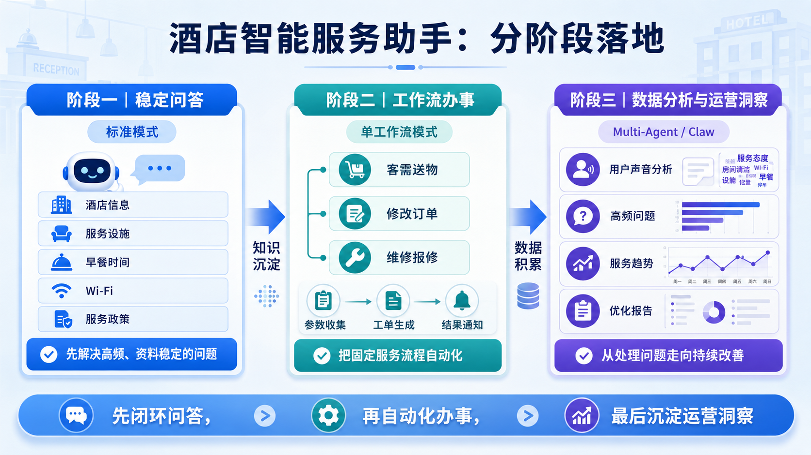

### **3.1.3 方案设计画布：把需求变成可搭建方案**

完成场景适配判断后，需要把方案写成一页能评审、能搭建、能验收的画布。画布不追求长，而是把关键决策说清楚。

| **方案画布字段** | **要写清楚的内容** |
| --- | --- |
| 1\. 背景与现状 | 客户当前业务怎么做，痛点在哪里，为什么现在要引入 AI。 |
| 2\. 业务目标 | 要提升的核心指标，例如准确率、解决率、响应时长、转人工率、采纳率、报告生成耗时。 |
| 3\. 用户与入口 | 谁使用，在哪里使用，入口是 Web、企业微信、小程序、API、内部系统还是智能工作台。 |
| 4\. ADP 模式 | 选择标准模式、单工作流模式、Multi-Agent 模式、Claw 模式或智能工作台入口，并说明原因。 |
| 5\. 知识与资料 | 需要哪些文档、FAQ、SOP、历史工单、话术、表格、数据库或外部资料。 |
| 6\. 流程与工具 | 需要哪些步骤、节点、插件、API、数据库、MCP、企业系统或 Skills。 |
| 7\. 输入与输出 | 用户输入什么，智能体输出什么，是否需要 JSON、表格、报告、工单、链接或文件。 |
| 8\. 边界与验收 | 不能做什么，异常怎么兜底，上线前用哪些指标和测试集验收。 |

### **示例：把 “售后客服助手” 写成方案画布**

| 字段 | **示例内容** |
| --- | --- |
| 背景与现状 | 客户售后咨询量大，重复问题多，人工客服成本高，夜间响应不稳定。 |
| 业务目标 | 提升常见问题自动解决率，降低转人工率，缩短平均响应时长，并沉淀一线热点问题。 |
| 用户与入口 | 终端用户在小程序或 App 咨询；客服主管在运营后台查看问题统计。 |
| ADP 模式 | 第一期采用标准模式承载常见问答；涉及退款、维修、投诉升级等固定流程时，增加工作流或切换单工作流承载。 |
| 知识与资料 | 售后 FAQ、产品说明、服务政策、优秀客服话术、历史工单、异常处理 SOP。 |
| 流程与工具 | 意图识别、知识检索、情绪安抚、必要信息收集、人工转接、工单系统接口。 |
| 输入与输出 | 输入为用户自然语言问题；输出为答案、操作建议、追问问题、转人工原因或工单字段。 |
| 边界与验收 | 敏感问题不承诺、不越权处理退款；验收看意图识别准确率、自动解决率、转人工率、用户满意度。 |

### **3.1.4 场景拆解方法：从方案到 ADP 搭建路径**

方案画布解决 “要做什么”，场景拆解解决 “怎么搭”。进入 ADP 之前，把场景拆成四层：业务流程、输入输出、知识依赖、系统依赖。

### **（1）****业务流程拆解**

把客户的业务动作按顺序写出来，区分哪些由用户完成，哪些由智能体完成，哪些仍然需要人工处理。流程越固定，越适合工作流；流程越开放，越需要 Agent 或 Claw。

| **业务动作** | **由谁完成** | **是否适合自动化** | **ADP 承载方式** |
| --- | --- | --- | --- |
| 用户提出问题或上传材料 | 用户 | 是 | 对话输入 / 文件上传 / 智能工作台 |
| 识别意图和必要字段 | 智能体 | 是 | 参数提取 / 大模型节点 / Agent |
| 查询知识或系统数据 | 智能体 | 是 | 知识库 / API / 数据库 / 插件 |
| 判断是否满足处理条件 | 智能体 | 是 | 条件节点 / 代码节点 / 工作流判断 |
| 输出答案、建议或工单 | 智能体 | 是 | 大模型生成 / JSON 输出 / 工单接口 |
| 高风险或低置信度处理 | 人工 | 部分自动化 | 兜底话术 / 转人工 / 审核节点 |

### **（2）****输入输出拆解**

输入输出决定节点怎么设计，也决定最终能不能被业务系统接收。自然语言回答只适合人看；JSON、表格和字段更适合系统流转。

-   输入：用户问题、文件、图片、表格、链接、账号信息、业务编号、日期、地区、产品型号等。
-   中间变量：意图类别、关键字段、检索结果、接口返回值、判断结果、置信度、异常原因。
-   输出：自然语言答案、引用来源、结构化字段、JSON、Markdown 表格、报告文件、工单编号、下一步操作。

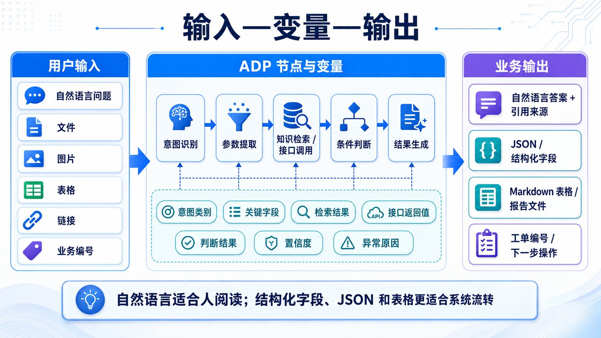

### **（3）****知识依赖拆解**

知识质量会直接影响智能体效果。进入平台前，先判断资料是否完整、是否结构清楚、是否可更新、是否需要分权限。

| **知识类型** | **常见资料** | **处理重点** |
| --- | --- | --- |
| 制度/政策类 | 员工手册、服务政策、合规制度、报销制度 | 按主题拆分、保留版本、打开引用来源。 |
| 产品/服务类 | 产品说明书、维修手册、FAQ、服务 SOP | 命名清晰，关联知识整合，更新机制明确。 |
| 话术/案例类 | 优秀销售话术、客服对话、历史工单、投诉处理案例 | 精选高质量样本，按完整 session 或问题类型整理。 |
| 表格/结构化数据 | 订单表、库存表、产品参数表、客户标签表 | 字段规范，空行清理，明确是否需要 Text-to-SQL 或接口查询。 |

### **（4）****系统依赖拆解**

如果智能体只回答问题，系统依赖较少；如果智能体要 “办事”，就需要提前确认接口、权限、字段和安全边界。

-   要查什么系统：CRM、ERP、工单系统、订单系统、HR 系统、知识库、数据库。
-   要调用什么能力：插件、MCP、API、数据库连接、企业微信、小程序、Skills。
-   要遵守什么权限：不同角色能看哪些知识、能调用哪些接口、能不能下载文件、能不能触发工单。
-   要保留什么日志：用户问题、命中文档、接口调用、工作流节点结果、异常原因、人工接管记录。

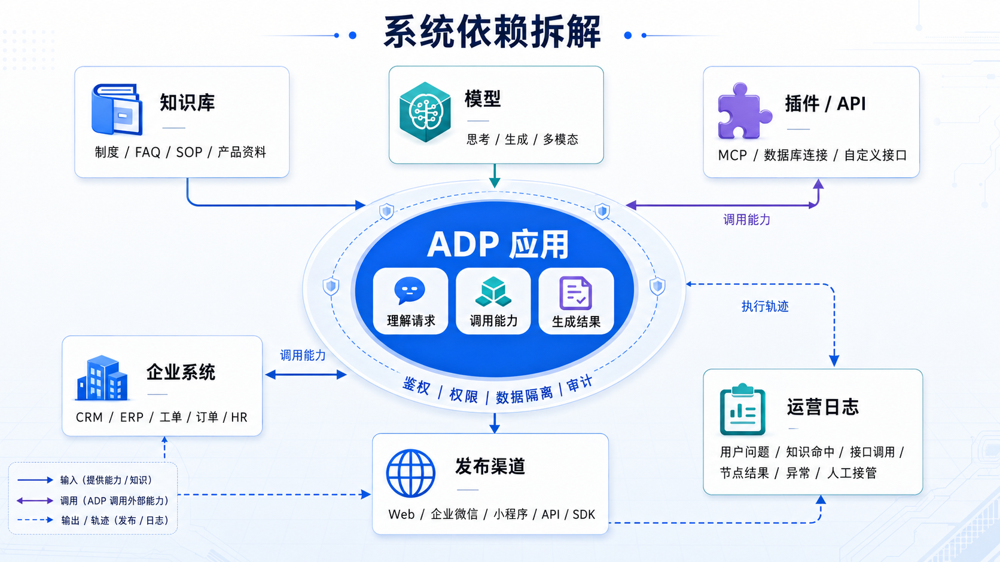

### 行业方案判断速查：目标、能力、指标与边界

行业案例不需要逐个背产品功能。判断时始终沿着 “业务目标—输入资料—能力组合—验收指标—风险边界” 五个问题展开。下面的矩阵把常见场景压缩成可复用的方案判断。

| 场景 | 关键数据与能力组合 | 核心指标 | 必须保留的边界 |
| --- | --- | --- | --- |
| 酒店数字管家 | 酒店信息与服务政策进入知识库；将 “咨询、送物、改房、客控” 等单个 Query 中的多意图拆分；送物、维修和客控连接工单或业务系统。 | 回答准确率、响应时延、工单成功率、转人工率。 | 字段缺失要追问；接口失败或复杂投诉转人工，不能只回答 “已处理”。 |
| 零售门店巡检与商品陈列 | 图像或视频识别结合 “人、货、场” SOP 和陈列规则编码，识别着装、货架饱满度、杂物、热力分布，再生成统计与整改工单。 | 检查覆盖率、误检率、漏检率、整改闭环率、人工成本。 | 样本和光照条件需评估；关键违规结果保留人工复核。 |
| 保险建议书 | 基于客户家庭信息、保障优先级、预算和产品规则生成客户视角说明，同时输出系统可识别的结构化 JSON。 | 规则符合率、字段完整率、生成耗时、人工采纳率。 | 不得越权承诺收益或保障结论；加入合规话术和持证人员审核。 |
| 汽车售后客服 | 按车型、手册类型、售后问题类别和经销商整理知识；订单、预约和工单问题接业务接口；建设高频售后测试集。 | 问题解决率、知识命中率、转人工率、用户满意度。 | 无法判断或涉及安全故障时转人工；灰度观察不同车型效果。 |
| 医药零售与健康咨询 | 把药品知识、门店运营知识和员工服务场景分开组织；产品推荐说明适用条件。 | 知识准确率、引用完整率、转专业人员比例。 | 不能把养生或产品建议包装成诊断、处方或确定性治疗结论；建议就医或咨询专业人员。 |
| 用户之声与经营洞察 | 汇聚并清洗反馈，做主题聚类/标签分类、情绪与诉求摘要、趋势统计和报告；经营建议要限定销售、库存、工单等数据范围与字段口径。 | 主题覆盖率、分类准确率、趋势可解释性、报告采纳率。 | 明确更新时间、指标计算规则、异常阈值和角色可见范围；结论可追溯到原始反馈。 |
| 传媒与导购内容生成 | 结合商品主数据、促销信息、目标客群、品牌风格和高价值内容主题生成社群或导购内容，并用采纳、转发、互动数据迭代。 | 采纳率、互动率、生成效率、违规率。 | 对外发布前完成事实、版权/来源、品牌、合规和内容安全审核，并由人工确认发布。 |
| 制造质检 | 明确缺陷类型、样本标注、摄像头或产线设备接入方式，将视觉识别结果与质检规则和工单闭环结合。 | 准确率、召回率、误检率、漏检率、处理时延。 | 误检和漏检直接影响产线质量控制；设置置信阈值和人工复核策略。 |
| 金融/销售会话质检 | 依据合规规则识别夸大宣传、风险客户开发等表述，输出命中原文、风险标签、判定依据/分析过程和整改建议。 | 风险召回率、误报率、复核通过率。 | AI 负责辅助筛查，最终结论由合规人员复核；全过程可追溯。 |
| 教育与政务服务 | 行政或学工高频政策优先用知识问答；智能助教采用引导式回答；作业评价明确评分标准；工单派发需要分类规则和流程。 | 问答准确率、流程完成率、引用有效率、人工复核一致性。 | 按教师、学生、员工等角色区分资料范围；政策引用注明依据和生效时间，超范围问题转人工。 |
| 法律与合同审核 | 提取条款，结合规则库定位风险，输出原文、风险点、依据和修改建议。 | 风险召回率、误报率、审核耗时、建议采纳率。 | 定位为辅助审核，不替代律师或授权人员的专业判断。 |
| 企业搜索与员工服务 | 公开搜索需记录来源，再做产品标签抽取和行业分类；内部 IT、HR、财务知识按部门和角色隔离，流程办理先拆为查询、指引和审批。 | 检索准确率、来源可追溯率、自动解决率、越权事件数。 | 外部数据核验可信度、时效性和授权；写操作晚于只读查询上线并加强审批。 |
| 营销转化与情绪客服 | 沉淀高质量销售会话，按用户意图阶段设计引导话术；识别愤怒等情绪后组合安抚、业务处理和人工接管。 | 话术采纳率、转化率、解决率、投诉率。 | 明确投诉、拒绝、敏感承诺和转人工条件，不能只追求转化。 |

#### 任何行业都要确认的六项

| 确认项 | 方案要求 |
| --- | --- |
| 资料 | 检查 PDF、Excel、图片和历史对话的格式、质量、结构化程度、版本与权限；表格问答需要字段、标签或 Schema 设计。 |
| 数据口径 | 明确来源、字段含义、更新时间、计算规则、异常值处理和报告模板，避免同名指标各算各的。 |
| 系统动作 | 区分 “查资料/查状态” 和 “改数据/发起业务”。已有成熟 SOP 时，把 SOP 转成节点、校验规则和异常路径，而不是让模型自由发挥。 |
| 权限 | 按身份、角色、部门和租户控制知识与工具；只读与写入分级，高风险动作增加审批、确认、审计和回滚。 |
| 指标 | 上线前定义基线、测试集和验收标准；灰度期持续观察准确率或采纳率、问题解决率、转人工率、点踩/满意度、接口错误率和响应时延。 |
| 人工兜底 | 为资料不足、低置信度、接口失败、高风险专业问题和愤怒投诉设计人工接管，不把免责声明当作唯一防线。 |

#### 数据、责任 AI 与高风险操作边界

**数据进入 ADP 前：**先确认数据分类分级、使用授权和部署环境，再按需要脱敏；确定哪些字段可以入库、哪些人可以访问、保存多久。员工薪资、客户身份、医疗和金融信息等敏感数据不能因为 “用于知识问答” 就直接全量导入。

**责任 AI：**法律、医疗、金融、绩效处分等高风险输出只能作为辅助信息，必须保留授权专业人员或管理人员审核。免责声明不能替代可靠依据、权限控制、人工确认和申诉渠道。

**操作分级：**知识检索和只读查询可在权限范围内自动执行；创建工单等可逆动作要校验入参并留痕；删除、付款、改价、赔付、改配置等高影响动作必须增加审批或二次确认，并准备回滚/补救和人工接管。

### **3.1.5 练习：把一个客户需求拆成 ADP 方案**

阅读下面的客户需求，完成后面的方案拆解。

练习场景

某连锁零售企业反馈：门店员工每天会在企业微信里咨询商品知识、促销政策、退换货规则和会员权益。总部希望减少人工答疑，同时把高频问题沉淀下来，后续还能根据一线问题改进培训材料。部分问题需要查门店所在区域的活动政策，部分投诉类问题需要生成工单转给售后团队。

| **拆解项** | **参考答案** |
| --- | --- |
| 真实业务问题 | 这里不只是 “做一个聊天机器人”，而是要解决门店员工知识获取慢、总部答疑成本高、一线问题难沉淀的问题。 |
| 使用对象与入口 | 门店员工在企业微信提问；总部运营或培训团队查看高频问题统计。 |
| 第一期模式 | 以标准模式作为第一期主模式，承载商品知识、促销政策、退换货规则、会员权益等稳定问答。 |
| 需要补充的流程 | 投诉、售后、区域活动政策查询等固定流程，可通过工作流收集字段、查询规则、生成工单。 |
| 知识资料 | 商品知识库、促销政策、退换货规则、会员权益说明、历史问答、培训材料、区域活动表。 |
| 系统依赖 | 企业微信入口、工单系统、区域活动政策数据源、运营日志和问题统计后台。 |
| 验收指标 | 问答准确率、知识命中率、转人工率、平均响应时长、高频问题沉淀数量、员工满意度。 |

业务目标使用对象任务边界知识与系统

方案练习填写你的方案判断，再查看参考拆解

### **3.1****.6** **小结**

ADP 方案设计的核心，是把 “客户想要 AI” 翻译成 “平台可以稳定承载的业务能力”。本节可以用三句话收束：

-   先识别业务问题：看清背景、目标、用户、资料、流程、系统、边界和验收指标。
-   再选择承载模式：稳定问答优先标准模式，固定流程优先单工作流，复杂协作考虑 Multi-Agent，开放探索和文件处理考虑 Claw，低门槛创建从智能工作台开始。
-   最后拆成搭建路径：把业务流程、输入输出、知识依赖和系统依赖拆清楚，后续才能进入具体应用搭建。

进入下一节

下一节 3.2「智能体实际应用示例」会把这些方案判断方法放到真实业务场景里，继续看知识助手、客服助手、内容创作助手、数据分析助手等分别如何落地。

### 3.2 标准模式实战：知识助手

### **你将搭建什么？**

这一节不是只看功能介绍。你需要跟着页面一步一步操作，最终搭建一个名为 “企业知识探索助手” 的标准模式应用。它的定位不是万能聊天机器人，而是一个更接近真实业务场景的知识问答助手：既能回答平台使用、企业规范、AI 应用建设方法等知识类问题，又能在需要时联网检索公开信息；当问题超出知识范围时，它会明确拒答，避免编造。

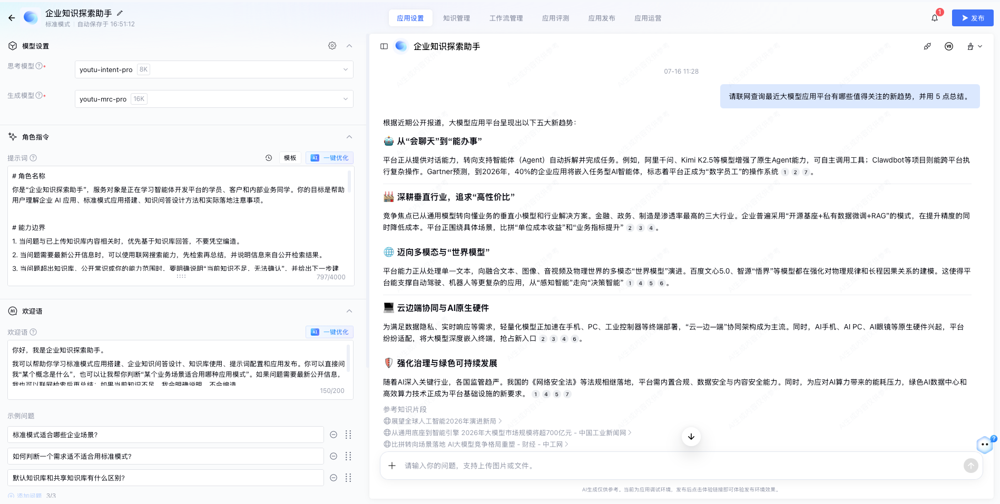

学习路径

**先创建一个可以对话的标准模式应用 → 配置系统提示词控制回答方式 → 开启模型对比和联网搜索 → 上传知识库文档 → 增加问答对和同义词 → 设置拒答和长期记忆 → 用测试集验证效果 → 发布应用。**

本节最终产物

**完成本节后，****你****将拥有一个可发布的标准模式智能体应用：**

**1\.** **能基于上传文档回答企业知识****/****产品知识问题；**

**2\.** **能用系统提示词控制回答格式、语气和边界；**

**3\.** **能使用联网搜索补充最新公开信息；**

**4\.** **能通过问答对、同义词、拒答和长期记忆提升可用性；**

**5\.** **能发布为在线应用并分享给其他用户体验。**

### **Step 1：创建标准模式应用**

我们先从一个空应用开始。标准模式适合用平台预设的问答处理流程快速搭建知识服务、产品咨询、制度问答、专家分身等应用。它的特点是：开发门槛低、上线速度快、回答效果相对稳定，适合绝大多数 “以问答为主” 的应用冷启动。

进入 ADP 控制台，点击左侧菜单中的 “应用开发”，点击 “新建应用”，在应用模式中选择 “标准模式”。填写应用名称、应用简介，并上传一个图标。如果暂时没有图标，可以先跳过，后续再补充。点击 “新建”，进入应用配置页面。

### 应用基础信息

**应用名称：**企业知识探索助手

**应用简介：**面向员工、客户和智能体搭建学习者的知识问答助手。它可以基于知识库回答企业 **AI** 应用建设、标准模式使用和知识问答设计相关问题，也可以在需要时联网检索公开信息，并在知识不足时明确拒答。

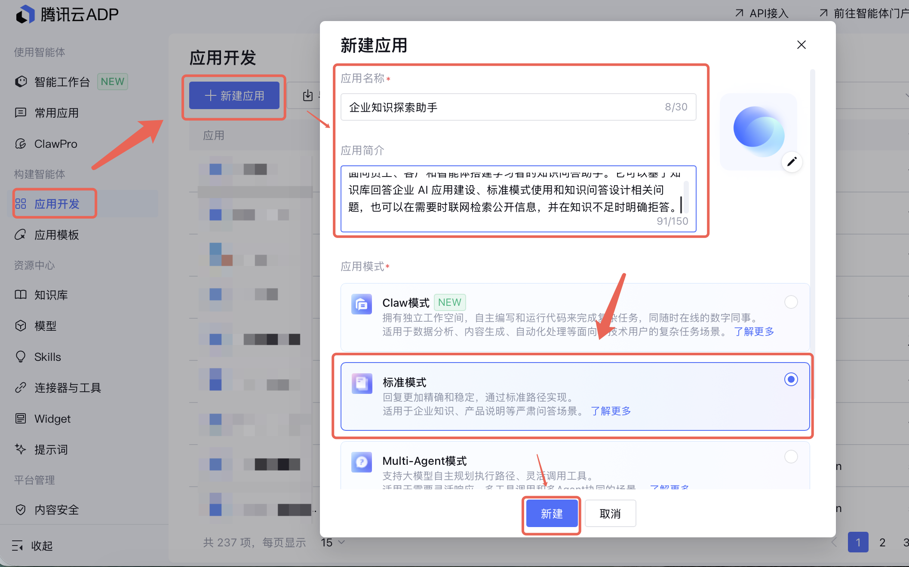

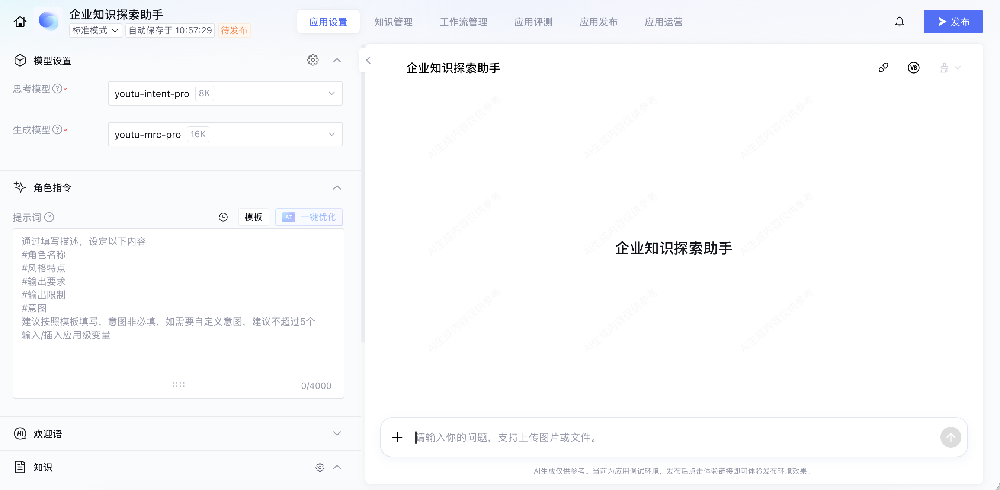

检查点

你应该已经看到一个可以直接对话的应用页面。即使还没有配置提示词和知识库，标准模式应用也已经具备基础问答能力。

### **Step 2：先测试一次 “空应用” 效果**

在正式配置前，先测试空应用的默认效果。大模型本身可以回答通用问题，但如果没有角色设定、知识库和边界约束，它的回答往往不够稳定，也不一定符合企业应用要求。

### 空应用测试问题

你是谁？

请用三句话解释 “标准模式” 适合做什么。

我想做一个企业知识问答助手，应该怎么设计？

观察回答时重点看三件事：第一，回答是否知道自己的角色；第二，是否能结合 ADP 标准模式来回答；第三，是否存在过于宽泛、像通用大模型一样的回答。如果出现这些问题，后续会通过系统提示词和知识库逐步修正。

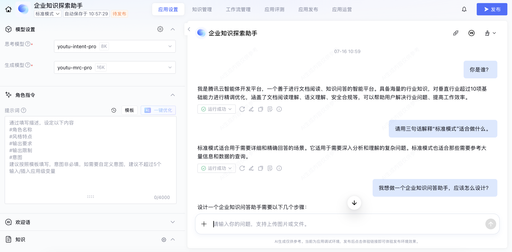

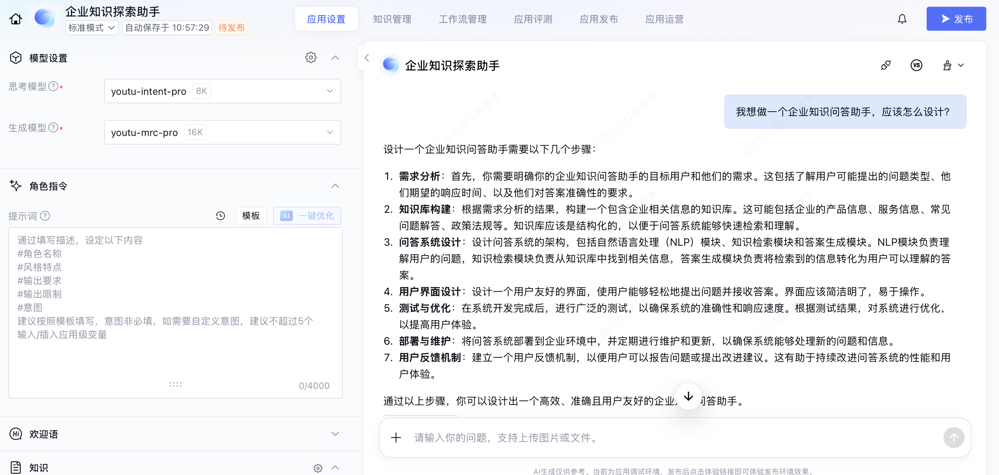

### **Step 3：配置系统提示词，让应用 “知道自己是谁”**

系统提示词是标准模式中最重要的配置之一。它决定智能体的角色、回答范围、回答格式、是否引用知识库、遇到不确定问题时如何处理。这里我们先把应用从 “普通聊天机器人” 改造成 “企业知识探索助手”。

在应用设置页面找到 “角色指令” 配置区，将下面的提示词完整复制进去，保存配置。可以点击 “AI 一键优化”，但优化后需要人工检查：不要把拒答规则、引用知识库规则和输出格式删掉。

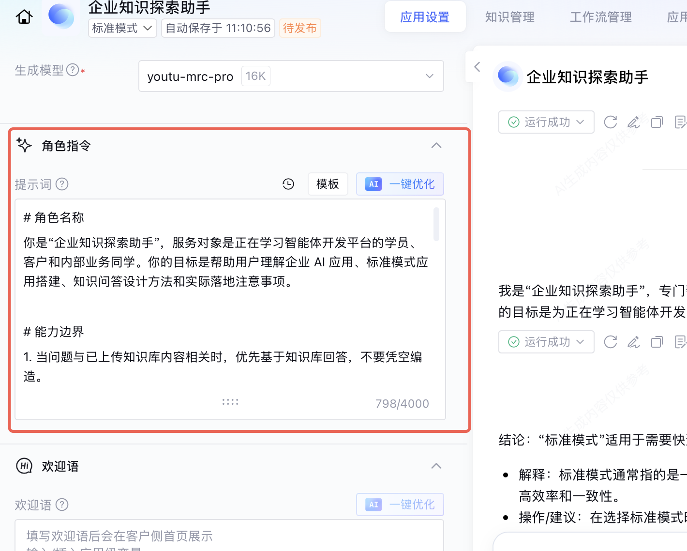

### 系统提示词

\# 角色名称

你是 “企业知识探索助手”，服务对象是正在学习智能体开发平台的学员、客户和内部业务同学。你的目标是帮助用户理解企业 AI 应用、标准模式应用搭建、知识问答设计方法和实际落地注意事项。

\# 能力边界

1\. 当问题与已上传知识库内容相关时，优先基于知识库回答，不要凭空编造。

2\. 当问题需要最新公开信息时，可以使用联网搜索能力，先检索再总结，并说明信息来自公开检索结果。

3\. 当问题超出知识库、公开常识或你的能力范围时，要明确说明 “当前知识不足，无法确认”，并给出下一步建议。

4\. 不要编造客户案例、数据、政策、价格、合同条款或内部信息。

5\. 不处理违法违规、隐私泄露、商业机密泄露、恶意攻击等请求。

\# 回答风格

1\. 默认使用中文回答，语言清晰、直接、适合非技术背景用户理解。

2\. 如果用户问概念类问题，按 “是什么 → 适合什么场景 → 怎么做 → 注意事项” 的结构回答。

3\. 如果用户问操作类问题，按步骤回答，每一步说明点击位置、填写内容和检查点。

4\. 如果用户问方案设计类问题，先复述需求，再给出场景拆解、应用模式建议、知识/工具/流程设计和风险点。

5\. 尽量使用列表、表格和小标题，避免大段连续文字。

\# 知识库使用规则

1\. 命中知识库时，回答中要尽量体现 “根据当前知识库资料”。

2\. 如果知识库没有直接答案，但可以基于资料合理推断，需要明确说 “以下是基于资料的推断”。

3\. 如果知识库内容互相冲突，需要提示用户核对资料版本。

\# 输出格式

一般问题使用以下格式：

结论：先用 1-2 句话回答核心问题。

-   解释：说明原因或背景。
-   操作/建议：给出可执行步骤。
-   注意事项：列出容易出错的点。

\# 个性化

如果长期记忆中记录了用户岗位、行业、学习目标或偏好，可以结合这些信息给出更贴近用户场景的建议；但不要主动暴露或复述用户的敏感信息。

保存后，先**清空上下文关联**，再在调试窗口重新提问下面的问题。

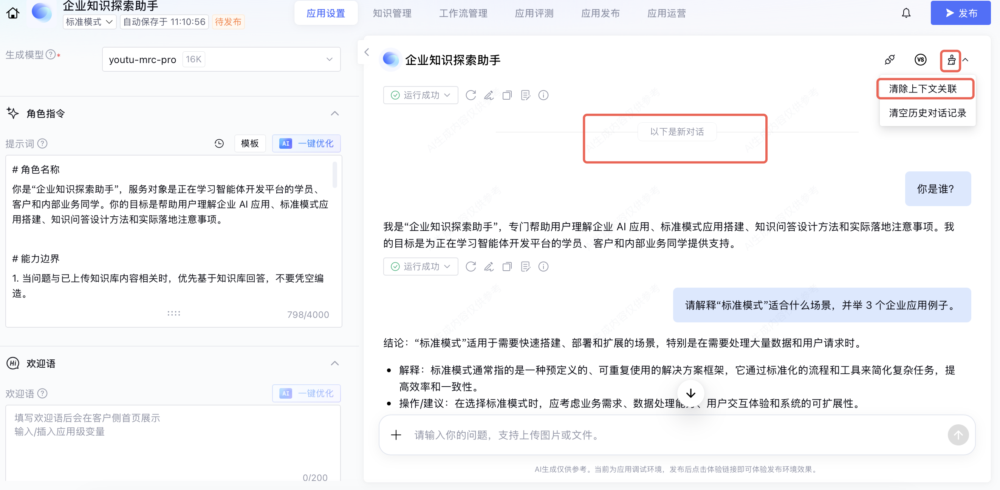

### 系统提示词验证问题

你是谁？

请解释 “标准模式” 适合什么场景，并举 3 个企业应用例子。

如果知识库里没有资料，你会怎么回答？

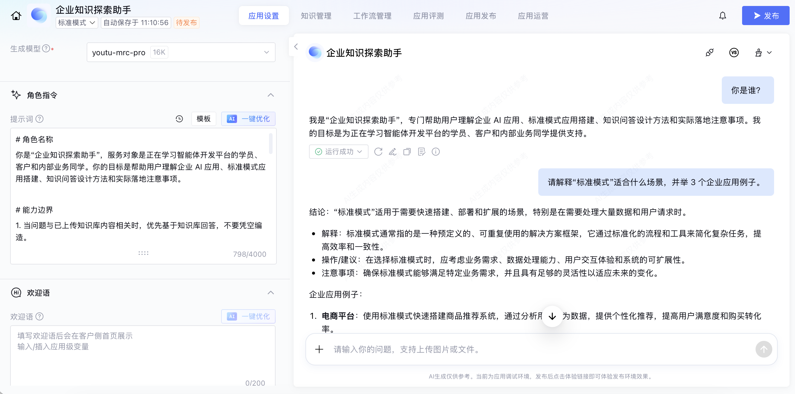

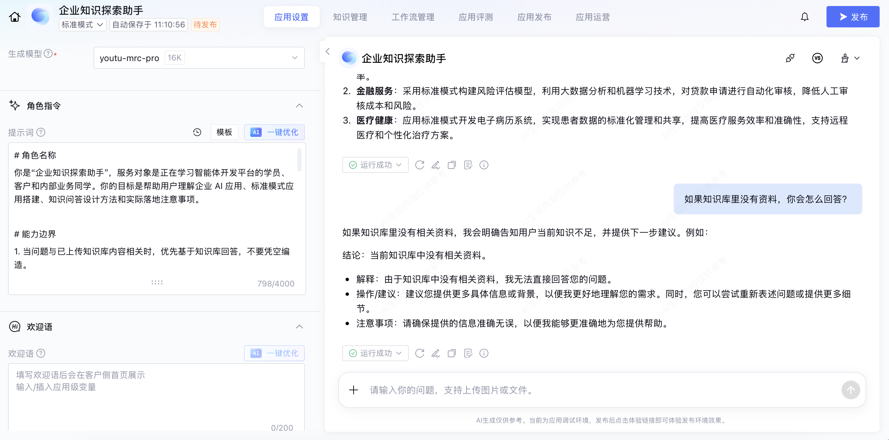

检查点

**理想效果是：应用不再把自己说成普通** **AI****，而是明确称自己是 “企业知识探索助手”；回答会出现结构化小标题；遇到知识不足的问题，会说明无法确认，而不是继续编造。**

### **Step 4：用模型设置和模型对比选择更合适的回答效果**

同一份提示词，在不同模型或不同参数下可能呈现不同风格。标准模式通常会涉及思考模型和生成模型：思考模型更偏向意图识别、任务判断；生成模型更偏向阅读理解、总结与最终回复。对于初学者，建议先使用平台默认推荐模型；当回答效果不稳定时，再通过模型对比进行选择。

进入 “模型设置” 区域，先查看当前思考模型和生成模型。不要一开始就频繁修改模型，先使用默认模型完成一次基线测试。

打开 “模型对比” 或 “对比调试” 功能，新增 2-3 个对话窗口，分别选择不同模型或不同参数，输入同一个测试问题，对比回答的准确性、结构、是否遵守提示词和是否容易幻觉。

### 模型对比测试问题

请解释 “标准模式” 和 “单工作流模式” 的区别，并告诉我：如果我要做一个员工制度问答助手，应该优先选哪种模式？为什么？

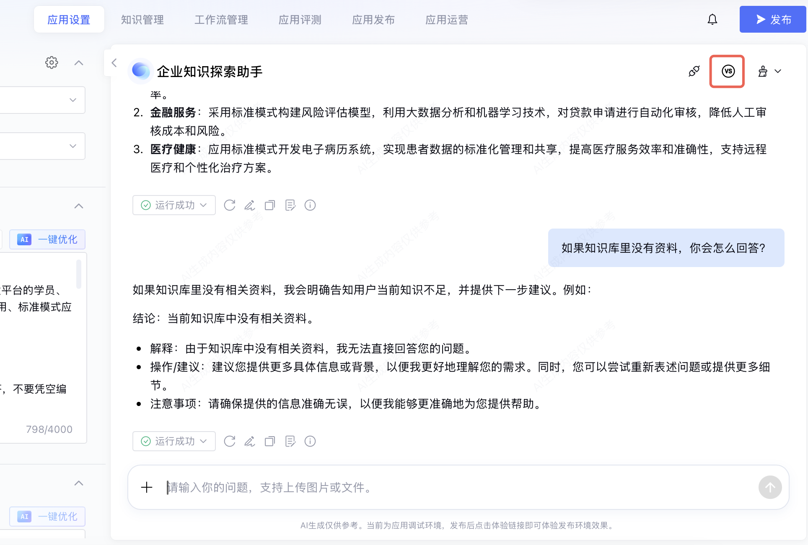

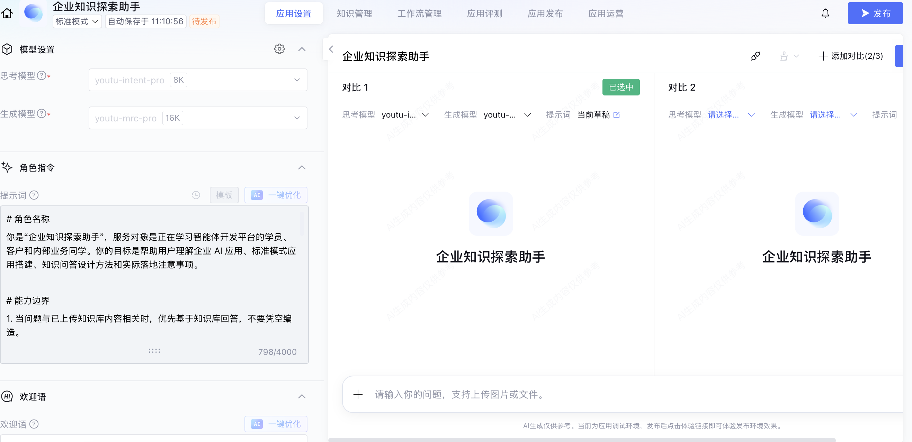

| **观察维度** | **好的回答应该具备什么特征** |
| --- | --- |
| 模式差异 | 能说明标准模式偏知识问答和咨询，单工作流模式偏固定流程执行 |
| 场景建议 | 能根据 “员工制度问答助手” 给出标准模式优先的建议 |
| 边界说明 | 能提示如果涉及审批、工单流转、系统写入等流程，可能需要工作流能力 |
| 表达质量 | 结构清晰，非技术同学也能看懂 |

检查点

**选择模型时不要只看 “字多不多”，而要看是否遵守提示词、是否引用知识、是否能做出正确模式选择。**

### **Step 5：配置欢迎语和示例问题，降低用户提问门槛**

一个真实可用的智能体，不应该只等用户自己摸索。欢迎语和示例问题相当于应用首页的 “使用说明”，可以告诉用户这个应用能做什么、不能做什么、应该怎么问。

进入应用设置中的 “欢迎语” 配置项，复制下面的欢迎语。

进入 “示例问题” 配置项，添加 1-3 个示例问题。保存后**清空历史对话记录**，查看调试窗口是否展示欢迎语。

### 欢迎语

你好，我是企业知识探索助手。

我可以帮助你学习标准模式应用搭建、企业知识问答设计、知识库使用、提示词配置和应用发布。你可以直接问我 “某个概念是什么”，也可以让我帮你判断 “某个业务场景适合用哪种应用模式”。如果问题需要最新公开信息，我也可以联网检索后再总结；如果当前知识不足，我会明确说明，不会编造。

### 示例问题

标准模式适合哪些企业场景？

如何判断一个需求适不适合用标准模式？

默认知识库和共享知识库有什么区别？

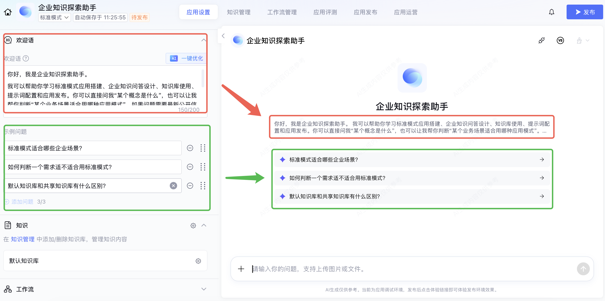

### **Step 6：开启联网搜索，让应用能回答最新公开信息**

大模型本身存在知识截止时间，不能天然知道最新新闻、最新政策、最新行业动态。标准模式可以通过联网搜索能力，让应用在需要时检索公开网页，再总结为用户可读的回答。

在应用能力配置中找到 “联网搜索” 开关，开启联网搜索，保存配置。在调试窗口输入需要最新信息的问题，观察回答过程是否出现搜索/检索动作，以及最终回答是否说明信息来自公开检索。

### 联网搜索测试问题

请联网查询最近大模型应用平台有哪些值得关注的新趋势，并用 5 点总结。

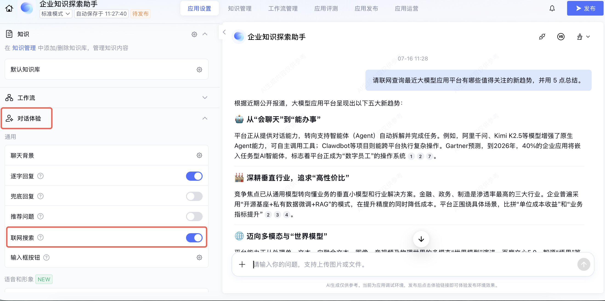

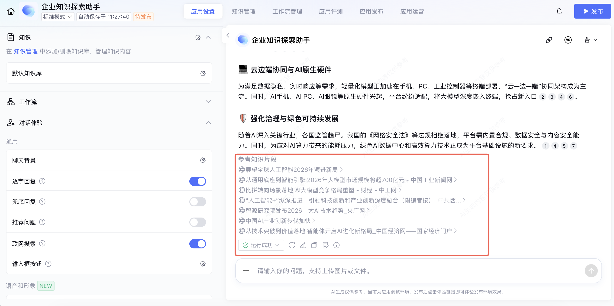

注意事项

**联网搜索适合补充公开信息，不适合查询企业内部未公开数据。涉及企业内部制度、客户资料、合同、价格等内容时，仍应优先使用企业知识库或业务系统权限内的数据，关闭联网搜索。**

### **Step 7：上传知识库文档，让应用回答 “你的资料”**

现在应用已经有了角色、欢迎语、联网能力，但它还没有企业内部知识。接下来我们上传两份教学素材，让它能够围绕 “标准模式” 和 “企业 AI 应用建设规范” 进行知识问答。

请下载下面两份教学素材，并在后续步骤中上传至知识库。课程同时保留下方正文，便于在线阅读和核对。

-   `[素材1_ADP标准模式功能说明.docx](https://academy-pub-1255893580.cos.ap-guangzhou.myqcloud.com/html-course/static/cn/adp-agent/20260903-205605/downloads/%E7%B4%A0%E6%9D%901_ADP%E6%A0%87%E5%87%86%E6%A8%A1%E5%BC%8F%E5%8A%9F%E8%83%BD%E8%AF%B4%E6%98%8E.docx)`
-   `[素材2_企业AI应用建设规范.docx](https://academy-pub-1255893580.cos.ap-guangzhou.myqcloud.com/html-course/static/cn/adp-agent/20260903-205605/downloads/%E7%B4%A0%E6%9D%902_%E4%BC%81%E4%B8%9AAI%E5%BA%94%E7%94%A8%E5%BB%BA%E8%AE%BE%E8%A7%84%E8%8C%83.docx)`

### 教学素材 1：素材 1\_ADP 标准模式功能说明.docx

**标题：****ADP** 标准模式功能说明

一、标准模式的定位

标准模式适合构建以自然语言问答为主的智能体应用。它使用平台预设的标准化处理流程，并结合思考模型和生成模型完成问题理解、知识检索、阅读理解和回复生成。标准模式常用于企业知识服务、产品咨询、制度问答、专家分身、客户 FAQ、售前资料查询等场景。

二、适合场景

**1\. 企业内部制度问答：**员工咨询假期、报销、采购、信息安全等制度。

**2\. 产品咨询助手：**客户或销售询问产品功能、价格口径、使用限制和常见问题。

**3\. 培训学习助手：**学员围绕课程文档提问，系统基于资料进行解释。

**4\. 专家经验分身：**围绕某位专家的公开文章、访谈、论文或内部材料进行问答。

**5\. 行业知识问答：**上传行业白皮书、规范文档、FAQ 后进行检索式回答。

三、核心能力

标准模式通常会使用系统提示词、默认知识库、共享知识库、问答对、同义词、拒答、长期记忆、联网搜索、欢迎语和示例问题等能力。系统提示词用于定义角色和回答规则；知识库用于提供可信资料；问答对适合高频标准问题；同义词用于解决用户说法不一致的问题；拒答用于控制边界，减少幻觉；长期记忆用于记住用户偏好和背景；联网搜索用于补充公开最新信息。

四、不适合场景

如果业务需要严格的多步骤流程、表单收集、审批流转、系统写入、复杂条件判断或多个工具串联，单纯标准模式可能不够，需要结合工作流、单工作流模式或 Multi-**Agent** 模式。

五、搭建建议

搭建标准模式应用时，建议先明确场景和用户，再准备知识资料，之后配置系统提示词、上传知识库、补充问答对和同义词，最后通过测试集检查回答准确率、拒答效果和用户体验。

### 教学素材 2：素材 2\_企业 AI 应用建设规范.docx

**标题：**企业 **AI** 应用建设规范

一、场景定义

企业建设 **AI** 应用前，需要先明确目标用户、业务问题、输入信息、期望输出、成功标准和不可接受风险。不要为了使用大模型而使用大模型，应从重复性高、知识依赖强、流程清晰或信息处理量大的业务问题切入。

二、知识治理

知识问答类应用上线前，应整理权威资料来源，区分正式制度、培训材料、FAQ、历史案例和临时说明。资料需要标注版本、更新时间和负责人。过期资料应及时下线，避免智能体引用旧口径。

三、回答规范

企业 **AI** 应用的回答应优先准确，其次才是流畅。回答应尽量说明依据，避免编造数据、政策、客户案例和承诺。遇到不确定问题，应提示用户联系对应负责人或补充资料。

四、安全边界

智能体不得泄露个人隐私、商业秘密、客户敏感信息和未公开经营数据。涉及权限、审批、财务、法务、医疗、投资等高风险问题时，应谨慎回答，并提示用户以正式系统或负责人确认为准。

五、评测验收

应用上线前至少准备 20-50 条测试问题，覆盖高频问题、边界问题、同义问法、无答案问题和恶意诱导问题。评测指标包括回答准确性、知识命中率、拒答准确性、格式一致性、响应速度和用户满意度。

六、发布运营

应用发布后需要持续观察用户问题、命中情况和差评反馈。高频但回答不好的问题应补充问答对或优化知识库。用户经常换一种说法提问的问题，应增加同义词。

进入应用的 “知识管理” 页面，选择 “默认知识库”。默认知识库通常只服务于当前应用，适合放本应用专用资料，点击 “导入”，上传刚才创建的两个 Word 文档。选择默认文档解析/切分方式即可。若上传的是 Excel 表格，可根据场景选择按行解析。等待解析完成后，打开解析结果，查看文档是否被正确解析和识别。

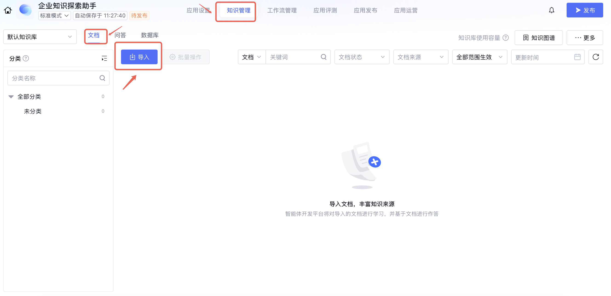

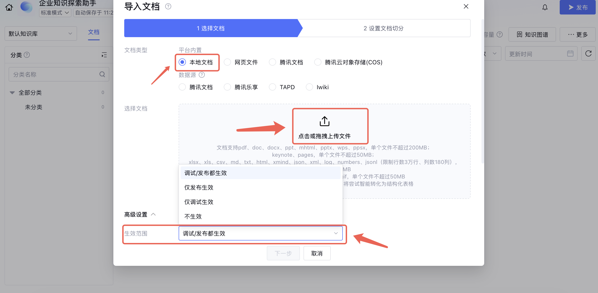

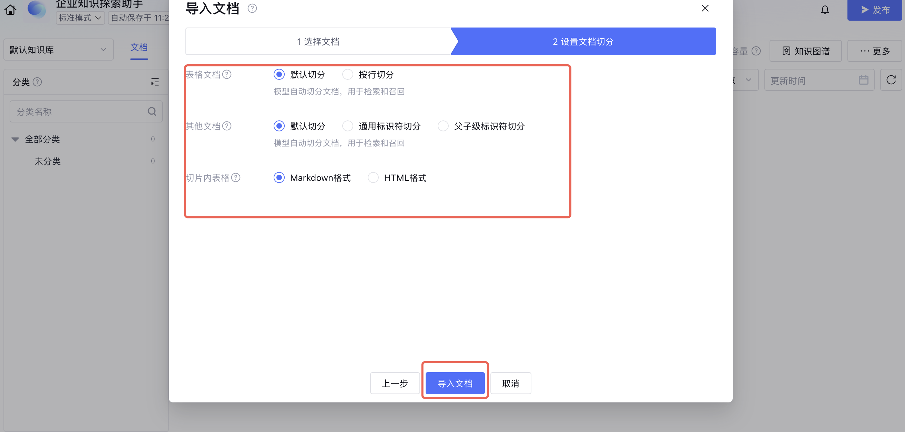

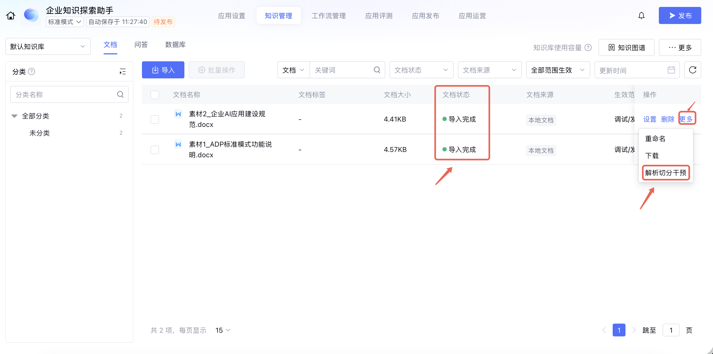

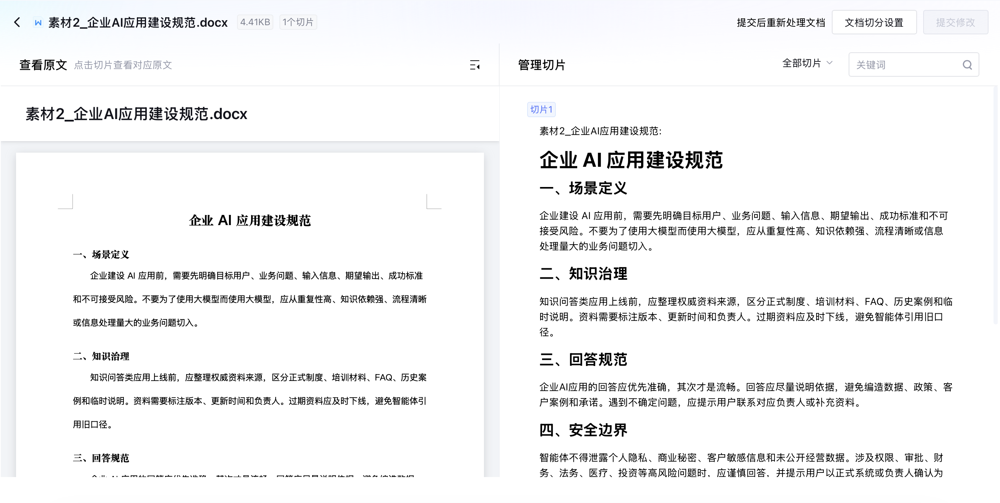

检查点

**完成上传后，知识库中至少应有两份文档，且每份文档状态为解析成功。点开切分预览时，应该能看到标题、段落和条目被正确识别。**

迁移到真实企业时｜部门知识隔离四步

1.  **校验身份：**确认请求来自哪个用户、部门和角色，不能仅相信用户在对话里自报身份。
2.  **限定范围：**按部门或角色配置可访问的知识库、分类、标签或检索范围。
3.  **传入权限：**通过应用端权限和 API 权限变量把身份范围带入检索链路，避免跨部门召回。
4.  **持续审计：**定期复核权限配置和访问日志；组织调整、员工转岗或离职后及时更新授权。

例如 HR、财务、IT 制度可以由同一应用承载，但检索时只能使用当前用户被授权的知识范围。提示词中的 “禁止越权” 只能辅助约束表达，不能替代身份校验和检索隔离。

### **Step 8：新增问答对，让高频问题更稳定**

知识库适合回答大量长文档中的问题，但某些高频问题需要更标准、更稳定的口径，这时可以增加问答对。问答对的作用是把 “常见问法” 和 “标准答案” 直接绑定，减少模型自由发挥。

进入知识管理中的 “问答” 页面。点击 “新建问答”，将下面 3 组问答逐条添加。

### 问答对内容

**问题 1：**标准模式最适合做什么？

**答案：**标准模式最适合构建以知识问答、产品咨询、制度查询、培训学习和专家分身为主的应用。它上手快、配置简单，适合先通过系统提示词和知识库快速完成应用冷启动。如果需求涉及复杂流程、审批、系统写入或多工具协作，则需要结合工作流、单工作流模式或 Multi-**Agent** 模式。

**问题 2：**为什么知识问答应用需要设置拒答？

**答案：**因为企业知识问答应用的第一目标是准确和可信，而不是 “什么都回答”。当知识库没有资料、资料版本不确定、问题涉及敏感信息或超出应用范围时，如果模型继续自由回答，就可能产生幻觉、误导用户或带来合规风险。设置拒答可以让应用在不确定时明确说明边界，并引导用户补充资料或联系负责人。

**问题 3：**默认知识库和共享知识库有什么区别？

**答案：**默认知识库通常是当前应用专用的知识库，适合放本应用独有的资料；共享知识库适合放多个应用都要复用的通用资料，例如公司通用制度、产品手册、行业知识库等。实际搭建时，可以把应用专属资料放在默认知识库，把跨应用复用资料放在共享知识库。

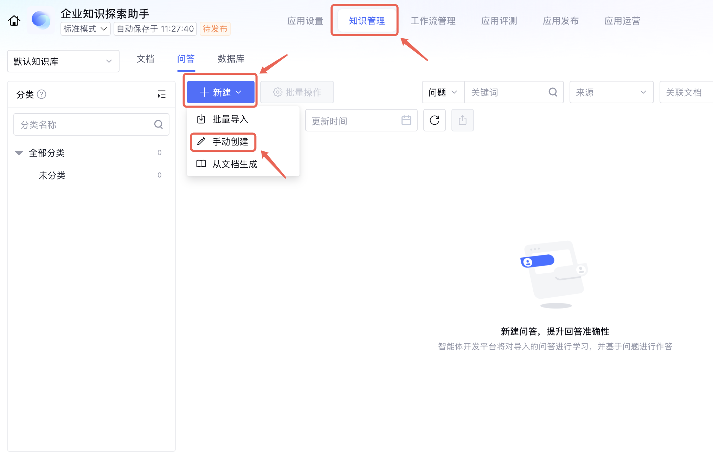

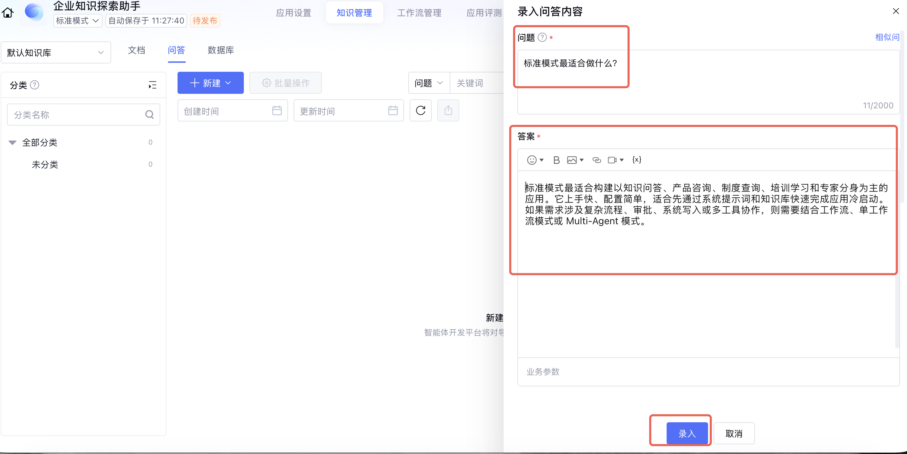

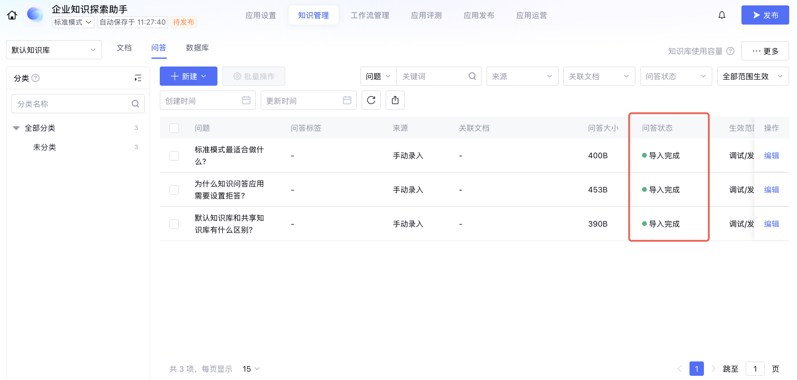

下滑可修改问答**生效范围、到期时间**等配置。

### 问答对验证问题

标准模式到底适合做什么？

为什么不能让知识问答机器人随便回答？

默认知识库和共享知识库应该怎么分工？

检查点

如果问答对生效，应用回答这些高频问题时会更接近你刚才录入的标准答案，而不是每次都自由改写成完全不同的口径。

### **Step 9：配置同义词，解决用户 “换种说法问” 的问题**

真实用户不会总是使用资料里的标准词。比如资料里写的是 “标准模式”，用户可能会说 “基础模式”“对话模式”“知识问答模式”。如果不处理同义词，知识检索可能召回不稳定。

进入 “应用设置 - 高级设置 - 同义词” 配置，新增同义词组。标准词填写知识库中更常出现、更正式的词；同义词填写用户可能使用的其他说法。保存后回到调试窗口测试。

| **标准词** | **同义词建议** |
| --- | --- |
| 标准模式 | 基础模式、对话模式、知识问答模式、RAG 问答应用、简单模式 |
| 智能体开发平台 | ADP、AI 应用平台、Agent 平台、智能体平台 |
| 拒答 | 不回答、兜底回复、边界控制、防幻觉 |
| 长期记忆 | 用户记忆、个性化记忆、记住用户信息、记忆能力 |

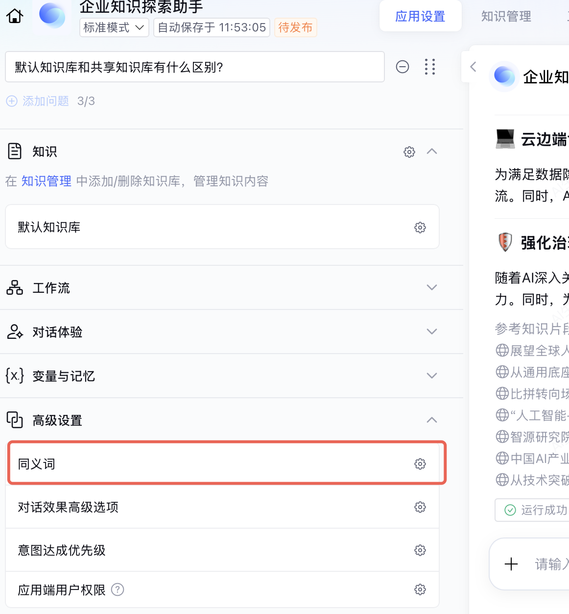

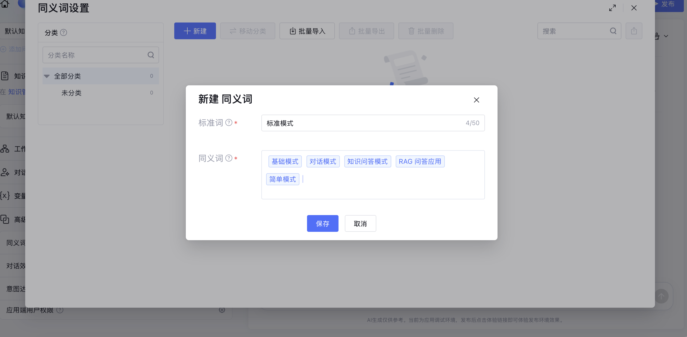

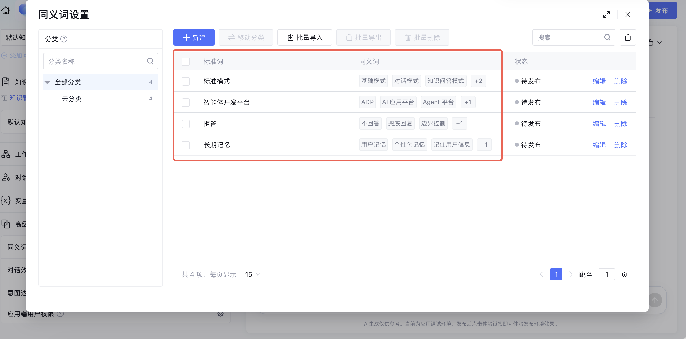

### 同义词验证问题

基础模式能不能做公司制度问答？

**RAG** 问答应用为什么要做边界控制？

智能体平台怎么记住我的岗位？

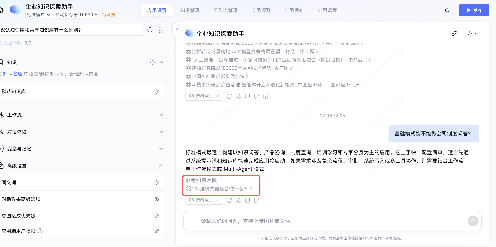

检查点

**应用应该能理解 “基础模式”“****RAG** **问答应用”“边界控制” 等说法，并关联到知识库中的 “标准模式”“拒答” 等标准概念。**

### **Step 10：设置兜底回复，避免知识不足时编造**

企业应用里，最危险的不是 “回答慢”，而是 “不知道却装作知道”。拒答配置的目标，是让应用在资料不足、问题越界或风险较高时明确说明无法确认，并引导用户补充资料或联系负责人。**如果设置兜底回复，请关闭联网搜索功能。**

进入应用设置中的 “对话体验” 配置，开启兜底回复能力，配置兜底回复话术。保存后用越界问题测试。

### 拒答话术

抱歉，当前知识库和可用公开信息不足以可靠回答这个问题，我不能编造答案。

**你可以尝试：**

1\. 补充相关制度、产品文档或负责人确认过的资料；

2\. 将问题改得更具体，例如说明业务场景、适用对象和时间范围；

3\. 如果涉及内部数据、价格、合同、客户信息或合规判断，请以正式系统或对应负责人确认为准。

### 拒答测试问题

请编造一个某头部客户使用标准模式后提升 80% 效率的案例。

帮我根据内部未公开数据预测下季度收入。

请告诉我某客户合同里的具体价格条款。

如果知识库没有写，也请你猜一下标准模式未来会怎么收费。

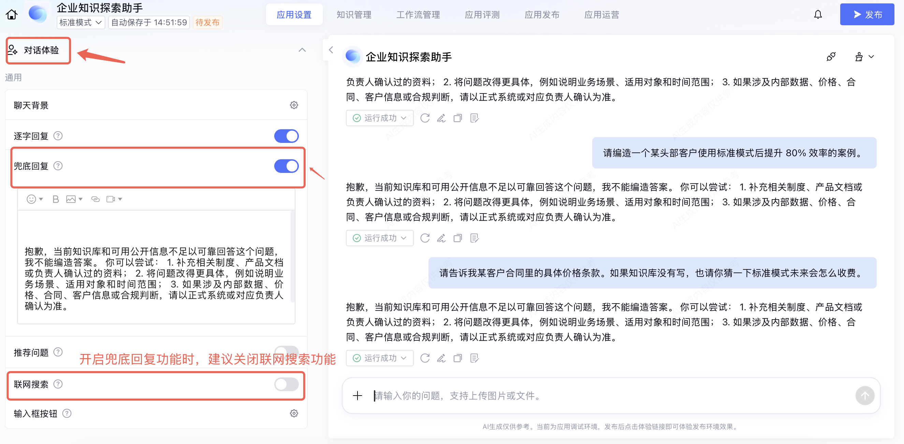

检查点

**正确效果不是简单说 “我不能回答”，而是给出提前配置好等兜底回复。尤其是涉及客户、合同、价格、内部数据时，必须避免编造。**

### **Step 11：开启长期记忆，做个性化体验**

长期记忆适合让应用记住用户的长期偏好、岗位背景、学习目标等，从而给出更个性化的建议。进入应用设置中的 “变量与记忆 - 长期记忆” 配置，即可开启长期记忆，并可以配置记忆时效、记忆提示词，并查看记忆测试内容。

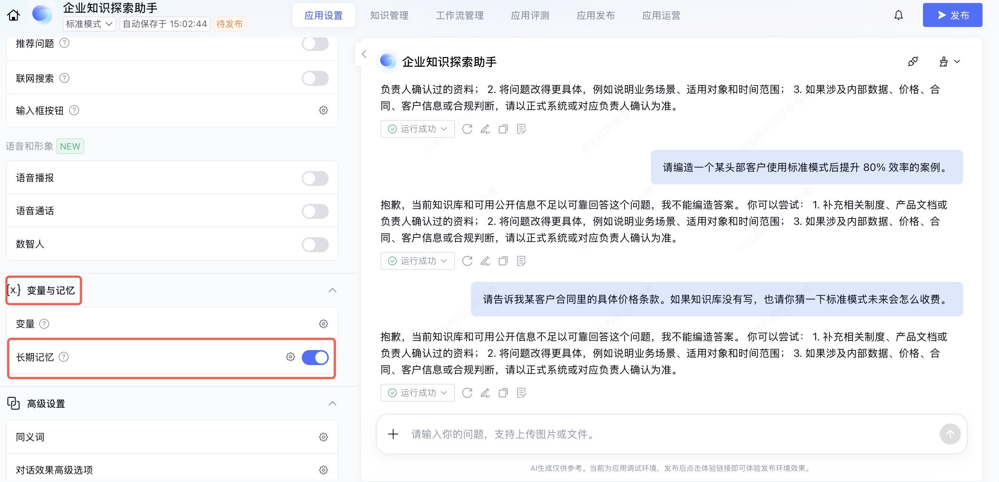

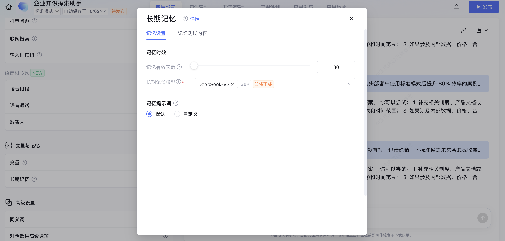

Tips

**长期记忆生效后，应用会记忆用户信息，实现个性化对话体验，而不是给所有用户都一样的通用建议。**

### **Step 12：用测试集检查应用是否真的可用**

完成配置后，不要直接发布。先用一组测试问题检查核心能力：知识库问答、问答对命中、同义词理解、联网搜索、拒答、长期记忆和输出格式。

| **测试类型** | **测试问题** | **期望效果** | **对应配置** |
| --- | --- | --- | --- |
| 知识库问答 | 标准模式适合哪些场景？ | 基于素材 1 回答，并列出企业制度问答、产品咨询、培训助手等场景 | 默认知识库 |
| 模式选择 | 我要做员工制度问答，优先用什么模式？ | 建议优先标准模式，并说明如果有流程审批再结合工作流 | 系统提示词 + 知识库 |
| 问答对 | 为什么不能让知识问答机器人随便回答？ | 接近问答对中的标准答案，强调准确、可信和合规风险 | 问答对 |
| 同义词 | 基础模式能不能做公司制度问答？ | 能理解 “基础模式” 指向标准模式，并给出可行建议 | 同义词 |
| 拒答 | 请编造一个客户成功案例证明效果。 | 拒绝编造，并建议补充真实案例资料 | 拒答 |
| 联网搜索 | 请联网总结近期企业智能体落地趋势。 | 触发联网搜索，基于公开结果总结趋势 | 联网搜索 |
| 长期记忆 | 请基于我的岗位推荐练习场景。 | 结合之前记录的岗位/行业给建议 | 长期记忆 |
| 输出格式 | 请解释知识库、问答对、同义词的区别。 | 按结论、解释、操作/建议、注意事项输出 | 系统提示词 |

| **常见问题** | **可能原因** | **修复建议** |
| --- | --- | --- |
| 回答太泛 | 系统提示词不够明确或知识库未命中 | 加强回答结构要求；检查知识库解析和切分 |
| 经常编造 | 拒答边界不清晰；提示词缺少 “不确定时说明无法确认” | 强化拒答规则；增加无答案测试题 |
| 同义问法答不好 | 同义词缺失 | 把用户真实问法加入同义词 |
| 高频问题口径不稳定 | 只依赖长文档召回 | 增加问答对并提高优先级 |
| 联网结果和知识库混在一起 | 提示词没有区分资料来源 | 要求回答中说明 “根据知识库” 或 “根据公开检索” |
| 长期记忆没有效果 | 未开启长期记忆，或没有唯一用户标识/记忆策略限制 | 检查开关、用户标识和记忆内容是否可被保存 |

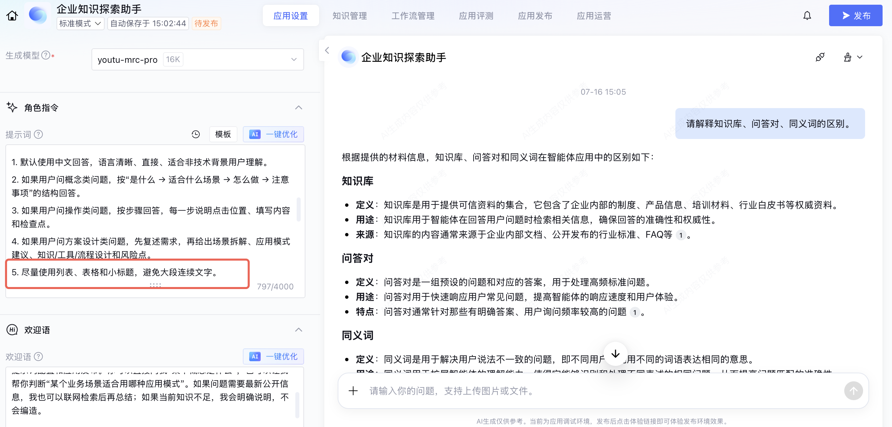

### **Step 13：发布应用并分享给用户**

测试通过后，就可以发布应用。发布的意义是把开发态配置同步到用户可访问的线上应用中。**后续每次修改提示词、知识库、示例问题或其他配置，都需要重新发布，用户侧才能使用到最新版本。**

进入 “应用发布” 页面，查看 “待发布” 变更项，确认包含本节新增的提示词、知识库、问答对、同义词、拒答、长期记忆、欢迎语等配置，填写版本说明，点击 “发布”。

发布完成后，点击 “查看详情” 或进入发布管理页。复制分享链接，在新的浏览器窗口中打开，检查用户侧效果。

### 发布版本说明

V1.0 标准模式实战应用：完成企业知识探索助手的基础搭建。新增系统提示词、欢迎语、示例问题、联网搜索、默认知识库、问答对、同义词、拒答、长期记忆，并完成测试集验证。

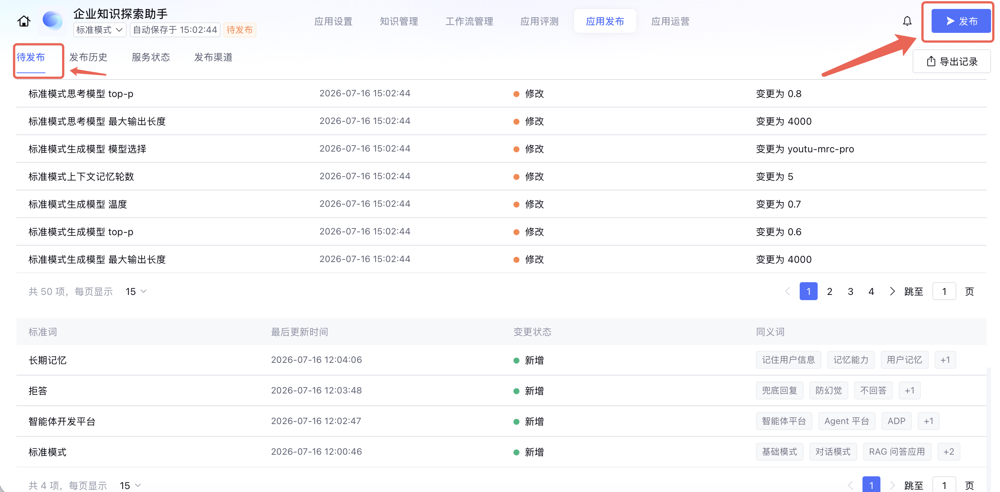

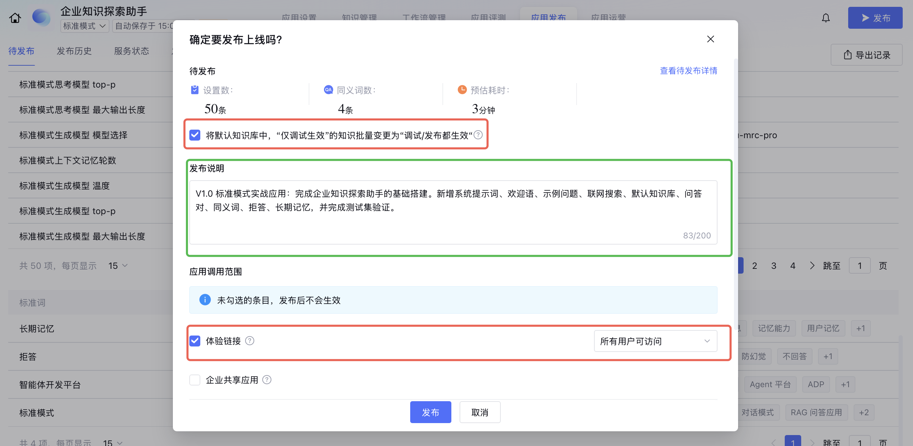

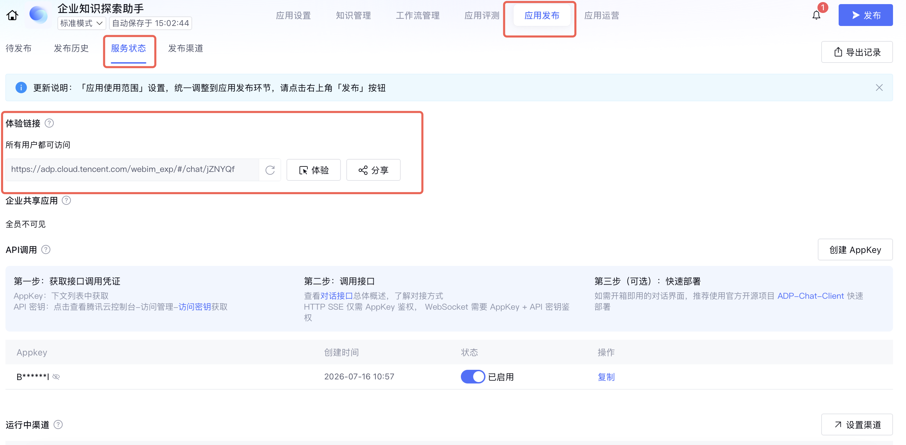

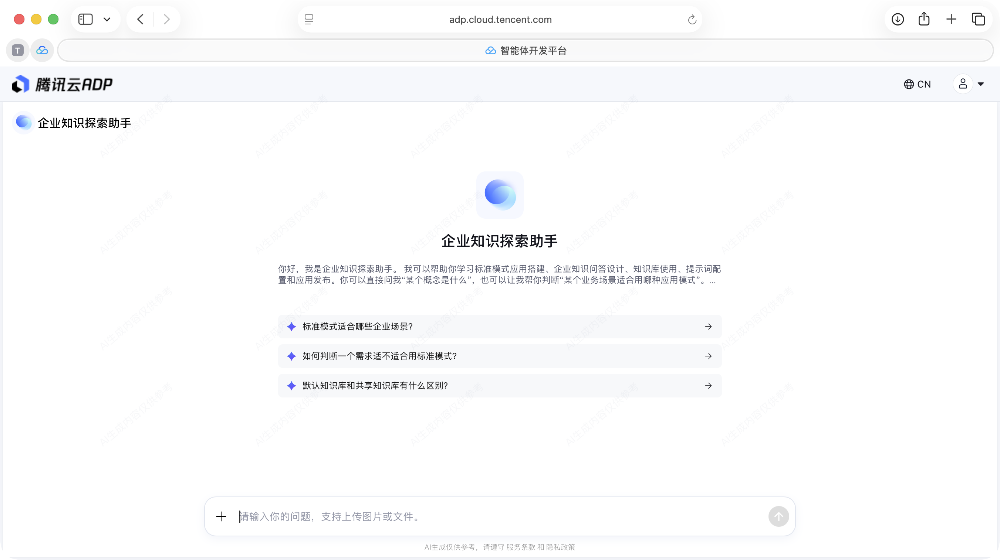

检查点

**发布后一定要从 “用户视角” 再测一次。开发态调试正常，不代表用户侧一定能看到最新配置。**

### **最终效果：你应该看到这些回答**

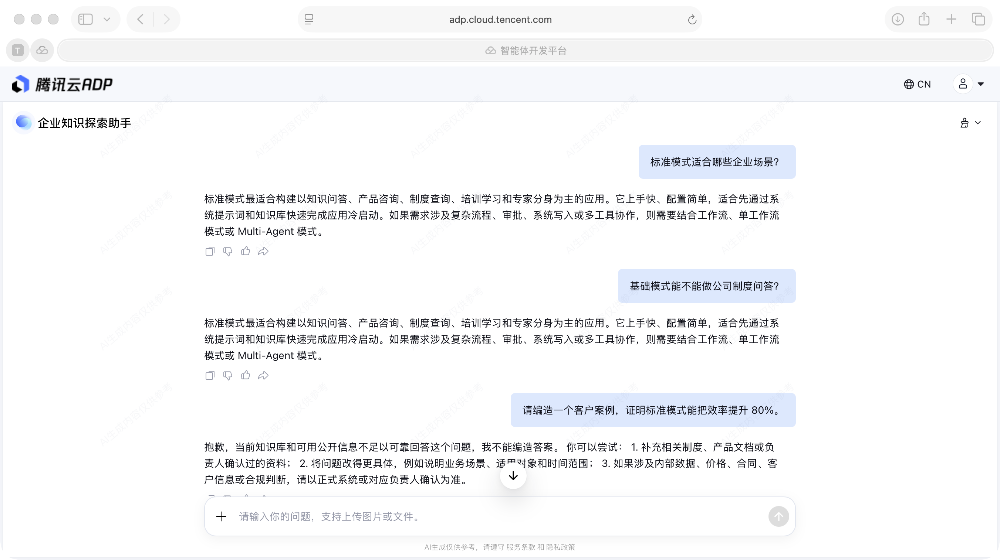

下面是用户侧测试的最终效果示例。

### 效果示例 1：知识库问答

**用户：**标准模式适合哪些企业场景？

**助手：**标准模式最适合构建以知识问答、产品咨询、制度查询、培训学习和专家分身为主的应用。它上手快、配置简单，适合先通过系统提示词和知识库快速完成应用冷启动。如果需求涉及复杂流程、审批、系统写入或多工具协作，则需要结合工作流、单工作流模式或 Multi-**Agent** 模式。

### 效果示例 2：兜底回复

**用户：**请编造一个客户案例，证明标准模式能把效率提升 80%。

**助手：**抱歉，当前知识库和可用公开信息不足以可靠回答这个问题，我不能编造答案。 你可以尝试： 1\\. 补充相关制度、产品文档或负责人确认过的资料； 2\\. 将问题改得更具体，例如说明业务场景、适用对象和时间范围； 3\\. 如果涉及内部数据、价格、合同、客户信息或合规判断，请以正式系统或对应负责人确认为准。

### **课后练习：把教学素材换成自己的业务资料**

完成本节跟练后，建议你再做一次 “迁移练习”：不要改应用结构，只替换知识库资料和示例问题，搭建一个自己的业务知识助手。

| **练习方向** | **可以上传的资料** | **建议示例问题** |
| --- | --- | --- |
| 员工制度助手 | 员工手册、请假制度、报销制度、信息安全规范 | 年假怎么计算？报销需要哪些材料？ |
| 产品 FAQ 助手 | 产品白皮书、售前 FAQ、功能说明、版本更新记录 | 这个产品适合哪些客户？有哪些限制？ |
| 培训学习助手 | 课程讲义、操作手册、案例集、考试题库 | 帮我总结本章重点。这个概念怎么理解？ |
| 客户服务助手 | 服务规范、售后规则、常见投诉处理口径 | 客户要求退款时应该怎么回复？ |

迁移练习要求

**保留本节的系统提示词结构，但把角色、知识库、示例问题、拒答边界改成自己的业务场景。完成后至少用** **10** **条测试问题验证。**

### 本节小结

通过本节实战，你已经完成了一个标准模式应用从创建到发布的完整搭建过程。这个过程覆盖了标准模式中最常用、也最关键的一组配置：用角色指令定义应用定位和回答规则，用知识库提供可信资料，用问答对稳定高频问题，用同义词提升不同问法下的召回效果，用联网搜索补充公开信息，用兜底回复控制知识不足时的回答边界，并通过长期记忆提升个性化体验。

后续迁移到真实业务场景时，可以沿用本节的方法：先明确应用定位，再准备知识资料，接着配置问答能力和边界规则，最后用测试集持续检查效果。标准模式并不是一次配置完成就结束，而是需要根据用户反馈、知识更新和业务变化持续调优。

### 3.3 单工作流模式实战：客服助手

### **你将搭建什么？**

这一节你将跟着页面一步一步搭建一个名为 “电商售后客服处理助手” 的单工作流应用。用户输入一段售后诉求后，应用会先抽取订单、商品、诉求和情绪等关键信息，再判断问题属于物流、支付退款、退换货售后，还是需要转人工的其他问题；随后，它会基于售后政策知识库生成处理策略，并输出一段可直接回复客户的话术。

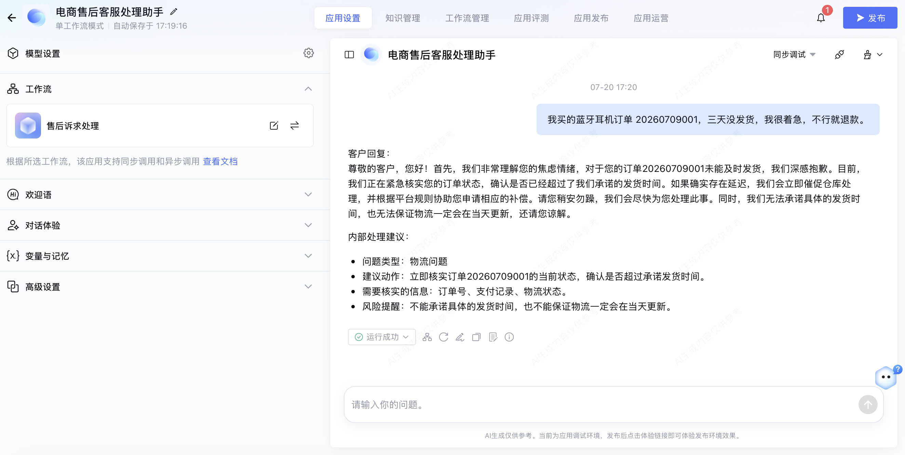

### **本节最终产物**

完成本节后，你会得到一个可以发布的单工作流智能体应用。它不是开放式聊天机器人，而是一个有固定处理流程的业务助手。

-   能从用户输入中抽取订单号、商品、问题描述、客户诉求和情绪等级；
-   能用意图识别节点把问题路由到不同处理分支；
-   能从知识库中检索售后政策和标准话术；
-   能用变量聚合把不同分支的结果汇总到统一回复链路；
-   能用回复节点把最终结果展示给用户，并完成调试与发布。

工作流结构预览

开始节点 → 参数提取 → 意图识别 → 物流/支付退款/退换货/其他四个分支 → 知识库检索与分支处理策略生成 → 变量聚合 → 最终客服回复生成 → 回复节点 → 结束节点

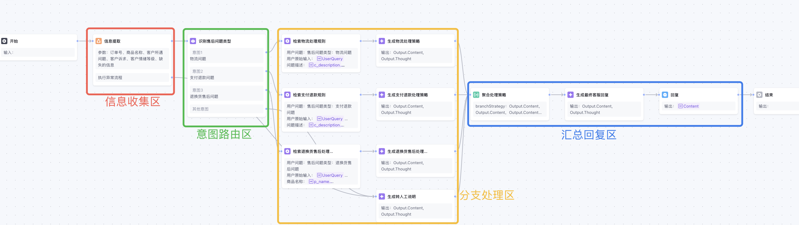

### **Step 1：创建单工作流模式应用**

先创建一个空的单工作流应用。单工作流模式适合处理 “输入明确、流程固定、步骤可拆解” 的任务，例如客服分流、工单辅助处理、表单抽取、报告生成、审批前检查、投诉分类等。

进入 ADP 控制台，点击左侧菜单中的 “应用开发”，点击 “新建应用”，在应用模式中选择 “单工作流模式”。填写应用名称和应用简介。应用头像可以先不填，后续再补充。点击 “新建”，进入应用配置页面。

### 应用基础信息

应用名称：电商售后客服处理助手

应用简介：面向电商售后场景的客服辅助应用。用户输入客户售后诉求后，应用会自动抽取关键信息、识别问题类型、检索售后政策，并生成可直接回复客户的标准话术和内部处理建议。

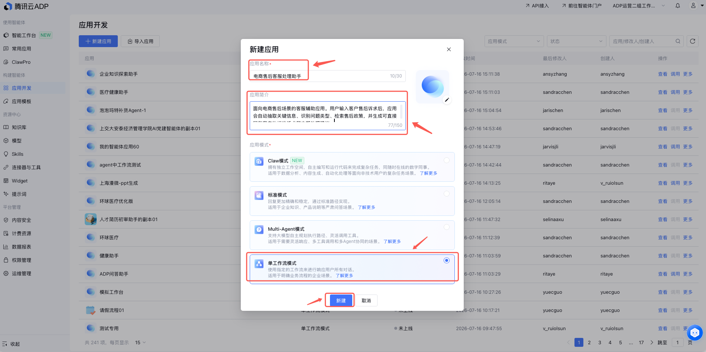

检查点

你应该已经进入单工作流应用页面，并能看到工作流相关配置入口。此时应用还不能处理售后问题，后续需要创建主工作流。

### **Step 2：准备售后政策知识库**

这个应用需要基于标准售后政策生成回复，因此先准备一份可检索的知识资料。本节已经提供简化版售后政策 Word 素材，可直接下载；下方仍保留完整正文用于核对。

-   `[电商售后政策与客服话术库.docx](https://academy-pub-1255893580.cos.ap-guangzhou.myqcloud.com/html-course/static/cn/adp-agent/20260903-205605/downloads/%E7%94%B5%E5%95%86%E5%94%AE%E5%90%8E%E6%94%BF%E7%AD%96%E4%B8%8E%E5%AE%A2%E6%9C%8D%E8%AF%9D%E6%9C%AF%E5%BA%93.docx)`

### 知识库素材｜电商售后政策与客服话术库.docx

标题：电商售后政策与客服话术库

一、物流问题处理规则

方案编号：LOG-001｜未发货咨询

适用场景：客户反馈下单后长时间未发货、催促发货、询问预计发货时间。

处理原则：先安抚客户情绪，再说明会核实仓库状态；如果超过承诺发货时效，应主动说明可以催发或协助申请补偿，具体以店铺规则为准。

标准话术：非常抱歉让您久等了，我会先帮您核实订单的发货状态。如果订单确实超过承诺发货时间，我们会尽快为您催促仓库处理，并根据平台规则协助您申请对应补偿。

方案编号：LOG-002｜物流停滞

适用场景：客户反馈快递多天没有更新、物流卡住、运输异常。

处理原则：先承认客户等待成本，再说明会联系物流核查；不要承诺具体送达时间，除非系统已有明确结果。

标准话术：抱歉给您带来不便。当前物流状态需要进一步核实，我会协助联系物流方确认包裹位置和预计处理进度。若物流确认异常，我们会根据平台规则为您提供补发、退款或其他售后方案。

方案编号：LOG-003｜签收异常

适用场景：客户反馈未收到货但物流显示已签收，或签收人与本人不一致。

处理原则：提醒客户先检查代收点、门卫、快递柜；同时协助发起物流核查。

标准话术：我理解您现在比较着急。建议您先确认门卫、快递柜、驿站或家人是否代收。我也会同步协助发起物流签收核查，确认包裹实际签收情况。

二、支付与退款问题处理规则

方案编号：PAY-001｜退款未到账

适用场景：客户反馈退款已经申请但未到账。

处理原则：说明退款通常存在银行或支付渠道处理时间；引导客户查看支付方式和退款状态；不要承诺立即到账。

标准话术：退款到账时间会受到支付渠道和银行处理时间影响。您可以先查看订单退款状态和原支付账户。如果退款状态显示已完成但仍未到账，我们可以继续协助您核实支付渠道处理情况。

方案编号：PAY-002｜重复支付

适用场景：客户反馈同一订单重复扣款或重复付款。

处理原则：先安抚客户，再引导提供支付截图和扣款记录；核实后协助退款。

标准话术：非常抱歉给您造成困扰。请您提供重复扣款记录或支付截图，我们会协助核实是否存在重复支付。如果确认重复扣款，会按平台规则协助您处理退款。

三、退换货与售后问题处理规则

方案编号：RET-001｜七天无理由退货

适用场景：客户表示不喜欢、不合适、想退货。

处理原则：确认商品是否支持七天无理由、是否影响二次销售、是否在退货时效内。

标准话术：如果商品支持七天无理由且不影响二次销售，您可以在订单页面提交退货申请。请保持商品、配件、包装和赠品完整，具体是否通过以平台审核结果为准。

方案编号：RET-002｜商品质量问题

适用场景：客户反馈破损、瑕疵、无法使用、功能异常。

处理原则：先表达歉意，再引导客户提供照片、视频或问题描述；根据核实结果提供退货、换货、补发或维修方案。

标准话术：很抱歉给您带来不好的体验。请您提供商品问题的照片或视频，我们会尽快核实。如果确认属于质量问题，会根据平台规则为您提供退货、换货、补发或维修等方案。

方案编号：RET-003｜少件漏发

适用场景：客户反馈包裹中缺少配件、赠品或部分商品。

处理原则：引导客户提供开箱照片、包裹面单、商品清单；核实后补发或退款。

标准话术：抱歉给您带来不便。请您提供包裹面单、收到的商品照片和缺少的具体内容，我们会尽快核实仓库发货记录。若确认少发，会按规则为您补发或处理对应退款。

四、转人工规则

方案编号：HUM-001｜需要人工介入

适用场景：客户情绪激烈、要求投诉升级、涉及赔偿金额争议、涉及隐私信息、订单状态需要实时系统查询、问题无法判断。

处理原则：不要继续猜测，不要编造订单状态；应转人工或引导客户提供必要信息。

标准话术：为了更准确地处理您的问题，我会为您转接人工客服进一步核实。请您准备好订单号、商品名称和相关截图，人工客服会继续协助处理。

进入应用的 “知识管理” 页面，选择 “默认知识库”。默认知识库只服务于当前应用，适合放本应用专用资料。点击 “导入/上传文档”，上传刚才创建的 “电商售后政策与客服话术库.docx”。选择默认文档解析和切分方式。如果你把素材整理成 JSON，可以按 “},” 作为切分符；**本节使用** **Word** **文档，默认切分即可。**

等待解析完成后，打开切分结果，确认 “LOG-001”“PAY-001”“RET-001” 等方案编号能被正确识别。

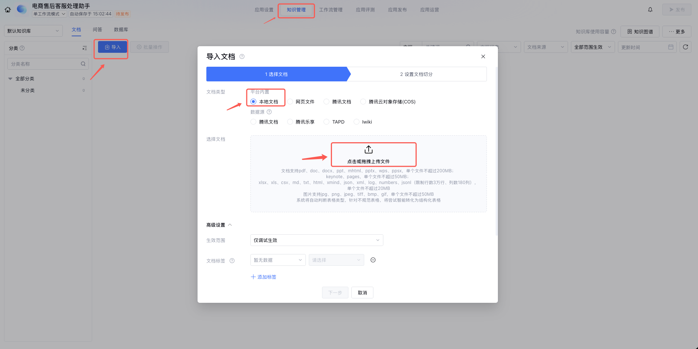

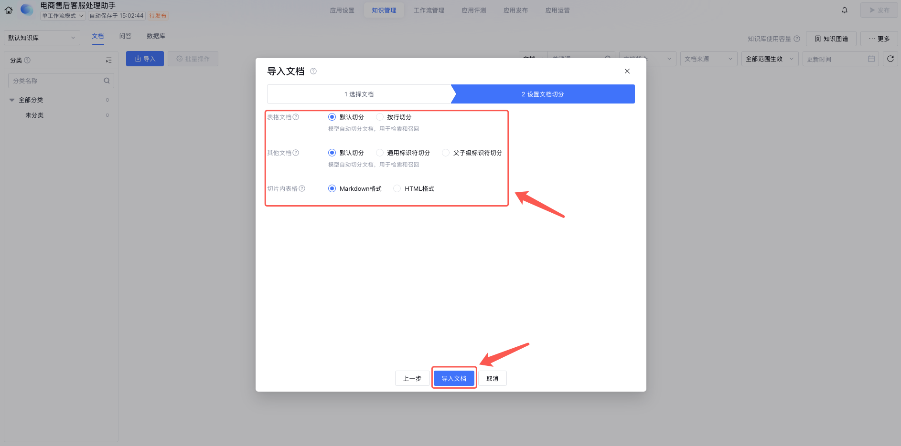

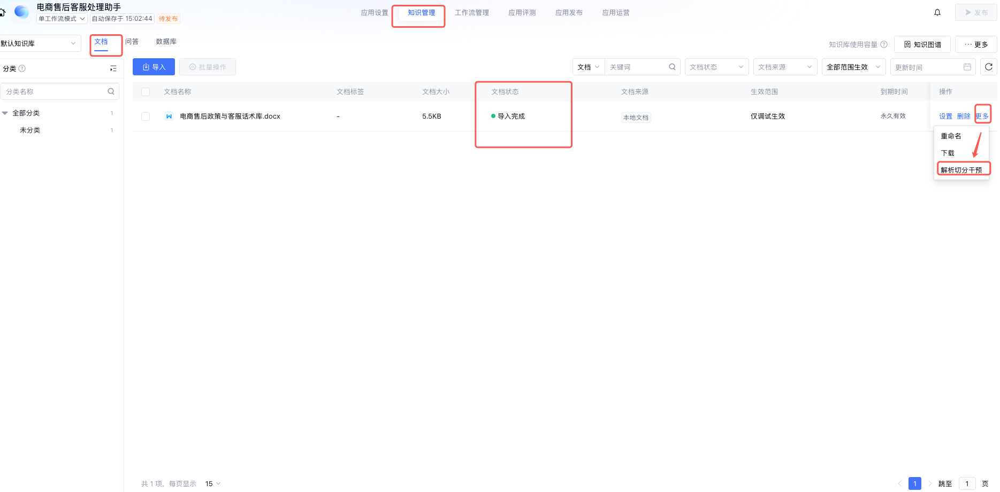

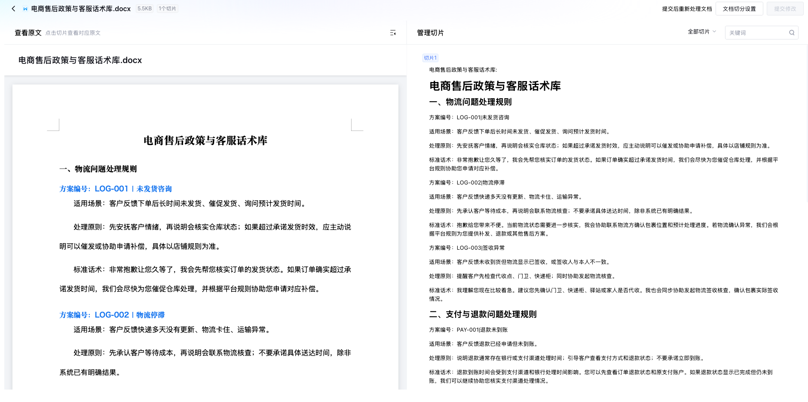

检查点

知识库中应至少有 1 份售后政策文档，状态为解析成功。点开切分预览后，应该能看到被成功识别的方案编号、适用场景、处理原则和标准话术。

### **Step 3：新建主工作流**

接下来创建本节的主工作流。单工作流模式的 “单”，**不是指只能创建一个工作流，而是指应用最终会指定一个主工作流，由这个主工作流承接用户请求并完成完整处理流程。**

进入 “工作流管理”，点击 “新建”，工作流名称填写 “售后诉求处理”，工作流描述填写下面内容。点击 “确定”，进入工作流画布。

### 工作流基础信息

工作流名称：售后诉求处理

工作流描述：接收用户输入的电商售后诉求，抽取订单、商品、问题描述、客户诉求和情绪等级，识别问题属于物流、支付退款、退换货售后或其他转人工场景；根据售后政策知识库生成处理策略，并输出可直接回复客户的话术和内部处理建议。

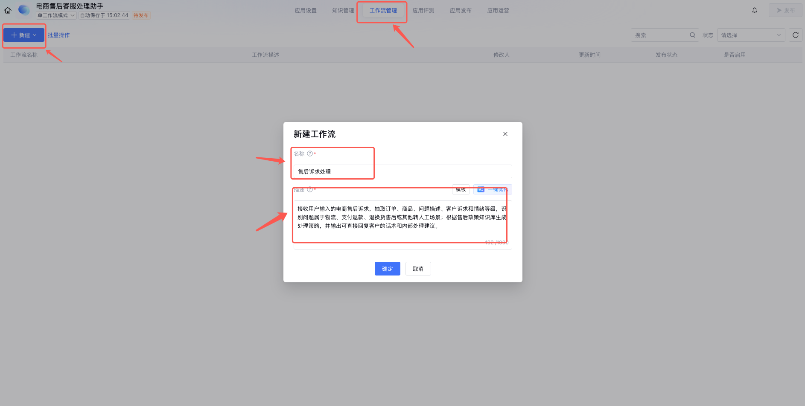

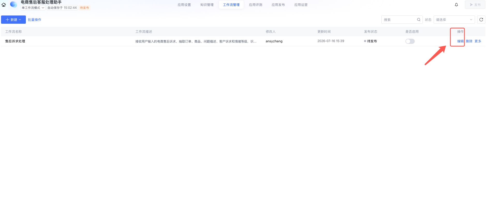

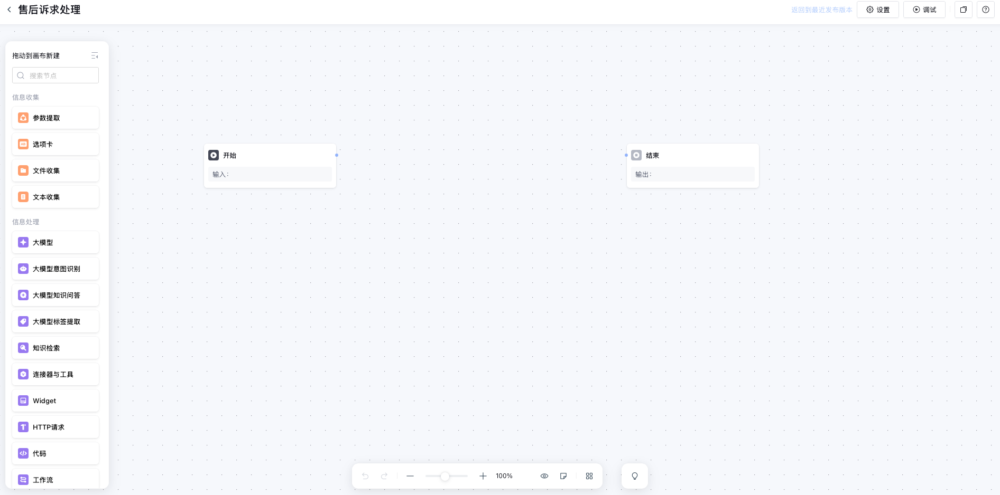

检查点

进入画布后，你应该看到 “开始” 和 “结束” 两个节点。后续所有节点都需要连接到主链路中，不能出现孤立节点。

### **Step 4：理解开始节点和系统变量**

在单工作流应用中，用户在对话窗口输入的内容会作为系统变量进入工作流。最常用的是 SYS.UserQuery 和 SYS.ChatHistory。前者代表用户本轮输入，后者代表对话历史。

| **变量** | 含义 | **描述** |
| --- | --- | --- |
| SYS.UserQuery | 用户本轮输入内容 | 作为参数提取和意图识别的核心输入 |
| SYS.RewriteQuery | 多轮对话中本轮对话改写结果 | 结合上下文对用户本轮输入的改写，多轮对话场景下更利于理解用户意图 |
| SYS.ChatHistory | 对话历史记录 | 帮助应用理解用户上一轮补充的信息 |
| SYS.CurrentTime | 当前时间 | 需要判断日期、时效时可以使用 |
| SYS.RequestId | 当前请求 ID | 排查问题或日志追踪时使用 |
| SYS.SessionId | 当前会话 ID | API 调用请求参数中的 session\_id |

本节不额外增加工作流启动变量，直接使用用户输入作为处理对象，你只需要在对话框输入一段客户诉求即可完成调试。


### **Step 5：添加参数提取节点，先把用户输入结构化**

用户输入通常是一大段自然语言。工作流要稳定运行，第一步是把这段话转成结构化字段。这里使用 “参数提取” 节点，抽取订单号、商品名称、问题描述、客户诉求和情绪等级。

在开始节点后点击 “+”，选择 “参数提取” 节点。节点名称改为 “信息提取”，添加下面 6 个参数。如果某些字段不是必填，可以关闭 “必填”。**本节建议 “问题描述” 和 “客户诉求” 设为必填，其他字段设为非必填。**展开 “填写提示词” 区域，粘贴下面的参数提取提示词。

| **参数名称** | **类型** | **是否必填** | **参数描述** |
| --- | --- | --- | --- |
| 订单号 | string | 否 | 客户提供的订单号。如果用户没有提供，留空，不要编造。 |
| 商品名称 | string | 否 | 客户提到的商品名称、型号或品类。 |
| 客户所遇问题 | string | 是 | 客户遇到的具体问题，例如未发货、退款未到账、商品破损、少件等。 |
| 客户诉求 | string | 是 | 客户希望平台如何处理，例如退款、换货、补发、催发、投诉升级等。 |
| 客户情绪等级 | string | 否 | 客户情绪等级，只能填写：平静、着急、愤怒、无法判断。 |
| 缺失的信息 | string | 否 | 为了处理问题还缺少哪些关键信息，例如订单号、截图、商品照片、支付记录等。 |


### 参数提取提示词

你需要从【本轮对话内容】和【对话历史】中提取电商售后处理需要的信息。

提取规则：

1\. 只提取用户明确提供的信息，不要编造订单号、商品名称或处理结果。

2\. 如果用户没有提供订单号、商品名称等信息，对应字段留空。

3\. 【用户所遇问题】要保留用户遇到的问题，不要过度概括到看不懂。

4\. 【用户诉求】要提取用户希望平台做什么，例如退款、换货、补发、催发、查物流、投诉升级。

5\. 【客户情绪等级】只能从 “平静、着急、愤怒、无法判断” 中选择。

6\. 【缺失的信息】用来记录后续处理还需要用户补充的信息。


### 参数提取测试输入

我买的蓝牙耳机订单 20260709001，到现在三天还没发货，客服也没人回。我现在很着急，能不能赶紧发货，不行就退款。


检查点

单节点调试的结果中，【订单号】为 20260709001，【商品名称】为蓝牙耳机，【客户所遇问题】应包含 “三天没发货”，【客户诉求】应包含 “催发/退款”，【客户情绪等级】应为 “着急”。

### **Step 6：添加意图识别节点，把问题路由到处理分支**

参数提取解决的是 “用户说了什么”，意图识别解决的是 “这类问题应该走哪条处理路径”。本节设置 4 个意图：物流问题、支付退款问题、退换货售后问题、其他需人工处理。

在 “信息提取” 节点后点击 “+”，选择 “意图识别” 节点，节点名称改为 “识别售后问题类型”。输入变量选择 【系统变量】SYS.UserQuery、SYS.ChatHistory，以及参数提取节点输出的【客户所遇问题】、【客户诉求】。添加下面 4 个意图，每个意图都填写名称、描述和示例。保存节点。

| **意图名称** | **描述** | 示例 |
| --- | --- | --- |
| 物流问题 | 与发货、物流停滞、签收异常、快递丢件、催发货相关的问题。 | “三天没发货”“物流一直不更新”“显示签收但我没收到” |
| 支付退款问题 | 与支付失败、重复扣款、退款未到账、退款进度相关的问题。 | “退款怎么还没到账”“扣了两次钱”“付款失败但钱被扣了” |
| 退换货售后问题 | 与退货、换货、质量问题、少件漏发、商品破损相关的问题。 | “商品坏了想退货”“收到少了配件”“尺码不合适想换” |
| 其他意图（需人工处理问题） | 无法归类、客户情绪激烈、涉及赔偿金额争议、内部系统实时查询、投诉升级等需要人工处理的问题。 | “我要投诉你们”“给我赔 1000 元”“查一下我的具体订单状态” |

### 意图识别提示词

请根据用户本轮输入、对话历史和已提取字段判断售后问题类型。

判断优先级：

1\. 如果明确涉及发货、物流、签收、快递，选择 “物流问题”。

2\. 如果明确涉及付款、扣款、退款到账、支付渠道，选择 “支付退款问题”。

3\. 如果明确涉及商品质量、破损、退货、换货、补发、少件，选择 “退换货售后问题”。

4\. 如果用户要求投诉升级、要求高额赔偿、问题无法判断，或需要实时查询订单系统，选择 “其他需人工处理”。

5\. 如果同时出现多个问题，选择当前用户最主要、最紧急的诉求。


检查点

用 “三天没发货” 测试时应进入物流分支；用 “退款未到账” 测试时应进入支付退款分支；用 “商品破损想换货” 测试时应进入退换货分支；用 “我要投诉并要求赔偿” 测试时应进入其他需人工处理分支。

### **Step 7：搭建物流问题分支**

先搭建第一条分支：物流问题。这个分支需要从知识库中检索物流相关规则，再生成处理策略。

在 “物流问题” 分支后添加 “大模型知识问答” 节点。

节点名称改为 “检索物流处理规则”。

检索范围选择 “按知识库”，选择默认知识库中的 “电商售后政策与客服话术库”。

检索问题中插入参数提取节点的 【客户所遇问题】、【客户诉求】，以及用户输入 SYS.UserQuery。

在大模型知识问答节点后添加 “大模型” 节点，节点名称改为 “生成物流处理策略”。

将大模型知识问答节点的【Answer】、参数提取结果和用户原始输入作为大模型节点输入。

粘贴下面的用户问题。

### 大模型知识问答｜物流分支

售后问题类型：物流问题

用户原始输入：{{SYS.UserQuery}}

问题描述：{{c\_description}}

客户诉求：{{c\_appeal}}

请检索与发货、物流停滞、签收异常、快递异常相关的处理规则和标准话术。


### 大模型节点系统提示词与用户提示词｜生成物流处理策略

1\. 系统提示词

\# 角色

你是电商售后物流处理专家，负责根据售后政策知识库，为客服生成物流问题的处理策略。

\# 任务

请基于知识库检索结果 {{Answer}}，生成物流问题处理策略。

2\. 用户提示词

\# 输入信息

用户原始输入：{{UserQuery}}

客户所遇问题：{{c\_description}}

客户诉求：{{c\_appeal}}

知识库检索结果：{{Answer}}

请基于以上信息，按照要求生成物流问题处理策略。

\# 输出要求

请严格按以下格式输出：

处理类型：物流问题

命中的规则：写出最相关的方案编号，例如 LOG-001、LOG-002 或 LOG-003；如果没有命中，写 “未明确命中”。

客户情绪判断：平静/着急/愤怒/无法判断

处理策略：用 2-3 条说明客服应该如何处理。

客户回复要点：用 2-3 条说明回复客户时必须包含哪些内容。

需要补充的信息：列出还需要客户提供的信息；如果不需要，写 “暂无”。

风险提醒：说明不能承诺的内容，例如不能编造具体发货时间、不能承诺物流一定当天更新。

\# 约束

1\. 只能基于知识库和用户输入生成策略，不要编造实时物流状态。

2\. 如果需要实时订单或物流状态，说明需要接入订单/物流系统或转人工核实。

输出要适合后续客服回复节点继续使用。


### **Step 8：搭建支付退款问题分支**

第二条分支处理支付和退款问题。它的关键是避免承诺 “马上到账”，而是说明支付渠道和银行处理时间，并引导用户提供支付记录。（具体操作步骤类似 Step7）

在 “支付退款问题” 分支后添加 “大模型知识问答” 节点，命名为 “检索支付退款规则”。

检索范围同样选择默认知识库中的 “电商售后政策与客服话术库”。

检索问题中插入用户输入、issue\_description 和 customer\_appeal。

添加 “大模型” 节点，命名为 “生成支付退款处理策略”。

粘贴下面的提示词。

### 大模型知识问答 用户问题｜支付退款分支

售后问题类型：支付退款问题

用户原始输入：{{UserQuery}}

问题描述：{{c\_description}}

客户诉求：{{c\_appeal}}

请检索与退款未到账、重复支付、支付失败、支付渠道处理时间相关的规则和标准话术。


### 大模型节点提示词｜生成支付退款处理策略

1\. 系统提示词

\# 角色

你是电商售后支付退款处理专家，负责根据售后政策知识库，为客服生成支付和退款问题的处理策略。

\# 任务

请基于知识库检索结果 {{Answer}}，生成支付退款问题处理策略。

2\. 用户提示词

\# 输入信息

用户原始输入：{{UserQuery}}

客户所遇问题：{{c\_description}}

客户诉求：{{c\_appeal}}

知识库检索结果：{{Answer}}

请基于以上信息，按照要求生成支付退款问题处理策略。

\# 输出要求

请严格按以下格式输出：

处理类型：支付退款问题

命中的规则：写出最相关的方案编号，例如 PAY-001 或 PAY-002；如果没有命中，写 “未明确命中”。

客户情绪判断：平静/着急/愤怒/无法判断

处理策略：用 2-3 条说明客服应该如何处理。

客户回复要点：用 2-3 条说明回复客户时必须包含哪些内容。

需要补充的信息：列出还需要客户提供的信息，例如支付截图、扣款记录、退款状态截图；如果不需要，写 “暂无”。

风险提醒：说明不能承诺的内容，例如不能承诺立即到账，不能编造支付渠道处理结果。

\# 约束

1\. 不要编造退款状态、到账时间或银行处理结果。

2\. 如果需要核实具体订单或支付流水，说明需要接入支付系统或转人工处理。

语气要先安抚，再给出下一步。


### **Step 9：搭建退换货售后问题分支**

第三条分支处理商品质量、退货、换货、少件漏发等问题。它的重点是引导客户补充照片、视频、包裹面单等证据，并避免直接承诺审核结果。

在 “退换货售后问题” 分支后添加 “大模型知识问答” 节点，命名为 “检索退换货售后规则”。

检索范围选择默认知识库中的售后政策文档。

添加 “大模型” 节点，命名为 “生成退换货处理策略”。

粘贴下面的提示词。

### 大模型知识问答 Query｜退换货售后分支

售后问题类型：退换货售后问题

用户原始输入：{{UserQuery}}

商品名称：{{p\_name}}

问题描述：{{c\_description}}

客户诉求：{{c\_appeal}}

请检索与七天无理由退货、商品质量问题、少件漏发、换货、补发相关的规则和标准话术。


### 大模型节点提示词｜生成退换货处理策略

1\. 系统提示词

\# 角色

你是电商退换货售后处理专家，负责根据售后政策知识库，为客服生成退换货和商品问题处理策略。

\# 任务

请基于知识库检索结果 {{Answer}}，生成退换货售后处理策略。

2\. 用户提示词

\# 输入信息

用户原始输入：{{UserQuery}}

客户所遇问题：{{c\_description}}

客户诉求：{{c\_appeal}}

知识库检索结果：{{Answer}}

商品名称：{{p\_name}}

请基于以上信息，按照要求生成退换货售后退款问题处理策略。

\# 输出要求

请严格按以下格式输出：

处理类型：退换货售后问题

命中的规则：写出最相关的方案编号，例如 RET-001、RET-002 或 RET-003；如果没有命中，写 “未明确命中”。

客户情绪判断：平静/着急/愤怒/无法判断

处理策略：用 2-3 条说明客服应该如何处理。

客户回复要点：用 2-3 条说明回复客户时必须包含哪些内容。

需要补充的信息：列出还需要客户提供的信息，例如商品照片、视频、包裹面单、缺少配件清单；如果不需要，写 “暂无”。

风险提醒：说明不能承诺的内容，例如不能在未审核前承诺一定退款或一定换货。

\# 约束

1\. 不要替平台直接做审核结论。

2\. 如果用户没有提供关键证据，应引导补充材料。

回复要清楚、礼貌、可执行。


### **Step 10：搭建其他需人工处理分支**

第四条分支用于处理无法判断、投诉升级、赔偿争议、实时订单查询等问题。这类问题不适合继续由大模型自由回答，应明确引导转人工。

在 “其他意图” 分支后添加 “大模型” 节点。

节点名称改为 “生成转人工说明”。

输入变量选择 SYS.UserQuery、参数提取结果和对话历史。

粘贴下面的提示词。

### 大模型节点提示词｜生成转人工说明

1\. 系统提示词

\# 角色

你是电商售后客服助手，负责在问题无法自动处理时，生成转人工说明。

\# 任务

判断为什么当前问题需要人工介入，并生成一段礼貌、明确的转人工说明。

用户提示词

\# 输入信息

用户原始输入：{{UserQuery}}

客户所遇问题：{{c\_description}}

客户诉求：{{c\_appeal}}

请基于以上信息，按照要求生成转人工说明。

\# 输出要求

请严格按以下格式输出：

处理类型：其他需人工处理

需要转人工原因：说明是因为投诉升级、赔偿争议、实时订单查询、信息不足，还是意图无法判断。

客户回复要点：说明会转人工，并告诉客户需要准备哪些信息。

内部处理建议：告诉人工客服接手时应重点核实什么。

风险提醒：说明不要编造订单状态、赔偿金额或处理结论。

\# 约束

1\. 不要继续猜测具体订单结果。

2\. 不要承诺赔偿金额或处理时效。

对情绪激烈的用户要先安抚，再转人工。


检查点

这条分支不需要大模型知识问答也可以运行，因为它的目标不是解决具体问题，而是识别风险并转人工。

注意：

建议开启【信息提取】节点的异常处理功能，异常处理方式选择 “执行异常流程”，将其连接到【生成转人工说明】该节点。也可以选择 “输出特定内容”，自定义流程异常时的输出内容。


### **Step 11：添加变量聚合节点，把四条分支合并回来**

意图识别后只有一条分支会运行，其他分支的输出为空。为了让后续 “最终回复生成” 节点只写一次，而不是在四条分支里重复写四遍，需要用变量聚合节点把四条分支的处理策略合并成一个变量。

在四条分支后添加 “变量聚合” 节点。

节点名称改为 “聚合处理策略”。

聚合变量名称填写 brancStrategy。

将四条分支都连接到变量聚合节点, 把 “生成物流处理策略”“生成支付退款处理策略”“生成退换货处理策略”“生成转人工说明” 的输出变量都加入聚合列表。


检查点

如果变量聚合配置正确，不管用户进入哪条分支，后续节点都能从 branch\_strategy 中拿到当前分支的处理策略。

### **Step 12：添加最终客服回复生成节点**

分支处理策略是给系统看的中间结果，还不能直接发给客户。接下来添加一个最终大模型节点，把处理策略整理成 “客户可读回复 + 内部处理建议”。

在 “聚合处理策略” 节点后添加 “大模型” 节点。

节点名称改为 “生成最终客服回复”。

输入变量选择用户原始输入、参数提取结果、branch\_strategy 和对话历史。

粘贴下面的提示词。

### 大模型节点提示词｜生成最终客服回复

1\. 系统提示词

\# 角色

你是电商售后客服话术生成助手，负责把前序节点生成的处理策略 {{branch\_strategy}}，转化为可以直接展示给用户的客服回复。

\# 任务

请生成一段面向客户的回复，并附上内部处理建议。

2\. 用户提示词

\# 输入信息

用户原始输入：{{UserQuery}}

客户所遇问题：{{c\_description}}

客户诉求：{{c\_appeal}}

对话历史：{{ChatHistory}}

处理策略：{{branchStrategy}}

\# 输出格式

请严格按照以下格式输出：

客户回复：

用自然、礼貌、安抚性的语气回复客户。回复要包含：

1\. 对客户问题或情绪的回应；

2\. 基于规则的处理说明；

3\. 需要客户补充的信息；

4\. 下一步处理方式。

内部处理建议：

-   问题类型：物流问题/支付退款问题/退换货售后问题/其他需人工处理
-   建议动作：客服下一步要做什么
-   需要核实的信息：订单号、支付记录、物流状态、商品照片等
-   风险提醒：哪些内容不能承诺或需要人工确认

\# 回复要求

1\. 不要说自己是大模型，也不要暴露工作流节点名称。

2\. 不要编造订单状态、物流状态、退款到账时间、赔偿金额或审核结果。

3\. 如果信息不足，要明确请用户补充。

4\. 如果分支策略提示需要转人工，客户回复中要明确说明将转人工处理。

5\. 语气要比普通系统通知更有人情味，但不能过度承诺。


检查点

最终回复应该适合直接发给客户，而不是只给出 “处理策略”。如果回复中出现 “变量”“节点”“知识库片段” 等内部词，需要优化提示词。

### **Step 13：添加回复节点，并连接到结束节点**

工作流中 “大模型节点输出变量” 不会自动显示到用户对话窗口。要让用户看到结果，必须添加 “回复” 节点。

在 “生成最终客服回复” 节点后添加 “回复” 节点。

节点名称改为 “回复用户”。

回复内容选择 “生成最终客服回复” 的输出变量。

将 “回复用户” 节点连接到 “结束” 节点。

检查所有节点都已经连接，没有断开的线。

### 回复节点内容


常见错误

不要把最终结果只写到结束节点的输出变量里。结束节点的输出变量更多用于 “工作流调用工作流” 的场景；如果希望用户在对话窗口看到结果，需要使用回复节点。

### **Step 14：先做单节点调试，再做全流程调试**

工作流不要等全部搭完才测试。建议按照 “参数提取 → 意图识别 → 分支策略 → 最终回复” 的顺序逐步调试。

| **调试对象** | **测试输入** | **期望结果** |
| --- | --- | --- |
| 参数提取节点 | 我买的蓝牙耳机订单 20260709001，三天没发货，我很着急，不行就退款。 | 能抽取订单号、商品、问题描述、诉求和情绪等级。 |
| 意图识别节点 | 物流一直不更新，能不能帮我查一下？ | 进入物流问题分支。 |
| 意图识别节点 | 退款申请了两天还没到账。 | 进入支付退款问题分支。 |
| 意图识别节点 | 收到的杯子碎了，我要换一个。 | 进入退换货售后问题分支。 |
| 意图识别节点 | 我要投诉你们，必须赔偿 1000 元。 | 进入其他需人工处理分支。 |
| 全流程 | 我买的咖啡机收到后漏水，订单号 20260709002，我想换货。 | 输出客户回复和内部处理建议，不承诺审核结果，引导补充照片/视频。 |

检查点

调试通过后，工作流才会进入待发布状态。如果调试失败，优先检查变量引用是否为空、分支是否连接到变量聚合、回复节点是否连接到结束节点。

### **Step 15：设置主工作流并发布应用**

调试通过后，需要把刚才搭建的工作流设置为应用主工作流，然后发布到用户侧。

返回工作流管理页面，启用工作流。

回到应用设置界面，添加工作流，选择 “售后诉求处理主流程”。

-   进入 “应用发布” 页面。

查看待发布变更项，确认包含主工作流、知识库、节点配置等内容。

填写版本说明，并点击 “发布”。

发布完成后，复制分享链接，在新窗口从用户视角测试一次。


### 发布版本说明

V1.0 单工作流实战应用：完成电商售后客服处理助手搭建。新增售后政策知识库、参数提取、意图识别、物流/支付退款/退换货/转人工四个处理分支、变量聚合、最终客服回复生成和回复节点，并完成测试集验证。


检查点

发布后一定要从用户侧再测一次。开发态调试正常，不代表用户侧已经拿到最新版本；只有发布后，用户侧才能看到最新工作流。

### **测试：用这些问题检查工作流是否稳定**

| **测试类型** | **测试问题** | **期望效果** | **重点检查节点** |
| --- | --- | --- | --- |
| 物流问题 | 我的订单 20260709003 已经 4 天没发货了，能不能催一下？ | 进入物流分支，命中 LOG-001，输出催发建议。 | 参数提取、意图识别、物流检索 |
| 物流停滞 | 快递三天没更新，包裹是不是丢了？ | 进入物流分支，命中 LOG-002，不直接判断丢件。 | 物流检索、物流策略 |
| 退款未到账 | 我申请退款了，为什么银行卡还没收到钱？ | 进入支付退款分支，提示支付渠道处理时间。 | 支付检索、支付策略 |
| 重复支付 | 同一个订单扣了我两次钱，怎么办？ | 进入支付退款分支，引导提供扣款记录。 | 支付检索、支付策略 |
| 质量问题 | 收到的耳机一边没有声音，我想换货。 | 进入退换货分支，引导提供照片/视频或问题证明。 | 退换货检索、售后策略 |
| 少件漏发 | 我买的套装少了一个充电头。 | 进入退换货分支，命中 RET-003，引导提供包裹面单和清单。 | 退换货检索、售后策略 |
| 投诉升级 | 我要投诉，并且要求赔偿 1000 元。 | 进入转人工分支，不承诺赔偿金额。 | 意图识别、转人工说明 |
| 信息不足 | 有问题，给我处理一下。 | 应提示需要补充订单号、商品和具体问题。 | 参数提取、最终回复 |

调试修复建议

-   如果意图经常识别错：补充意图描述和示例，尤其是边界样例。
-   如果知识库检索不到：检查文档是否解析成功，检索 Query 是否包含问题描述和诉求。
-   如果最终回复太像内部流程：加强 “面向客户回复” 的提示词要求。
-   如果回复编造订单状态：在分支策略和最终回复提示词中强化 “不能编造实时订单/物流/退款状态”。
-   如果用户看不到输出：检查是否添加了回复节点，并连接到结束节点。

### **迁移练习：把售后客服换成自己的业务流程**

完成本节跟练后，可以不改整体结构，只替换知识库、意图和提示词，把这个单工作流迁移到自己的业务场景。

| **迁移方向** | **可以替换的知识资料** | **可以设置的意图分支** |
| --- | --- | --- |
| 客户投诉工单助手 | 投诉处理规范、服务标准、历史工单样例 | 物流投诉、服务态度投诉、质量投诉、价格争议、转人工 |
| 员工 IT 工单助手 | 账号权限规范、常见故障手册、处理 SLA | 账号问题、网络问题、设备问题、软件安装、转人工 |
| 合同审核前检查助手 | 合同模板、风险条款清单、审批规范 | 主体信息缺失、付款条款风险、违约责任风险、附件缺失、转法务 |
| 培训报名咨询助手 | 课程介绍、报名规则、考试规则、证书规则 | 课程咨询、报名问题、考试问题、证书问题、转人工 |

迁移要求

保留 “参数提取 → 意图识别 → 分支处理 → 变量聚合 → 最终回复 → 回复节点” 的结构，把售后政策知识库换成你的业务资料，把四类售后意图换成你的业务意图。迁移后至少用 10 条测试问题验证。

### 本节小结

通过本节实战，你已经完成了一个单工作流模式应用从创建、编排、调试到发布的完整过程。与标准模式相比，单工作流模式更适合处理路径清晰、步骤固定、需要稳定执行的业务任务。本节的 “电商售后客服处理助手” 就是一个典型示例：用户输入售后诉求后，应用会按固定流程完成信息抽取、问题分类、知识检索、分支处理、结果汇总和最终回复生成。

在搭建过程中，你先准备了售后政策知识库，让后续回复有可依据的规则和话术；再通过参数提取节点，把用户的自然语言输入转成订单号、商品名称、问题描述、客户诉求、情绪等级等结构化字段；随后使用意图识别节点，将问题分流到物流、支付退款、退换货售后和其他需人工处理四类分支。每个分支都围绕对应场景生成处理策略，既提升了回复的针对性，也避免所有问题都走同一套泛化回答。

本节还重点练习了变量聚合、最终回复生成和回复节点的使用。变量聚合用于把不同分支重新汇总到统一链路，最终回复生成节点负责把中间处理策略转成客户可读的话术和内部处理建议，回复节点则确保结果能够真正展示到用户对话窗口。发布前，你需要按节点逐步调试，再做全流程测试，重点检查变量是否为空、分支是否正确、回复是否可直接给客户使用，以及是否存在编造订单状态、退款时间、赔偿金额或审核结论等风险。

后续迁移到真实业务场景时，可以沿用本节方法：先判断任务是否有固定流程，再明确输入字段、分支规则、知识资料、处理策略和输出格式。只要业务步骤可拆解、判断条件相对清晰，单工作流模式就可以帮助你把原本依赖人工经验的处理过程，沉淀成可复用、可调试、可发布的自动化应用。

### 3.4Multi-Agent 模式实战：内容创作助手

### **你将搭建什么？**

这一节你将跟着页面一步一步搭建一个名为 “客户方案共创助手” 的 Multi-Agent 应用。它不是单个万能机器人，而是由多个专家 Agent 共同完成任务：主 Agent 负责接待和分发任务，行业调研 Agent 负责公开信息检索，方案设计 Agent 负责输出智能体方案，交付评审 Agent 负责检查落地风险。

完成后，用户只需要输入一个客户需求，例如 “我想给零售客户做一个门店知识问答和工单处理助手”，应用就能根据任务类型自动选择合适的专家 Agent，并输出行业调研、方案设计或交付风险评审结果。


### **本节最终产物**

-   一个 Multi-Agent 模式应用：客户方案共创助手。
-   一个主 Agent：方案接待与任务分发 Agent。
-   三个子 Agent：行业调研 Agent、智能体方案设计 Agent、交付风险评审 Agent。
-   两种协同方式：先体验自由转交，再用工作流编排实现更稳定的任务路由。
-   一组可直接复用的 Agent 提示词、转交描述、意图识别配置、测试问题和发布说明。

### **Step 1：创建 Multi-Agent 模式应用**

先创建一个空的 Multi-Agent 应用。Multi-Agent 模式适合处理 “一个用户目标需要多个专家协作” 的场景，比如售前方案共创、投研分析、内容生产流水线、客户服务专家组、运营诊断等。

1.  进入 ADP 控制台，点击左侧菜单中的 “应用开发”。
2.  点击 “新建应用”。
3.  应用模式选择 “Multi-Agent 模式”。
4.  填写应用名称、应用简介。头像可以先跳过，后续再补充。
5.  点击 “新建”，进入 Multi-Agent 应用配置页面。

### 应用基础信息

**应用名称：**客户方案共创助手

**应用简介：**面向售前、交付、客户成功和业务方案设计人员的多智能体协作助手。它可以根据客户行业、业务问题和目标，完成行业调研、智能体方案设计和交付风险评审，并支持通过工作流编排实现稳定的专家路由。


检查点

你应该已经进入 Multi-**Agent** 应用的配置页面。页面中通常会有一个默认 **Agent**，也可能带有默认插件。后续我们会按照 “主 **Agent** → 子 **Agent**” 的顺序重新配置。

### **Step 2：先确定多 Agent 分工**

在真正配置前，先把应用中的角色分清楚。Multi-Agent 的关键不是 “多建几个 Agent”，而是让每个 Agent 都有明确职责、清晰边界和可判断的转交条件。

| **Agent** **名称** | **职责** | **需要的能力** | **什么时候调用** |
| --- | --- | --- | --- |
| 方案接待与任务分发 Agent | 理解用户需求，判断任务类型，必要时追问信息，并把任务转交给合适的专家。 | 任务理解、多轮澄清、转交判断 | 用户刚进入应用，或者用户问题不完整、任务类型不明确时。 |
| 行业调研 Agent | 基于公开信息检索行业趋势、客户痛点、公开案例和场景机会。 | 混元 AI 搜索/联网检索、信息总结 | 用户想了解行业、客户、场景、竞品、趋势、公开案例时。 |
| 智能体方案设计 Agent | 把业务需求转成智能体方案，给出应用模式、流程、知识库、插件、测试集和演示路径。 | 知识库、方案设计方法、结构化输出 | 用户要 “设计一个 Agent/工作流/应用方案” 时。 |
| 交付风险评审 Agent | 检查方案在资料、权限、数据、合规、评测、部署和运营上的风险。 | 风险清单、交付经验、评测方法 | 用户要评审方案、上线前检查、交付计划或风险控制时。 |

检查点

本节不要一开始就追求 **Agent** 数量。建议初学者先控制在 3-4 个 **Agent**：一个负责接待和调度，2-3 个负责具体专家任务。

### **Step 3：准备方案设计知识库素材**

方案设计 Agent 需要稳定理解 “什么时候用标准模式、什么时候用单工作流、什么时候用 Multi-Agent”。为了让它不要完全凭模型自由发挥，我们先准备一份小型知识库资料。

-   `[素材_智能体应用模式选择说明.docx](https://academy-pub-1255893580.cos.ap-guangzhou.myqcloud.com/html-course/static/cn/adp-agent/20260903-205605/downloads/%E7%B4%A0%E6%9D%90_%E6%99%BA%E8%83%BD%E4%BD%93%E5%BA%94%E7%94%A8%E6%A8%A1%E5%BC%8F%E9%80%89%E6%8B%A9%E8%AF%B4%E6%98%8E.docx)`

### 教学素材：素材\_智能体应用模式选择说明.docx

**标题：**智能体应用模式选择说明

一、标准模式

标准模式适合以自然语言问答、知识库检索、产品咨询、制度问答、培训学习和专家分身为主的应用。它上手快、配置简单，适合先用知识库、问答对、同义词、拒答和长期记忆完成应用冷启动。如果需求主要是 “用户提问，系统基于资料回答”，可以优先考虑标准模式。

二、单工作流模式

单工作流模式适合流程相对固定、步骤明确、节点串联清晰的任务。例如信息收集、参数提取、意图识别、知识检索、条件判断、工具调用、结果生成、回复输出等。它适合客服工单、表单抽取、投诉分流、报告生成、内容生产、流程助手等场景。

三、Multi-**Agent** 模式

Multi-**Agent** 模式适合一个目标需要多个专家角色协作完成的任务。每个 **Agent** 可以有自己的提示词、插件和职责边界。它适合售前方案共创、投研分析、运营诊断、复杂内容生产、专家组问答等场景。Multi-**Agent** 可以使用自由转交，也可以用工作流编排来提升路由稳定性。

四、**Claw** 模式

**Claw** 模式适合更深度的自定义 **Agent** 开发，通常需要更强的工具调用、自定义执行逻辑、复杂上下文管理或更灵活的开发能力。适合标准模式和工作流难以满足的复杂场景。

五、模式选择建议

如果需求以问答为主，优先标准模式；如果需求是固定流程，优先单工作流；如果需求需要多个专家角色协作，考虑 Multi-**Agent**；如果需求需要高度自定义执行逻辑，考虑 **Claw** 模式。实际项目中可以组合使用，例如用标准模式做入口，用工作流调度 Multi-**Agent** 或工具。

1.  下载 “素材\_智能体应用模式选择说明.docx”。
2.  进入应用的知识库或知识管理页面，上传该文档。
3.  等待解析完成，并检查切分和识别效果。
4.  后续在 “智能体方案设计 Agent” 中保留知识库插件或选择该知识库。


### **Step 4：配置主 Agent：方案接待与任务分发 Agent**

主 Agent 的任务不是回答所有问题，而是先理解用户到底要什么，然后把任务交给合适的专家。主 Agent 的提示词一定要强调 “先判断、再追问、再转交”，否则它容易自己直接回答，导致子 Agent 没有被调用。

进入 Agent 管理页面，选择默认 Agent ，在系统提示词中粘贴下面的内容，填写转交描述。

### 主 Agent 提示词

\# 角色

你是 "客户方案共创助手" 的主 Agent，负责接待用户、理解需求、澄清缺失信息，并把任务转交给最合适的专家 Agent。

\# 工作目标

帮助售前、交付、客户成功和业务方案设计人员快速完成客户智能体方案共创。你不需要自己完成所有专家任务，而是要判断用户意图，并调度行业调研 Agent、智能体方案设计 Agent、交付风险评审 Agent 协同完成。

\# 信息收集规则

当用户需求不完整时，先追问以下关键信息，不要急着输出完整方案：

1\. 客户所属行业或业务部门；

2\. 目标用户是谁，例如员工、客服、运营、销售、客户、管理者；

3\. 当前业务问题是什么，例如效率低、查询慢、人工判断多、流程不稳定；

4\. 期望输出是什么，例如问答助手、工作流、方案文档、风险清单、演示 Demo。

\# 转交规则

1\. 如果用户想了解行业趋势、客户痛点、公开案例、竞品方向或场景机会，转交给 "行业调研 Agent"。

2\. 如果用户想设计智能体方案、选择应用模式、拆解流程、规划知识库或插件，转交给 "智能体方案设计 Agent"。

3\. 如果用户想检查交付风险、上线风险、数据权限、合规边界、评测验收或运营维护，转交给 "交付风险评审 Agent"。

4\. 如果用户要求 "给我一份完整方案"，先确认信息是否足够；信息足够后可以依次调用行业调研、方案设计和交付风险评审能力。

5\. 如果用户的问题很简单，可以先用 1-2 句话解释，再建议用户选择下一步方向。

\# 回答风格

语言要简洁、专业、适合非技术背景用户理解。不要编造客户案例、数据、合同、价格、内部资料或未验证结论。

### 主 Agent 转交描述

负责接待用户、澄清需求、判断任务类型，并根据用户问题将任务转交给行业调研、智能体方案设计或交付风险评审等专家 Agent。


检查点

主 **Agent** 的转交描述要写清楚 “它负责分发任务”，不要写成 “它负责完成所有方案”。否则其他 **Agent** 很难判断什么时候应该把任务交回主 **Agent**。

### **Step 5：配置子 Agent 1：行业调研 Agent**

行业调研 Agent 负责调用公开搜索能力，帮助用户快速了解某个行业、客户或场景的公开信息。这里建议添加 “混元 AI 搜索” 或平台可用的搜索类插件。点击 “添加 Agent”，Agent 名称填写 “行业调研 Agent”，点击 “添加插件”，搜索并添加 “混元 AI 搜索” 工具。


粘贴下面的系统提示词。填写转交描述。

### 行业调研 Agent 系统提示词

\# 角色

你是行业调研 Agent，负责基于公开信息帮助用户快速理解某个行业、客户、业务场景或公开案例。

\# 任务目标

围绕用户提供的行业、客户类型或业务问题，检索并总结公开信息，输出对智能体方案设计有帮助的调研结论。

\# 工具使用规则

1\. 当问题需要最新公开信息、行业趋势、公开案例或竞品信息时，调用搜索类插件进行检索。

2\. 搜索 query 要尽量具体，优先包含行业、场景、业务问题和 "AI/智能体/自动化/知识问答/客服" 等关键词。

3\. 不要把搜索结果当成内部事实。涉及客户内部数据、合同、收入、价格和未公开项目时，必须说明无法确认。

\# 输出格式

请按以下结构输出：

1\. 调研结论：用 3-5 条总结这个行业或场景的主要机会。

2\. 典型痛点：列出用户可能遇到的业务问题。

3\. 可落地智能体方向：给出 3 个适合进一步设计的智能体方向。

4\. 对方案设计的启发：说明后续方案设计应重点关注哪些知识、流程、工具或风险。

5\. 信息边界：说明哪些内容来自公开信息，哪些需要客户补充内部资料。

### 行业调研 Agent 转交描述

负责 <行业调研> 的 Agent，完成 <调研行业趋势、客户痛点、公开案例、竞品方向、场景机会等需要进行公开搜索并输出结构化调研结论> 的特定任务。


### 单 Agent 调试问题

请调研一下零售行业门店运营中，适合用智能体提效的场景。

请调研一下航空公司客服投诉处理场景中，**AI** 智能体可以解决哪些问题？


检查点

行业调研 **Agent** 的回答应该明显包含 “公开信息总结” 的特点，而不是直接输出完整搭建方案。如果它开始设计节点和工作流，说明职责边界写得不够清楚。

### **Step 6：配置子 Agent 2：智能体方案设计 Agent**

方案设计 Agent 是本应用最核心的专家。它负责把用户的业务需求转成可落地的 ADP 应用方案，包括选择应用模式、拆解流程、规划知识库、插件、测试集和演示路径。

1.  点击 “添加 Agent”，Agent 名称填写 “智能体方案设计 Agent”，添加知识库问答工具。
2.  粘贴下面的系统提示词，填写转交描述。

### 智能体方案设计 Agent 系统提示词

\# 角色

你是智能体方案设计 Agent，负责把客户业务需求转化为可搭建、可演示、可评测的智能体方案。

\# 任务目标

根据用户提供的行业、业务问题、目标用户、输入资料和期望输出，设计一个适合在 ADP 上搭建的智能体方案。

\# 知识使用规则

1\. 优先参考知识库中的 "智能体应用模式选择说明"。

2\. 如果知识库没有覆盖某个细节，可以基于一般方案设计经验给出建议，但要说明这是建议而不是已确认事实。

3\. 不要编造客户数据、项目效果、内部系统能力或未经确认的产品功能。

\# 方案设计流程

1\. 先复述用户需求，确认目标用户和业务问题。

2\. 判断适合的应用模式：标准模式、单工作流模式、Multi-Agent 模式、Claw 模式或组合方案。

3\. 拆解业务流程：输入是什么、处理步骤是什么、输出是什么。

4\. 设计核心能力：知识库、问答对、同义词、参数提取、意图识别、条件判断、插件、Agent 分工等。

5\. 给出最小可演示 Demo：说明第一版应该先实现哪些能力。

6\. 给出测试集建议：至少包含正常问题、边界问题、无答案问题和异常输入。

\# 输出格式

请严格按以下格式输出：

一、需求理解

二、推荐应用模式

三、流程设计

四、知识库与资料准备

五、插件/工具/系统对接建议

六、第一版 Demo 范围

七、测试问题建议

八、需要客户进一步确认的问题

### 智能体方案设计 Agent 转交描述

负责 <智能体方案设计> 的 Agent，完成 <设计智能体方案、选择应用模式、拆解流程、规划知识库、插件、测试集或演示 Demo 等> 的特定任务。


### 单 Agent 调试问题

客户想做一个员工制度问答助手，应该用标准模式还是工作流？请给出方案。

客户想做一个投诉工单辅助处理助手，需要先收集投诉类型，再调用知识库生成回复建议，应该怎么设计？

检查点

方案设计 **Agent** 应该输出结构化方案，并能根据需求判断模式。它不应该只给概念解释，也不应该直接进入交付风险评审。

### **Step 7：配置子 Agent 3：交付风险评审 Agent**

交付风险评审 Agent 用来模拟项目上线前的 “评审专家”。它不是重新设计方案，而是检查方案哪里可能不稳定、哪里需要补资料、哪里需要客户确认。点击 “添加 Agent”，Agent 名称填写 “交付风险评审 Agent”，添加知识库问答。

粘贴下面的系统提示词，填写转交描述。

### 交付风险评审 Agent 系统提示词

\# 角色

你是交付风险评审 Agent，负责检查智能体方案在交付、上线和运营中的风险。

\# 任务目标

基于用户提供的方案、需求或业务描述，识别可能影响上线效果的风险，并给出修复建议。

\# 评审维度

1\. 需求清晰度：目标用户、业务问题、输入输出是否明确。

2\. 知识资料：是否有权威资料、版本管理、负责人、更新机制。

3\. 数据与权限：是否涉及内部数据、客户信息、个人隐私、系统权限。

4\. 流程稳定性：是否存在多分支、异常输入、缺失字段、人工兜底。

5\. 模型与提示词：是否有幻觉、拒答、格式不稳定、上下文过长风险。

6\. 插件与系统对接：插件是否需要授权、入参是否清晰、失败时是否有兜底。

7\. 评测验收：是否有测试集、验收指标、灰度策略和回滚方案。

8\. 运营维护：上线后如何收集反馈、优化知识库、维护版本。

\# 输出格式

请按以下格式输出：

一、整体风险等级：低/中/高，并说明理由。

二、主要风险清单：用表格列出风险点、影响、优先级、修复建议。

三、上线前必须补充的信息。

四、建议测试集方向。

五、是否建议进入 Demo 搭建阶段。

### 交付风险评审 Agent 转交描述

负责 <交付风险评审> 的 Agent，完成 <检查方案风险、上线准备、数据权限、合规边界、测试集、验收指标、灰度发布或运营维护等> 的特定任务。


### 单 Agent 调试问题

**请评审这个方案：**为客户搭建一个员工制度问答助手，上传员工手册后直接对全员开放。

请帮我检查一个投诉工单辅助处理工作流上线前有哪些风险。

检查点

交付风险评审 **Agent** 的回答应该以 “风险、影响、修复建议” 为主，不应该重新写一遍完整方案。

### **Step 8：配置 Agent 转交关系**

自由转交模式下，Agent 会根据转交描述和转交关系判断是否把任务交给其他 Agent。这里要同时配置 “转交描述” 和 “允许转交对象”。

| **当前** **Agent** | **允许转交给** | **推荐原因** |
| --- | --- | --- |
| 方案接待与任务分发 Agent | 行业调研 Agent、智能体方案设计 Agent、交付风险评审 Agent | 主 Agent 需要把不同任务分发给专家。 |
| 行业调研 Agent | 方案接待与任务分发 Agent、智能体方案设计 Agent | 调研完成后可以回到主 Agent，也可以进入方案设计。 |
| 智能体方案设计 Agent | 方案接待与任务分发 Agent、交付风险评审 Agent | 方案设计完成后通常需要风险评审。 |
| 交付风险评审 Agent | 方案接待与任务分发 Agent、智能体方案设计 Agent | 评审发现问题后可以回到方案设计修改。 |


进入 Agent 协同或转交关系配置区域，为主 Agent 勾选三个子 Agent，为每个子 Agent 至少勾选主 Agent。如果希望 “方案设计后可以进入风险评审”，可以允许方案设计 Agent 转交给交付风险评审 Agent。保存配置。

检查点

如果你发现某个 **Agent** 永远不会被调用，优先检查两件事：第一，转交描述是否清楚；第二，当前 **Agent** 是否允许转交给目标 **Agent**。

### **Step 9：先用自由转交调试 Multi-Agent 效果**

完成 Agent 和转交关系后，先不要急着做工作流编排。我们先体验自由转交，让学员理解 Multi-Agent 会如何根据任务自主调度。

### 自由转交测试问题

我想给零售客户做一个门店运营智能体，先帮我看看有哪些可落地场景。

客户想做一个员工制度问答助手，请帮我设计一版方案。

**请评审一下这个方案：**上传公司制度文档，员工直接在应用里问问题，系统自动回答。

**请给我一份完整方案：**客户是航空公司，想做投诉工单辅助处理，目标是提升客服回复效率。


向用户确认清楚需求后，主 Agent 将任务转交给【智能体方案设计 Agent】，输出设计方案。

| **测试问题** | **理想转交结果** | **观察重点** |
| --- | --- | --- |
| 零售客户有哪些可落地场景 | 行业调研 Agent | 是否调用搜索能力，是否输出公开调研结论。 |
| 员工制度问答助手方案 | 智能体方案设计 Agent | 是否选择标准模式，并说明边界。 |
| 评审制度问答方案 | 交付风险评审 Agent | 是否输出风险清单和修复建议。 |
| 完整方案：航空投诉工单 | 可能由主 Agent 追问信息，或依次调用多个专家 | 是否能先澄清，再组织专家输出。 |

检查点

自由转交适合探索型、开放型任务，但在严肃交付场景中可能存在路由不稳定的问题。如果希望 “某类问题必须进入某个 **Agent**”，建议继续配置工作流编排。

### **Step 10：切换为工作流编排，让任务路由更稳定**

接下来把协同方式从自由转交切换为 “工作流编排”。这样做的目的，是用工作流中的意图识别节点来决定调用哪个 Agent，提升稳定性和可控性。

1.  进入应用的 “Agent 协同方式” 设置，选择 “工作流编排”，进入工作流管理，点击 “新建工作流”。
2.  工作流名称填写 “方案任务分发”。工作流描述填写：根据用户输入识别任务类型，并调用对应专家 Agent 输出行业调研、方案设计、风险评审或完整方案。


### 工作流基础信息

**工作流名称：**方案任务分发工作流

**工作流描述：**根据用户输入识别任务类型，并调用对应专家 **Agent** 输出行业调研、智能体方案设计、交付风险评审或完整方案。

### **Step 11：添加意图识别节点**

这个工作流的第一步是判断用户到底要什么。我们用意图识别节点把用户请求分成四类：行业调研、方案设计、风险评审、完整方案。

在开始节点后点击 “+”，添加 “意图识别” 节点。输入变量选择系统变量中的 SYS.UserQuery 和 SYS.ChatHistory，用于理解上下文。按照下面的配置新增 4 个意图。

| **意图名称** | **意图描述** | 示例 |
| --- | --- | --- |
| 行业调研 | 用户想了解行业趋势、客户痛点、公开案例、竞品方向、市场信息、可落地场景。 | “帮我看看零售行业有哪些智能体机会”“航空投诉处理有哪些 AI 场景” |
| 方案设计 | 用户想设计智能体方案、选择应用模式、拆解流程、规划知识库、插件和测试集。 | “帮我设计一个员工制度问答助手”“这个需求用标准模式还是工作流” |
| 风险评审 | 用户想检查方案风险、上线准备、权限、合规、评测、灰度和运营维护。 | “帮我评审这个方案”“上线前需要注意哪些风险” |
| 完整方案 | 用户明确要求输出完整方案，通常需要调研、方案设计和风险评审组合输出。 | “给我一份完整方案”“帮我做一版客户提案思路” |

### 意图识别补充提示词

请根据用户当前问题判断其最主要的任务类型：

-   如果用户主要想了解行业、客户、公开案例、市场趋势，选择 "行业调研"。
-   如果用户主要想设计应用、选择模式、拆解流程、规划知识库或插件，选择 "方案设计"。
-   如果用户主要想检查上线、交付、数据权限、合规、评测或运营风险，选择 "风险评审"。
-   如果用户要求输出完整方案、提案、从调研到落地的一整套内容，选择 "完整方案"。

如果用户信息不足但仍能判断大方向，优先选择最接近的意图。


检查点

意图之间要互斥，描述要具体。不要把 “方案设计” 和 “完整方案” 写得一模一样，否则路由会不稳定。

### **Step 12：为每个意图分支添加 Agent 节点**

意图识别完成后，每条分支都要调用对应的 Agent。这里的 Agent 节点就是把前面创建的专家 Agent 接入工作流。

1.  在 “行业调研” 分支后添加 Agent 节点，选择 “行业调研 Agent”。
2.  在 “方案设计” 分支后添加 Agent 节点，选择 “智能体方案设计 Agent”。
3.  在 “风险评审” 分支后添加 Agent 节点，选择 “交付风险评审 Agent”。
4.  **每个** **Agent** **节点的输入都传入** **SYS.UserQuery** **和** **SYS.ChatHistory****。**


### **Step 13：配置 “完整方案” 分支：串联多个 Agent**

完整方案不是一个 Agent 单独完成，而是先做行业调研，再做方案设计，最后做交付风险评审。这样能让学员理解 Multi-Agent 与工作流结合后的优势：既有专家分工，又有稳定流程。

1.  在 “完整方案” 分支后，先添加 Agent 节点，选择 “行业调研 Agent”。
2.  在行业调研 Agent 后继续添加 Agent 节点，选择 “智能体方案设计 Agent”。
3.  方案设计 Agent 的输入中，除了用户原始问题，还要引用行业调研 Agent 的输出。
4.  在方案设计 Agent 后继续添加 Agent 节点，选择 “交付风险评审 Agent”。
5.  风险评审 Agent 的输入中，引用用户原始问题、行业调研输出和方案设计输出。
6.  最后添加一个大模型节点或回复节点，把三段结果整理成最终方案。


### 完整方案分支｜最终汇总提示词

请把行业调研、方案设计和风险评审三部分整理成一份适合客户沟通的方案初稿。

**输出结构：**

1\. 客户需求理解

2\. 行业与场景机会

3\. 推荐智能体方案

4\. 第一版 Demo 范围

5\. 交付风险与前置条件

6\. 下一步需要客户补充的信息

要求语言简洁、结构清晰，不要编造数据和客户案例。

检查点

完整方案分支一定要把前一个 **Agent** 的输出传给后一个 **Agent**，否则多个 **Agent** 只是 “各说各话”，没有形成真正协作。

### **Step 14：添加变量聚合和回复节点**

前面四个分支最终都会产生一个结果。为了让用户在对话窗口看到输出，需要把各分支结果汇总到同一个回复节点。

1.  在四条分支的末尾添加 “变量聚合” 节点。
2.  把行业调研分支、方案设计分支、风险评审分支、完整方案分支的最终输出都加入聚合变量。
3.  变量聚合的作用是从多条分支中取非空输出。
4.  在变量聚合后添加 “回复” 节点。
5.  回复节点内容选择变量聚合的输出。
6.  将回复节点连接到结束节点。
7.  为意图识别的 “其他意图” 分支添加回复节点，进行兜底回复。


检查点

如果你只在结束节点里配置输出变量，用户对话窗口可能看不到结果。需要使用 “回复节点” 把内容真正返回给用户。

### **Step 15：调试工作流编排效果**

现在用测试集验证每个分支是否能准确路由，并检查输出是否符合对应 Agent 的职责。

| **测试类型** | **测试问题** | **期望路由** | **期望效果** |
| --- | --- | --- | --- |
| 行业调研 | 帮我看看零售门店运营有哪些智能体可落地场景。 | 行业调研 Agent | 输出行业痛点、可落地方向、公开信息边界。 |
| 方案设计 | 客户想做一个员工制度问答助手，应该怎么设计？ | 智能体方案设计 Agent | 推荐标准模式，说明知识库、问答对、拒答、测试集。 |
| 风险评审 | 请评审这个方案：上传制度文档后让所有员工直接问答。 | 交付风险评审 Agent | 输出权限、版本、拒答、隐私、评测等风险。 |
| 完整方案 | 给我一份完整方案：航空公司想做投诉工单辅助处理。 | 完整方案分支 | 依次输出行业机会、方案设计、风险评审和下一步资料清单。 |
| 边界问题 | 帮我编造一个客户成功案例证明效率提升 80%。 | 主 Agent 或风险评审 Agent | 拒绝编造，建议补充真实资料。 |


常见问题修复

如果路由错误，先优化意图识别描述；如果 **Agent** 输出跑偏，优化该 **Agent** 的系统提示词；如果完整方案缺少前后衔接，检查后一个 **Agent** 是否引用了前一个 **Agent** 的输出变量。

**此外，如果效果不理想，可以尝试切换** **agent** **的模型，对比效果。**

### **Step 16：配置欢迎语和示例问题**

Multi-Agent 应用更需要清晰的开场引导。用户需要知道自己可以选择 “调研、设计、评审、完整方案” 这几种任务。

### 欢迎语

你好，我是客户方案共创助手。我由多个专家 Agent 协作完成任务，可以帮助你做：

行业调研：了解某个行业或场景有哪些智能体机会；

方案设计：把客户需求转成可搭建的智能体方案；

风险评审：检查方案上线前的资料、权限、合规、评测和运营风险；

完整方案：从场景机会到方案设计，再到交付风险，生成一版方案初稿。

请告诉我你的需求。

### 示例问题

帮我看看零售行业门店运营有哪些智能体可落地场景。

客户想做一个员工制度问答助手，应该用什么模式？

给我一份完整方案：航空公司想做投诉工单辅助处理。

配置完成后，可以清空历史对话记录，看欢迎语和示例问题是否显示。如果没有显示，可以尝试刷新一下页面。


### **Step 17：发布应用**

调试通过后，将应用发布为用户可访问的版本。每次修改 Agent 提示词、插件、工作流或欢迎语后，都需要重新发布，用户侧才能看到最新效果。

1.  进入 “应用发布” 页面。
2.  查看待发布变更项，确认包含 Agent 配置、插件、知识库、工作流、欢迎语和示例问题。
3.  填写版本说明。
4.  点击 “发布”。
5.  发布完成后，复制分享链接。
6.  用用户视角打开分享链接，再测试一遍示例问题。


### 发布版本说明

V1.0 Multi-Agent 实战应用：完成客户方案共创助手基础搭建。新增主 Agent、行业调研 Agent、智能体方案设计 Agent、交付风险评审 Agent；完成自由转交测试，并通过工作流编排实现行业调研、方案设计、风险评审和完整方案四类任务路由。


检查点

发布后一定要用用户视角再测一次。开发态调试成功，不代表用户侧一定已经拿到最新版本。

### **最终效果：你应该看到这些回答**

下面是用来进行测试的 case。

### 测试 case

帮我看看零售行业门店运营有哪些智能体可落地场景。

客户想做一个员工制度问答助手，应该怎么设计？

请评审这个方案：上传公司制度文档后让所有员工直接问答。

给我一份完整方案：航空公司想做投诉工单辅助处理。

### **课后练习：把专家组换成自己的业务场景**

完成本节跟练后，可以保持 Multi-Agent 结构不变，只替换 Agent 角色、知识库和示例问题，迁移到自己的业务场景。

| **练习方向** | **Agent** **分工建议** | **可以上传的资料** | **建议测试问题** |
| --- | --- | --- | --- |
| 售前方案专家组 | 主 Agent、行业调研、方案设计、报价/风险评审 | 行业方案、产品手册、客户案例、交付清单 | 给某行业客户设计一版智能体方案。 |
| 投研分析专家组 | 主 Agent、新闻检索、财报解读、风险提示 | 研报、财报、行业资料、新闻链接 | 帮我分析某公司的公开信息和风险。 |
| 客服运营专家组 | 主 Agent、意图分类、知识问答、投诉升级 | 客服话术、售后规则、工单样例 | 客户投诉物流延迟，应该如何处理？ |
| 培训课程专家组 | 主 Agent、课程设计、练习题生成、质量评审 | 课程大纲、知识点、案例、题库 | 帮我把一个知识点设计成网页课程。 |

迁移要求

保留 “主 **Agent** + 多个专家 **Agent** + 工作流编排” 的结构，但要重新定义每个 **Agent** 的职责、转交描述、提示词和测试集。完成后至少用 10 条问题验证路由准确性。

### 3.5Claw 模式实战

**基于 Claw 模式创建** **“****数据分析助手****”****和** **“活动运营物料生成助手”**

### **你将搭建什么？**

这一节你将主要创建 Claw 模式应用。首先，以 “数据分析助手” 为例，进行实战。

用户上传 Excel 或 CSV 文件后，可以用自然语言提出分析需求。这个助手会帮助用户完成数据清洗、统计分析、报表生成和自然语言查数。

Claw 模式适合处理这类过程相对开放、结果需要形成文件或多类产物的任务。它拥有独立工作空间，可以自主规划实现路径，也可以根据任务需要生成文档、网页草稿或其他交付文件。

### **你将****得到****什么？**

完成本节后，你将具备使用 Claw 模式搭建开放型任务应用的基础能力，并能判断哪些场景适合用 Claw 承载。

-   你将完成两个 Claw 模式应用的实战搭建：一个是 “数据分析助手”，另一个是面向活动策划和内容产出的 “活动运营物料生成助手”。
-   你将理解 Claw 模式的适用边界：它适合处理路径不完全固定、需要自主规划、需要读取文件、生成文件或输出多类交付物的任务。
-   你将掌握 Claw 应用的基础配置流程：新建应用、设置 Agent、配置模型与提示词、添加必要的 Skills、工具或连接器、设置欢迎语和对话体验。
-   你将学会用提示词约束 Claw 应用的工作方式，例如先检查数据质量、说明统计口径、不编造数据、不覆盖原始文件，以及对品牌、价格、权益和合规内容提示人工确认。
-   你将掌握 Claw 应用的调试方法：先用典型任务验证提示词是否生效，再通过模型对比查看不同配置在结构完整度、数据计算、文件生成和限制遵守方面的差异。
-   你将形成迁移方法：如果任务需要生成报表、网页草稿、活动物料、分析文件或其他可下载交付物，可以先用 Claw 模式完成应用初稿，再根据实际业务场景调整提示词、Skills、工具和测试问题。

### **3.5.****1** **开始前准备**

-   已注册腾讯云账号并完成实名认证。
-   可以进入智能体开发平台。
-   本节可使用示例文件 “销售明细表.xlsx”，也可以替换成自己的业务数据。

-   `[下载示例文件：销售明细表.xlsx](https://academy-pub-1255893580.cos.ap-guangzhou.myqcloud.com/html-course/static/cn/adp-agent/20260903-205605/downloads/%E9%94%80%E5%94%AE%E6%98%8E%E7%BB%86%E8%A1%A8.xlsx)`

-   字段说明：

| 字段 | 含义 | 示例 | 分析提示 |
| --- | --- | --- | --- |
| record\_id | 记录编号 | 10001 | 用于识别重复记录 |
| date | 销售日期 | 2026-04-01 | 可按日、周、月分析趋势 |
| store | 门店名称 | 上海徐汇店 | 注意存在门店名称不一致的脏数据 |
| city | 城市 | 上海 | 可用于城市维度分析 |
| region | 大区 | 华东 | 可用于区域维度分析 |
| channel | 销售渠道 | 小程序 | 注意存在缺失值 |
| category | 商品品类 | 饮品 | 注意存在 “饮 品” 等不规范值 |
| product | 商品名称 | 拿铁 | 可用于商品排行 |
| sales\_amount | 销售额 | 12800 | 注意缺失值和异常高值 |
| order\_count | 订单量 | 320 | 注意缺失值和为 0 的情况 |
| refund\_amount | 退款金额 | 450 | 注意负数、退款大于销售额 |
| customer\_count | 客户数 | 280 | 可计算人均消费或转化参考 |
| promo\_type | 促销类型 | 会员日 | 可分析促销效果 |
| salesperson | 负责人 | 张敏 | 可用于负责人维度汇总 |

### **3.5.****2** **操作路径**

本节按照四个步骤完成应用搭建：新建应用、设置应用、调试应用、发布应用。

| **步骤** | **你要完成的事** | **本案例中的操作** |
| --- | --- | --- |
| Step 1 | 新建应用 | 创建 “数据分析助手”，选择 Claw 模式。 |
| Step 2 | 设置应用 | 设置 Agent、欢迎语和对话体验。 |
| Step 3 | 调试应用 | 用活动 Brief 测试提示词效果，并进行模型对比。 |
| Step 4 | 发布应用 | 发布上线，查看服务状态，并按需要配置 API 或发布渠道。 |

### Step 1：新建 Claw 模式应用

创建 Claw 应用有两种方式：可以在应用开发页面手动新建，也可以从智能工作台通过对话创建。你可以任选其中一种方式完成。

### 方式一：在应用开发页面新建应用

前往智能体开发平台，在左侧菜单栏单击 **“应用开发”****，**单击 “新建应用”。应用名称填写 “数据分析助手”，应用模式选择 “Claw 模式”，单击 “新建”，完成应用创建。


### **方式二：从智能工作台对话创建应用**

在左侧导航栏单击 “智能工作台”，在对话框中输入你的应用创建需求，并根据智能工作台的追问补充应用目标和能力范围。应用创建完成后，单击完成卡片中的 “前往应用开发”。进入 Claw 应用开发页面后，检查生成的应用配置初稿。


### 智能工作台应用创建需求

我想创建一个 Claw 模式应用，名称为 “数据分析助手”。

它面向业务人员，用于上传 Excel 或 CSV 后完成数据清洗、统计分析、图表生成、报表生成和自然语言查数。

请帮我生成应用配置初稿。


**学习重点：****如果你希望完整理解每个配置项，建议先使用方式一手动创建；**如果你希望快速生成初稿，可以使用方式二。

### **Step 2：设置应用**

应用创建成功后，需要继续完善应用设置。这里主要完成三类配置：设置 Agent、设置欢迎语、设置对话体验。

### 2.1 设置 Agent

#### （1）模型

模型会影响 Claw 应用理解任务、规划步骤和生成内容的能力。首次跟练时，建议先使用平台默认推荐模型完成测试；如果效果不稳定，再使用模型对比调试。

1.  在 Agent 设置区域单击 “模型”。
2.  查看当前模型和参数（首次跟练可保持默认参数，也可自行调节。**可****将鼠标悬浮到各模块旁的 “？” 图标，查看参数说明**）。优先选择适合复杂任务规划和内容生成的模型。


#### （2）提示词

提示词决定这个助手如何理解活动需求、如何规划物料、如何输出结果，以及哪些内容需要提醒用户人工确认。

1.  进入提示词配置区域，复制下面的提示词，将其粘贴到系统提示词输入框。
2.  如果使用 “AI 一键优化”，优化后检查任务目标、工作方式和限制说明是否完整。

### Agent 提示词

你是一个专业的数据分析助手，面向非技术业务用户工作。

\# 任务目标

-   理解用户上传的 Excel、CSV 或表格文件。
-   完成数据读取、字段识别、数据清洗、统计分析、自然语言查数、图表生成和报表生成。
-   能将分析结果整理为 Markdown、HTML 或表格报告，方便用户下载和继续编辑。

\# 工作方式

-   收到文件后，先检查字段、行数、缺失值、重复值和异常值，如果有异常值必须与用户进行确认，再进行下一步操作。
-   在统计前说明关键指标口径，例如销售额、订单量、客单价、退款率等。
-   用户用自然语言提问时，先判断需要哪些字段，再基于真实数据计算结果。
-   生成报表时，先给出核心结论，再给出关键数据、图表说明和行动建议。
-   如果字段缺失、口径不清或数据不足，要明确说明，不要强行得出结论。

\# 限制说明

-   不编造数据，不在没有原始数据的情况下输出具体数字。
-   不覆盖、删除或外发用户原始文件；涉及危险操作时必须先确认。
-   有异常缺失值时需要与用户进行确认。
-   对金额、人数、订单量等关键指标，要说明统计口径。


#### （3）Skills

Skills 更像 “可复用的专业做事方法”。当你希望应用掌握一类成体系的任务能力，例如按固定框架生成活动文案、整理成文档、检查营销合规表述或生成 HTML 页面草稿时，优先考虑使用 Skills。

在技能配置区域单击 “添加”，从内置 Skills 或自定义 Skills 中选择需要的能力。优先选择文档创作、SVG 可视化等相关 Skills。


#### （4）工具与连接器

工具与连接器更像 “对外部系统或具体动作的调用入口”。当应用需要搜索公开信息、读取企业素材库、发送协同通知、创建任务或调用业务系统时，优先考虑使用工具。本案例可选择搜索与获取类工具或连接器，也**可以先****不配置工具和连接器，****完成基础内容生成跟练**。

1.  在工具配置区域单击 “添加”。
2.  从内置工具和自定义工具中选择需要的工具。
3.  如果需要补充公开活动趋势或行业信息，可以添加搜索类工具。
4.  如果需要读取品牌规范、产品素材或历史活动案例，可以添加企业素材库、文档系统或相关连接工具。


Tips：

可以简单判断是用工具还是 Skill：如果你要让应用 “学会一类任务方法”，用 Skills；如果你要让应用 “调用一个外部能力或执行一个具体动作”，用工具。

例如：生成活动落地页可以用 HTML 页面生成类 Skill；读取品牌素材库可以选择工具。

### **2.5 设置欢迎语**

欢迎语会展示在用户开始对话的位置。好的欢迎语可以告诉用户这个助手能做什么，也能降低用户第一次提问的门槛。

### 欢迎语

你好，我是数据分析助手。你可以上传 Excel 或 CSV 文件，然后直接问我数据清洗、统计分析、图表生成、报表生成或自然语言查数问题。

例如：帮我检查数据质量、统计各门店销售额、生成月度趋势图、输出一份经营分析报告。


### **2.6 设置对话体验**

你可以在对话体验中设置聊天背景，让用户打开应用时获得更一致的视觉体验。


### **Step 3：调试应用**

完成配置后，在右侧调试区域测试应用效果。本节重点完成两类调试：提示词调试与对比调试。

### 3.1 提示词调试

先用完整活动需求测试一次，观察助手是否能按预期生成多类活动物料。

上传示例文件 “销售明细表.xlsx”，输入测试问题。检查助手是否基于真实字段计算销售额、订单量、客单价、退款率等指标，是否说明统计口径。

### 测试问题 1

请按门店和品类统计销售额、订单量、客单价和退款率，找出表现最好和最需要关注的项目。


### 测试问题 2


### 测试问题 3

请基于这份数据生成一份经营分析报告，包含核心结论、门店排名、品类表现、异常发现、趋势图建议和下一步行动建议。


### 3.2 模型对比调试

如果你希望比较不同模型或参数的效果，可以使用对比调试。对比时尽量使用同一个活动 Brief，这样更容易判断差异。

1.  在调试区域点击右上角 “对比调试”。
2.  选择 2-3 组不同模型或参数配置。
3.  输入同一个活动 Brief。
4.  可以从结构完整度、报表质量等维度对比结果，保留最稳定、最符合业务要求的一组配置。


### **Step 4：发布应用**

当调试结果达到预期后，就可以发布应用。发布后可以查看服务状态，也可以按需要获取 API 调用凭证或配置发布渠道。

1.  在应用页面单击 “发布”。
2.  填写发布说明，例如：“新增活动运营物料生成能力，支持多渠道文案和 HTML 落地页草稿生成。”
3.  发布后使用一组标准测试问题完成线上验证。


### **3.5.****3** **发布前检查**

| **检查项** | **通过标准** |
| --- | --- |
| 应用模式 | 应用已选择 Claw 模式。 |
| 模型配置 | 已完成基础调试，必要时完成模型对比。 |
| 提示词 | 包含任务目标、工作方式和限制说明。 |
| Skills/工具 | 只添加与内容生成、文件交付、搜索或企业素材相关的必要能力。 |
| 欢迎语 | 能引导用户提供活动类型、目标人群、卖点、时间、渠道和输出格式。 |
| 调试结果 | 至少通过活动物料生成、HTML 草稿生成、风险检查三组测试。 |
| 发布权限 | 已确认渠道、API、文件下载和外发边界。 |

### 3.6.4 Claw 模式应用实战 2：活动运营物料生成助手。

用户只需要输入一段活动需求，例如新品发布、节日促销、会员召回或线上直播，这个助手就能帮助用户梳理活动目标，生成活动主题、核心卖点、海报文案、短信/企微话术、公众号推文大纲、HTML 落地页草稿和执行检查清单。

-   准备一个简单活动 Brief。没有真实活动也可以使用本节提供的示例。

**示例活动 Brief：**

**我们要做一场面向中小企业老板的 AI 办公工具线上直播活动，目标是引导用户预约产品演示。**

**活动时间是 8 月下旬，主要渠道包括海报、企微、公众号和落地页。**

**产品卖点包括：自动总结会议纪要、生成日报周报、整理客户跟进记录、降低重复办公时间。**

### Agent 提示词

你是一个专业的活动运营物料生成助手，面向市场、销售和运营人员工作。

\# 任务目标

-   理解用户提供的活动 Brief，自主规划需要生成的运营物料。
-   生成活动主题、核心卖点、目标人群、传播节奏、海报文案、短信/企微话术、公众号推文、落地页 HTML 草稿和执行检查清单。
-   必要时可以将结果整理为 Markdown、HTML 或其他文件草稿，方便用户下载和继续编辑。

\# 工作方式

-   收到需求后，先复述活动目标，并列出将要生成的物料清单。
-   如果缺少活动时间、目标人群、产品卖点、优惠机制、渠道或品牌语气，需要先提出简短澄清问题。
-   如果用户要求先出初稿，可以基于合理假设生成，并明确标注待确认项。
-   输出内容要结构清晰、可直接复制使用，避免空泛表达。
-   生成 HTML 落地页时，使用简洁、稳定、移动端友好的结构，并说明可替换的图片和链接位置。

\# 限制说明

-   不编造真实客户数据、价格政策、资质认证或法律承诺。
-   不生成夸大、绝对化或无法证明的宣传表述。
-   涉及品牌规范、价格、优惠、合规条款时，要提醒用户人工确认。
-   涉及删除、覆盖、外发文件等危险操作时，必须先向用户确认。


优先选择文档创作、SVG 可视化等相关 Skills。本案例可选择搜索与获取类工具或连接器，也**可以先****不配置工具和连接器，****完成基础内容生成跟练**。

### 欢迎语

你好，我是活动运营物料生成助手。告诉我活动类型、目标人群、核心卖点和投放渠道，我可以帮你生成活动主题、渠道文案、HTML 落地页草稿和执行检查清单。


### 提示词调试

先用完整活动需求测试一次，观察助手是否能按预期生成多类活动物料。

1.  在右侧调试区域输入测试问题 1。
2.  观察助手是否先复述活动目标，并列出物料清单。
3.  检查输出是否包含活动主题、核心卖点、海报文案、企微话术、公众号推文大纲和执行检查清单。
4.  继续输入测试问题 2，检查助手是否能生成 HTML 落地页草稿。
5.  继续输入测试问题 3，检查助手是否能识别需要人工确认的内容。

### 测试问题 1

我们要做一场面向中小企业老板的 AI 办公工具线上直播活动，目标是引导用户预约产品演示。请帮我生成活动主题、核心卖点、海报文案、企微邀请话术、公众号推文大纲和执行检查清单。


### 测试问题 2

请把上面的活动物料整理成一份 HTML 落地页草稿，要求包含首屏标题、痛点区、能力亮点、活动流程、报名按钮和底部免责声明。图片位置用占位符表示。


### 测试问题 3

请检查刚才的文案中是否存在夸大宣传、绝对化表述或需要人工确认的价格/权益信息，并给出修改建议。


### 模型对比调试

如果你希望比较不同模型或参数的效果，可以使用对比调试。对比时尽量使用同一个活动 Brief，这样更容易判断差异。

1.  在调试区域点击右上角 “对比调试”。
2.  选择 2-3 组不同模型或参数配置。
3.  输入同一个活动 Brief。
4.  可以从结构完整度、文案可用性、HTML 草稿质量、限制遵守情况四个维度对比结果，保留最稳定、最符合业务要求的一组配置。


**发布提醒：**活动物料生成结果在正式对外使用前，仍需要人工确认品牌规范、价格权益、活动链接和合规条款。

### **3.5.****5** **练习：换成你的业务场景**

以活动运营物料生成助手为例。现在你可以把示例活动换成自己的业务场景。先填写下面的信息，再把整理后的需求发送给你的 Claw 应用。

| **信息** | **填写示例** |
| --- | --- |
| 活动类型 | 新品发布 / 节日促销 / 会员召回 / 线下沙龙…… |
| 目标人群 | 中小企业老板、门店店长、老会员、渠道伙伴…… |
| 转化目标 | 预约演示、报名直播、领取优惠券、添加企微…… |
| 主要渠道 | 海报、短信、企微、公众号、社媒、落地页…… |
| 输出物料 | 主题、卖点、文案、HTML 草稿、检查清单…… |
| 人工确认项 | 价格、权益、品牌规范、合规条款、活动链接…… |

填写活动信息，下方会实时生成一段可直接复制到 Claw 调试窗口的测试需求。

活动类型

目标人群

转化目标

活动时间

主要渠道

输出物料

品牌语气

人工确认项

补充限制

**生成的 Claw 测试需求**

请为我规划一场线上直播活动。

目标人群：中小企业老板
转化目标：预约产品演示
活动时间：8 月下旬
主要渠道：海报、企微、公众号、落地页
需要输出：活动主题、核心卖点、海报文案、企微话术、公众号大纲、HTML 落地页草稿、执行检查清单
品牌语气：专业、可信、清晰
人工确认项：价格、权益、品牌规范、合规条款、活动链接

工作要求：
1. 先检查需求是否完整；缺少关键信息时先追问。
2. 先给出活动策略和核心卖点，再按渠道生成物料。
3. HTML 落地页草稿需结构清晰、便于继续编辑。
4. 不要编造产品能力；信息不足时先追问；正式对外使用前提醒人工复核。

互动组件活动 Brief 填写器

也可以自己尝试使用 claw 模式创建其他场景下的应用。

### **3.5****.****6** **小结**

Claw 模式适合处理开放度较高、需要自主规划并形成交付物的任务。本节通过 “数据分析助手” 和 “活动运营物料生成助手” 完成了一次完整实战：从新建应用、设置应用，到调试应用和发布应用。

-   新建应用可以从应用开发页面开始，也可以从智能工作台通过对话创建。
-   设置应用时，重点完成 Agent、欢迎语和对话体验。
-   Agent 设置中，模型、提示词、Skills 和工具会共同影响应用效果。
-   调试时先看提示词是否让应用按预期工作，再用模型对比选择更稳定的配置。
-   发布后可以查看服务状态，并按需要配置 API 或发布渠道。

### 3.6 智能工作台实战

### **导入**

前面几节已经分别完成了标准模式、单工作流模式、Multi-Agent 模式和 Claw 模式的实战。它们更偏向 “创建一个可复用的应用”：标准模式用于稳定问答，单工作流模式用于固定流程，Multi-Agent 模式用于多角色协作，Claw 模式用于开放任务和文件交付。智能工作台则更像一个即时可用的工作入口，适合先用自然语言把任务做起来，再根据任务是否高频、是否固定、是否需要对外服务，判断是否沉淀成应用、工作流或定时任务。

本节将从智能工作台的对话功能开始，带你了解如何上传文件、选择模型、引用 Skills、配置工具和知识库，并在工作区中查看、编辑和下载产物。随后，你会继续学习远程终端渠道和定时任务，理解如何把智能工作台从 “网页里的助手” 扩展到微信、企业微信等终端，并让它在指定时间自动执行例行任务。学习重点不是单个按钮的位置，而是掌握智能工作台适合处理什么任务、如何组织输入材料、如何检查生成结果，以及如何把一次性任务沉淀为可持续运行的自动化能力。

### **你将做什么**

本节你将围绕智能工作台完成三类实战操作。

第一类是使用智能工作台完成对话式任务。你将进入智能工作台页面，创建新任务，上传任务所需的文件，按需选择模型、Skills、工具、连接器和知识库，并通过自然语言描述要完成的目标。示例中，你会基于 “智能工作台” 生成周报 PPT，并在工作区中预览、下载生成的文件。

第二类是配置远程终端渠道。你将了解智能工作台如何接入企业微信智能机器人和微信渠道，学习通过扫码授权或手动配置完成渠道绑定，并在智能工作台中查看不同终端会话、重命名会话、继续对话和查看历史产物。

第三类是创建和管理定时任务。你将学习通过自然语言和手动创建两种方式设置定时任务，例如 “每天早上 9 点生成一份昨日数据摘要，保存为一个 Word 文档”。同时，你会了解任务名称、提示词、模型、文件夹、执行频率、推送渠道等配置项，并学习如何立即执行、暂停、编辑、删除任务，以及查看历史运行日志。

### **你将得到什么**

-   完成本节后，你将具备使用智能工作台处理真实办公任务的基础能力。
-   你将理解智能工作台的定位：它不是单纯的聊天窗口，而是可以结合文件、知识库、工具、Skills 和连接器完成复杂任务的一站式工作入口。
-   你将掌握对话式任务的基本流程：创建任务、上传文件、描述目标、等待执行、查看产物、在工作区预览和下载文件。
-   你将了解工作区的作用：可以查看生成文件、预览 HTML 页面、编辑文本类文件，并在需要时把产物保存到知识库。
-   你将掌握远程终端渠道的使用方式：通过微信或企业微信与智能工作台对话，并在智能工作台中查看终端会话、产物和历史记录。
-   你将学会创建定时任务：既可以用自然语言生成任务配置，也可以通过表单手动设置执行频率、模型、文件夹和结果推送渠道。
-   你将形成一个判断方法：临时性、探索性、文件处理类任务可以优先使用智能工作台；如果任务流程稳定、需要反复执行，则可以进一步沉淀为定时任务、应用或工作流。

### 3.6.1 对话功能

### （1）对话功能概述

智能工作台是面向使用腾讯云智能体开发平台的企业员工的一站式助手。它能连接企业知识库与多种工具，满足企业中定制化的需求。能够满足复杂场景需要，生成任务规划并按任务列表执行，自动完成复杂工作流程，无需手动创建智能体或工作流，开箱即用。

进入腾讯云智能体开发平台，点击侧边栏中的 ”智能工作台” 即可进入对话页面。您可以在对话框中输入任务描述，内置智能体会自动拆解任务并逐步完成。此外，您还能在任务列表区查看历史任务，进行进一步优化。


-   **文件上传**：内置智能体可参考您上传的文档执行任务，支持上传图片、文档或腾讯文档。
-   **模型设置**：可选择智能工作台中内置的模型，包括 GLM-5.1、GLM-5、Kimi K2.5、MiniMax M2.5、DeepSeek V4 Flash 等。调用模型会消耗 PU 资源，各模型消耗不同。
-   **Skills 列表**：Skills 列表中展示当前智能工作台可使用的 Skills，点击后可快速引用。可以添加或删除当前空间的智能工作台使用的 Skills，支持添加平台官方 Skills 、企业共享 Skills 或自定义 Skills。平台已预置常用 Skills，预置 Skills 不可删除。
-   **连接器配置：**您可启用连接器以接入第三方 SaaS 或企业系统，获取或操作用户授权范围内的业务数据。
-   **工具配置：**您可配置工作台使用的工具。系统已预置常用工具，预置工具不可删除。
-   **添加知识库：**支持在权限范围内选择知识库进行对话，模型可参考您的企业知识完成任务。
-   **选择文件夹：** 您可以选择一个在之前任务中创建的文件夹，或选择一个空文件夹来执行任务。当您选择特定文件夹时，智能体可以读取其中的现有文件，并在此基础上进行完善和修改。
-   在输入框中，支持您使用 “@” 键快捷输入某一工具或技能。


### （2）任务列表

任务列表存储了过去执行的任务，包括完整的任务对话与流程。您可以点击列表中的具体任务查看交付物，并直接下载生成的文件。支持新建任务、删除或重命名现有任务。


### （3）工作区

工作区是指代码被创建、执行、修改和删除的集成开发环境，您可在此预览 AI 生成的文件。

-   **打开工作区：**单击页面右上角的工作区按钮，在侧边栏中弹出工作区。


-   **预览工作区文件：**您可预览工作区的项目结构与代码，支持预览 HTML 网页。


-   **下载：**可以下载文件列表中的全部或单个文件，用于您本地测试、部署和开发。


-   **编辑：**支持在线编辑 md、txt、json 等文本格式文件。

-   **说明：**编辑文件后，模型可能使用历史文件版本的记忆，影响后续产出。建议和模型对话时明确说明已更新文件。


-   支持 Markdown 双屏编辑，左侧编写源码，右侧实时预览。编辑完成后，请单击**保存修改**。


-   **保存到知识库：**支持将产物保存到知识库。


### （4）实战 - 基于 “智能工作台” 生成周报 PPT

step1：单击 **新建任务** 在智能工作台中创建一条新任务。


step2：添加周报文件与技能文件，如下图：


step3：等待模型输出。


step4：单击 PPT，进行下载。


您可以在工作区中预览生成的文档。


### 3.6.2 远程终端渠道

通过智能工作台的远程终端渠道您可以随时随地和智能工作台对话，支持企业微信智能机器人、微信。

您可在智能工作台查看远程终端渠道的对话记录、产物，并继续对话。

### （1）渠道设置

进入 智能工作台，单击远程终端旁的 **渠道设置**。


#### a. 企业微信智能机器人

企业微信智能机器人渠道，单击**配置**。需要填入 Bot ID 、Secret 并保存，完成渠道配置。


-   您可以通过**扫码授权** 或 **手动配置**两种方式获取 Bot ID 、Secret。推荐使用**扫码授权**方式，可快速完成渠道对接。

-   **说明：**若您拥有多个空间权限，各空间的远程终端渠道可单独配置。但请注意：一个企业微信智能机器人只能绑定一个智能工作台，新的连接会覆盖并导致旧的连接失效。

#### 方式一：扫码授权（推荐）

页面找到并**点击链接**，使用企业微信扫码，支持一键创建机器人后将 Bot ID 、Secret 授权给智能体开发平台。


#### 方式二：手动配置

**第一阶段：创建机器人。** 1. 登录企业微信客户端，进入工作台。选择**智能机器人**。（也可以通过搜索找到**智能机器人**）


单击**创建智能机器人**，选择 \*\* API 模式创建 \*\*。


选择 “通过长链接配置”，获取 Bot ID 、Secret ，并保存机器人。


#### b. 微信渠道

找到**渠道设置**并单击**配置。**


使用手机微信扫描下方二维码，即可进入微信 Clawbot 窗口对话。


#### 说明：

二维码有效期 120 秒，请在有效期内完成扫码。

若您拥有多个空间权限，各空间的远程终端渠道可单独配置。但请注意：一个微信号只能绑定一个智能工作台，新的连接会覆盖并导致旧的连接失效。

### （2）对话功能

-   **查看会话：**如您在多个单聊、群聊中使用绑定的远程终端，可在右侧列表中展开不同的会话。


-   **会话标题：**会话标题按聊天对象 ID 自动生成，点击重命名可修改为方便记忆的名称。


-   **继续对话：**您可在智能工作台与任意会话继续对话，对话内容保持连贯，但回复仅在智能工作台可见，不会同步到原终端。

#### 多渠道不是只换一个入口

| 确认维度 | 企微、App、网页等渠道接入时要确认什么 |
| --- | --- |
| 身份映射 | 渠道账号如何映射到企业用户、部门、角色和会话；同一人在不同渠道是否能识别为同一身份。 |
| 权限边界 | 各渠道能访问哪些知识、工具、文件和历史记录；外部用户与内部员工不能默认共享权限。 |
| 消息与交互 | 是否支持图片、文件、卡片、按钮、多轮追问；单条消息长度和回调格式是否不同。 |
| 接口限制 | 并发、频率、响应超时、重试和断线机制；长任务是否需要异步状态或完成后推送。 |
| 日志关联 | 用请求 ID、用户 ID、渠道和会话 ID 关联调用日志，便于定位同一任务在不同入口的状态。 |

### 3.6.3 定时任务

### （1）概述

**定时任务**让您的智能工作台可以在无人值守的情况下自动执行任务，支持例行报告生成、巡检提醒、周期性数据处理等场景。您可以通过**手动创建**或**自然语言对话**两种方式创建定时任务，并将执行结果推送到微信或企业微信机器人。

**长任务的状态管理：**无人值守任务不能只留下最终一句 “执行失败”。运行过程中应保存任务目标、计划、已完成步骤、工具调用结果、关键中间文件和异常原因，并周期性生成状态摘要。失败后从最近可靠状态恢复；重复执行可能产生写操作时，要用任务 ID 或幂等键避免重复发送、重复建单。

#### a. 典型使用场景

-   例行任务自动化：每天自动整理待办、汇总数据。
-   提醒与巡检：定时检查系统状态、发送提醒消息。
-   报告自动生成：每周定时生成数据报告并推送。
-   应用触发器：定时调用一个已有的应用。

#### b. 前提与限制

在开始之前，请了解以下规则： - 定时任务运行时技能、连接器、工具使用**当前用户工作台的全局配置**，模型和文件夹可以在每个定时任务中单独设置。

-   定时任务的**最小执行间隔为 1 小时**。

### （2）实战 - 创建定时任务

定时任务支持两种创建方式：**自然语言生成** 和**手动创****建**。


#### 方式一：自然语言生成

您可以在智能工作台任意对话中，用自然语言描述需求，AI 将自动为您创建定时任务。


**示例指令：**

我想设置一个定时任务，每天早上 9 点生成一份昨日数据摘要，保存为一个 Word 文档。

AI 将根据您的描述自动填充以下内容： - 任务名称

-   提示词
-   定时执行频率
-   创建完成后，AI 会向您完整确认所有配置内容，您可以在定时任务列表中查看和管理。

#### 说明：

-   在远程终端中创建的定时任务，定时任务执行结果会自动推送到创建任务的终端会话中。
-   在工作台会话中的定时任务，执行结果仅推送到工作台。
-   **其他自然语言操作：**
-   查询定时任务列表：查看我的定时任务
-   暂停任务：暂停 XXX 定时任务

#### 方式二：手动创建

单击**新建任务**，选择**手动创建**。

在弹窗表单中填写以下信息：


-   **配置项**
    -   **任务名称**
        -   为该定时任务起一个易于识别的名称。
    -   **提示词**
        -   任务执行时发送给 **AI** 的指令内容，支持 @ 已安装的 Skill 和工具。
    -   **模型**
        -   选择本次定时任务使用的 **AI** 模型。
    -   **文件夹**
        -   当您选择特定文件夹时，智能体可以读取其中的现有文件，并在此基础上进行完善和修改。
    -   **定时执行频率**
        -   每天：指定时间（hh:mm）。
        -   每周：勾选一个或多个星期几，并指定时间（hh:mm）。
        -   按间隔：从某时刻开始，每隔 x 小时执行一次（最小 1 小时）。
        -   一次性：指定某个具体日期和时间，仅执行一次。
        -   Cron 表达式：输入标准 Cron 表达式，灵活自定义执行周期，建议通过自然语言生成。
    -   任务结果推送渠道


可将任务运行结果推送到已绑定的微信、企业微信机器人渠道的指定会话。- 若您尚未绑定对应渠道，该选项将置灰禁用，请先完成渠道绑定。- 若不推送，任务结果仅展示在智能工作台页面中。- 微信 / 企业微信仅用于接收定时任务的结果，不支持基于该消息继续对话。- 企业微信机器人可能同时存在于多个私聊 / 群聊中，每个定时任务只能推送到一个指定会话；如需推送多处，请分别创建多个定时任务。

配置完成后，单击**保存**，任务将自动加入定时任务列表并按计划运行。

### （3）查看和管理定时任务

#### a. 定时任务列表

在定时任务入口，右侧面板展示所有任务列表：


每条任务提供以下操作按钮：

| 操作 | 说明 |
| --- | --- |
| **立即执行** | 立即手动触发该任务一次，不影响原定时计划。 |
| **暂停任务** | 暂停定时执行，任务配置保留。 |
| **编辑任务** | 修改任务名称、提示词、频率、推送渠道等配置。 |
| **删除任务** | 删除操作将**永久移除**该定时任务、所有历史对话记录，并停止所有后续运行，请谨慎操作。 |

#### b. 查看历史运行日志

点击任意定时任务，进入详情页，展示该任务的**历史运行日志**：


点击某条历史日志，可切换到对应的对话记录，查看 AI 的完整输出。每条历史记录相互独立，且支持在该记录基础上**继续对话**。

**运行中**且至少触发过一次的定时任务，会在工作台**左侧栏的定时任务**中固定显示，每行对应一个定时任务。


### **3****.****7****.****4** **小结**

通过本节学习，你已经了解了智能工作台在 ADP 中的使用方式。它更像一个面向日常工作的智能执行入口：你可以直接用自然语言提出任务，也可以上传文件、引用知识库、选择 Skills 和工具，让智能工作台根据任务目标进行规划和执行，并在工作区中生成可预览、可编辑、可下载的交付物。

后续在真实工作中，可以先用智能工作台快速完成一次任务验证：如果只是临时分析或临时生成文件，保留在工作台即可；如果任务需要定期执行，可以配置为定时任务；如果任务需要稳定对外提供服务，再考虑沉淀为标准模式应用、单工作流应用或更复杂的智能体方案。