---
title: "腾讯云 ADP 前沿部署工程师 (FDE) 认证课程"
source: "https://cloud.tencent.com/edu/learning/course-4742-84530-84547"
site_name: "cloud.tencent.com"
date: "2026-09-28T02:00:20.169Z"
---

# 腾讯云 ADP 前沿部署工程师 (FDE) 认证课程

## 评测与优化智能体

建立调试与评测方法，系统掌握 Prompt、知识库与 RAG、Workflow、Multi-Agent 的问题定位和调优路径。

### 4.1 智能体调试与评测基础

**智能体调优不是等应用全部搭完后再 “统一验收”。真实项目里，更常见的做法是：搭建过程中先在测试环境里一条一条试问、逐个节点排查；应用基本成型后，再用评测集做批量验证、效果对比和回归评测。**

本 节 学 什 么

学完这一节，你应该能区分 “单次调试” 和 “批量评测” 的使用阶段；能在测试环境里围绕用户输入、知识命中、变量、节点输出、工具调用和最终回复进行单轮排查；能判断什么时候需要建立评测集；能理解 “调试—优化—评测—回归” 的完整闭环。

### **4.1.1 什么是智能体调试与评测**

智能体调试与评测不是同一件事。**调试更像 “边搭边修”，评测更像 “阶段验收”**。前者解决当前链路是否跑通、某个问题为什么答错；后者解决一批样本下整体效果是否稳定、某个版本是否比另一个版本更好。

| **概念** | **发生阶段** | **典型动作** | **主要产出** |
| --- | --- | --- | --- |
| **单次调试** | 搭建过程中，每配置一个关键能力后。 | 在测试环境输入一条问题，查看命中知识、变量流转、节点输出、工具调用和最终回复。 | 定位具体问题，并立即修改 Prompt、知识库、节点或工具配置。 |
| **批量评测** | 应用基本成型后，上线前或重要版本变更后。 | 用评测集批量运行几十到几百条样本，结合自动打分和人工标注分析结果。 | 形成效果指标、Badcase 列表、上线依据和回归结论。 |

核心判断

搭建阶段不要急着做大规模评测。先用单次调试把主链路跑通，把明显错误修掉；等应用能力基本稳定后，再用评测集做覆盖性验证。

### （1）为什么不能等搭完再测？

智能体应用往往由 Prompt、知识库、工作流节点、工具接口、变量、模型参数等共同组成。如果等到全部搭完才开始测试，问题会叠在一起，排查成本会非常高。

-   问题来源会变得难以归因：同一个错误可能来自 Prompt、知识没命中、节点变量为空、工具返回异常或模型输出格式不稳定。
-   修改成本会被放大：越晚发现问题，越可能牵连后续节点、数据结构和业务流程。
-   演示样例容易产生误判：少数几个问题答对，不代表真实用户的大量问法都能稳定处理。
-   上线风险不可控：缺少单次调试和批量评测，无法说明应用是否达到了业务验收标准。

| **错误做法** | **推荐做法** |
| --- | --- |
| **先把所有模块一次性搭完，再统一测试。** | 每完成一个关键环节就做单次调试，确认输入、输出和变量都符合预期。 |
| **只看最终回复是否 “差不多”。** | 同时看中间链路：知识命中、节点输出、工具调用、异常兜底和最终答案。 |
| **只用几条演示问题判断效果。** | 演示问题用于快速调试；成型后用评测集做覆盖性验证。 |

### （2）单次调试与批量评测的区别

单次调试和批量评测不是替代关系，而是先后衔接。单次调试解决 “当前问题为什么不对”，批量评测解决 “整体效果是否稳定”。

| **维度** | **单次调试** | **批量评测** |
| --- | --- | --- |
| **使用时机** | 搭建过程中，高频发生。 | 应用基本成型后，上线前或重要改版后。 |
| **样本数量** | 一次 1 条或少量问题。 | 几十到几百条评测样本。 |
| **目标** | 定位具体链路问题。 | 衡量整体效果、版本差异和上线风险。 |
| **观察重点** | 日志、变量、节点、工具、最终回复。 | 准确率、召回率、命中率、完成率、满意度、响应时长、Token 成本。 |
| **结果形式** | 调试记录和修改动作。 | 评测报告、Badcase 列表、指标趋势和回归结论。 |

实际项目中的推荐节奏是：先用单次调试把主链路跑通，再用小样本做专项验证，最后使用评测集做批量评测。

### **4.1.****2** **单次调试：边搭边测、逐轮验证**

测试环境的价值，是让搭建者在不影响正式用户的情况下，反复输入问题、观察链路、修改配置并验证结果。单次调试不是随机问一句，而是带着明确目的去试。

### **（****1****）****单次调试的五步法**

1.  明确本轮调试目标：是看知识是否命中、Prompt 是否有效、工具是否可用，还是流程节点是否能跑通。
2.  输入一条可解释的问题：问题不要太随机，最好能对应某个知识点、流程节点或边界条件。
3.  观察完整链路：不仅看最终回复，还要看中间变量、检索结果、节点输出和工具返回。
4.  记录问题与修改动作：每次只改一个主要变量，避免同时改 Prompt、知识库和流程导致无法归因。
5.  重新试跑验证：确认问题是否被修复，同时用一两条相邻问题检查是否引入新问题。

常见的调试问题类型可参考下表：

| **调试问题类型** | **适合验证什么** |
| --- | --- |
| **标准问题** | 验证主路径是否跑通。 |
| **口语化问题** | 验证意图理解和同义表达。 |
| **缺少信息的问题** | 验证是否会追问必要字段。 |
| **边界问题** | 验证拒答、转人工或合规边界。 |
| **复杂组合问题** | 验证多知识、多节点或多工具协同。 |

调试习惯

每次单次调试建议保留 “问题、期望结果、实际结果、定位原因、修改动作、复测结果” 六项记录。后续建立评测集时，这些记录就是最有价值的样本来源。

### （2）**如何根据单次结果定位问题**

每次在测试环境里进行单次调试时，最终回复只是整条执行链路的最后结果。一个回答不符合预期，并不一定意味着 Prompt 写得不好，也不一定说明模型能力不足。智能体运行过程中还包含意图识别、知识检索、变量传递、节点执行、工具调用、格式生成、异常兜底等多个环节，任何一个环节出错，最后都可能表现为 “回答不对”。

因此，单次调试的重点不是反复追问，直到某一次回答看起来满意，而是要**根据问题现象反推最可能出错的环节**。比如，同样是 “回答错误”，可能是意图识别走错了分支，也可能是知识库没有命中；同样是 “流程失败”，可能是变量没有提取出来，也可能是节点条件判断写错；同样是 “输出格式不稳定”，可能是 Prompt 没给清楚格式约束，也可能是后续解析逻辑缺少容错。

下面这张表可以作为搭建过程中的**单次调试快速诊断表**。使用时，先观察本轮试跑中最明显的问题现象，再根据表格中的 “优先怀疑” 判断应该先检查哪一层配置，最后按照 “排查动作” 进入对应位置查看日志、变量、检索结果、节点输出或工具返回。

| **问题现象** | **优先怀疑** | **排查动作** |
| --- | --- | --- |
| **回答方向完全错** | 意图识别、系统 Prompt、分支判断。 | 检查用户问题进入了哪个分支；看 Prompt 是否明确任务边界。 |
| **知识库里有答案但没有命中** | Chunk 切分、检索数量、相似度阈值、关键词表达。 | 查看检索结果；尝试同义问法；检查文档标题、FAQ 和 Chunk 内容。 |
| **命中了知识但回答仍错误** | Prompt 未要求基于引用回答，模型自由发挥过多。 | 强化 “仅依据命中内容回答”；增加引用要求和不确定时的兜底策略。 |
| **流程走错节点** | 条件判断、变量提取、节点连接。 | 查看关键变量值；确认条件表达式和节点顺序。 |
| **工具调用失败** | 工具入参、权限、接口状态、返回格式。 | 检查入参字段、账号权限、接口返回和异常分支。 |
| **输出格式不稳定** | Prompt 格式约束不足，缺少示例或解析保护。 | 补充输出模板、字段说明、示例和 JSON 容错策略。 |
| **回答太慢或成本太高** | 上下文过长、检索过多、节点过多、模型选择过重。 | 减少无效上下文；拆分节点；控制检索数量；选择更合适的模型。 |

### **4.1.****3** **评测集****：****批量测试**

### （1）什么时候需要评测集

评测集的作用，是用一批相对稳定、可重复运行的样本，验证智能体在核心场景下的整体表现。它不是用来替代搭建过程中的单次调试，也不是越早建立、越大越好。

在应用刚开始搭建时，需求、Prompt、知识库、Workflow、工具调用方式往往都还在变化。如果这时就投入大量精力设计完整评测集，很容易出现两个问题：一是评测样本很快过期，二是评测结果难以归因。比如应用主链路还没跑通时，批量评测失败并不能说明模型效果差，可能只是变量没传、知识没接好、工具没配置成功。

因此，评测集更适合在应用主链路基本稳定、核心场景已经明确后建立。它主要用于三类任务：

-   **覆盖性验证**：确认高频问题、复杂问题、边界问题是否都能稳定处理。
-   **版本对比**：确认 Prompt、模型、知识库或 Workflow 调整后，新版本是否真的更好。
-   **回归验证**：确认修复旧问题后，没有引入新的错误。

下面这张表可以作为判断是否需要建立或更新评测集的参考。

| **触发条件** | 说明 | **建议动作** |
| --- | --- | --- |
| **应用即将上线** | 需要证明核心问题能稳定回答或处理。 | 建立覆盖高频问题、复杂问题和边界问题的上线评测集。 |
| **Prompt 或模型发生重要变更** | 需要确认新版本是否比旧版本更好。 | 使用同一批样本做对比评测，避免只凭主观体验判断。 |
| **知识库大规模更新** | 新增、删除或重构文档可能影响命中结果。 | 跑知识类回归样本，检查命中率和答案准确性。 |
| **Workflow 或工具链路调整** | 节点拆分、变量、接口或权限变化可能引入新问题。 | 跑流程类样本，检查完成率、异常兜底和输出格式。 |
| **线上出现集中 Badcase** | 真实用户反馈说明原评测覆盖不足。 | 把 Badcase 清洗后沉淀回评测集，作为下一轮回归样本。 |

### （2）评测任务

### a. 新建评测任务

新建评测任务主要分为两个步骤：**基准评测配置**和**对比评测配置**，在下文中进行详细说明。

#### **第一步：基准评测配置**

基准评测配置支持选择评测集，根据应用配置批量运行以获取结果，并设置评分方式，支持裁判模型、规则或代码等多种评分方式。无论选择哪种评分方式，运行后的结果均支持批量下载和界面人工标注。

-   **说明：**
-   **名称：**评测任务的名称，20 字以内，不可重复。
-   **评测集：**用于运行应用批量评测任务的评测样本集合。可选择已上传的评测集，支持多选，最多不超过 5 个。选择的评测集列名必须保持一致，否则系统会提示错误。
-   **打分方式：**选择对批量运行后的评测集结果的打分方式，包括：裁判模型打分、规则打分、代码打分、仅输出结果不打分。

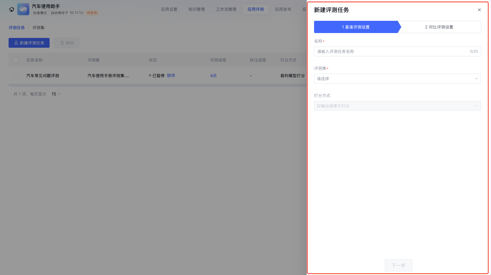

#### 裁判模型打分：

通过大模型评估评测集批量运行结果，包含裁判模型和裁判提示词两部分：

**裁判模型**：选择作为大模型裁判的模型，支持选择不同模型，并可配置模型参数。

**裁判提示词**：用于对评测结果进行打分的模型提示词，支持通过快捷键引入评测集中的查询（query）、预置列、自定义列、应用的输出内容以及其他系统变量。请确保裁判模型提示词与评测集内容的匹配程度，以保证裁判模型能够正确打分。例如，若按照参考答案进行打分，则需要在评测集中上传参考答案（例如：reference\_output）。同时支持点击**模板**，查看提示词模板库中更多适合的提示词。

注意：

裁判模型打分会产生 token 消耗，请在严格验证提示词准确性后再启动任务，以避免不必要的消耗。

#### 规则打分：

按照预定义的规则对输出结果进行打分。支持单条规则和多条规则组合 。

#### 代码打分：

通过编写代码对输出结果进行打分，目前支持 Python 语言。可直接引用评测集中的 query 、预置列和自定义列。

#### 仅输出结果不打分：

仅批量运行评测集，**不进行任何打分**，直接输出结果。选择此方式时，相当于执行任务批处理。

#### **第二步：对比评测配置**

对比评测功能用于在同一应用内对多组模型或多个提示词进行效果对比，帮助快速评估不同配置在相同任务下的表现差异。支持的对比方式包括：

-   不进行对比评测
-   多模型对比评测
-   多提示词对比评测

该功能仅支持标准模式的应用。在选择进行对比评测时，可对对比结果进行以下处理方式：

-   仅输出多个结果：生成多个结果，不进行对比打分。
-   对比打分：使用裁判模型对每条样本的多个结果进行评分。

#### 不进行对比评测（默认） ：

按照当前应用的测试环境配置运行，不进行模型或提示词的对比。

#### 多模型对比评测：

支持添加最多 2 组对比模型，与当前配置模型进行对比。如果对比模型与当前配置模型相同，系统会提示错误。

#### 多提示词对比评测：

支持添加最多 2 组对比提示词，与当前配置提示词进行对比。如果对比提示词与当前提示词相同，系统会提示错误。

#### **是否进行对比打分**

-   **仅输出多个结果，不进行对比打分**（默认） ：仅输出多组对比结果，不进行优劣判断。
-   **对每条样本的多个输出结果，使用裁判模型进行对比打分**：基于多个版本的运行结果，使用裁判模型进行对比打分，判断优劣。需要选择对比打分裁判模型和对比打分裁判提示词，和裁判模型以及裁判提示词类似。

### b. 查看评测报告

跑批完或评测完后可以查看报告，报告中包含基本信息、评测配置信息、基准评测结果、对比打分评测结果、基准评测性能报告、对比评测性能测试报告等内容并支持输出图表，将已有的测试结果数据进行可视化展示。

### c. 评测结果标注

评测任务完成后，用户可对运行结果进行人工标注，以提升评测的准确性和参考价值。标注后的结果将体现在评测报告和下载的结果文件中。

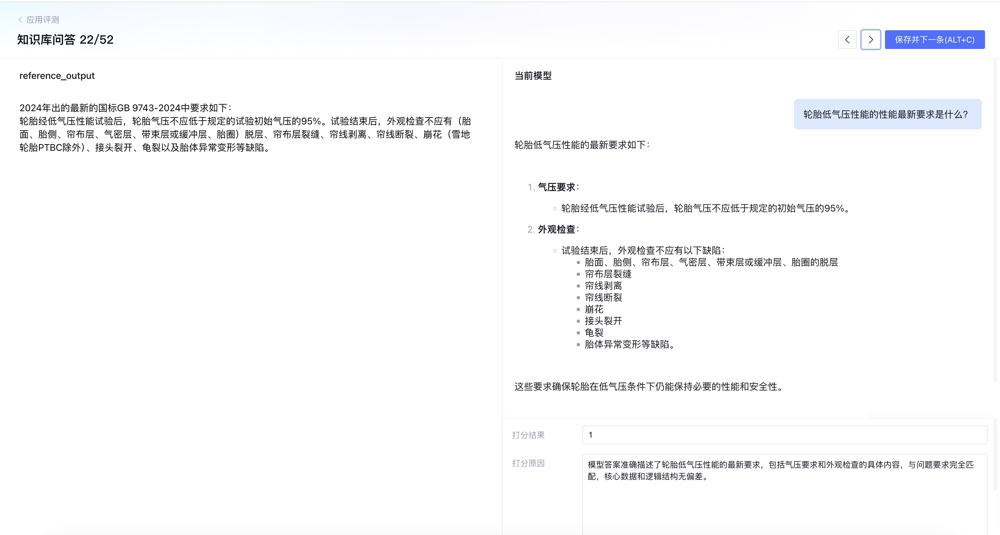

注意：

-   建议在应用评测进行过程中，不要对知识库内容进行更改，包括新增和导入、删除和修改知识库设置，避免影响评测结果。
-   不建议对 Plan-and-Execute 协同方式的 Multi-Agent 应用进行评测，该模式下无法进行完整的应用评测。

### **4.1.****4** **调试—优化—评测—回归的完整闭环**

一个稳定的智能体，不是一次搭建出来的，而是在不断调试、优化和回归中逐步稳定下来的。

| **阶段** | **主要动作** | **判断标准** |
| --- | --- | --- |
| **单次调试** | 在测试环境逐条试问，查看链路和输出。 | 主链路能跑通，明显错误能定位。 |
| **专项优化** | 根据问题类型调整 Prompt、知识库、RAG、Workflow、Agent 或工具配置。 | 修改后同类问题明显改善。 |
| **批量评测** | 使用评测集批量运行，结合自动评测和人工评测分析结果。 | 关键指标达到上线或阶段验收标准。 |
| **回归验证** | 每次重要修改后重新运行核心样本。 | 修复旧问题的同时，没有引入新的高风险问题。 |
| **运营沉淀** | 把线上 Badcase、人工标注和高频问题补充进评测集。 | 评测集持续覆盖真实业务变化。 |

### 从 “可评测” 到 “可上线”：交付与运维清单

| **阶段** | 必须完成的动作 | 交付证据 |
| --- | --- | --- |
| 上线前 | 定义业务基线、测试集和验收指标；验证峰值并发下的响应时间、成功率和稳定性；确认权限、降级、转人工、监控和回滚方案。 | 测试集结果、性能/压测记录、问题清单、修复记录、剩余风险与上线建议。 |
| 灰度上线 | 先限定用户或流量范围，观察回答准确率/采纳率、问题解决率、转人工率、点踩/满意度、接口错误率和响应时延。 | 灰度日报、异常记录、反馈列表和是否扩大范围的决策。 |
| 客户培训 | 除功能演示外，明确适用场景、不适用边界、高风险问题处理流程、常见问题和反馈渠道。 | 培训材料、操作手册、边界说明和问题升级联系人。 |
| 持续运营 | 收集反馈并分级，进入 “问题定位—修复—回归—迭代发布—效果复测” 闭环；重要变更可灰度后再全量。 | 版本记录、回归报告、发布记录和指标趋势。 |
| 范围变更 | 客户临时增加大量场景时，先评估资料、接口、工期、安全和验收影响，再走范围变更或分期交付。 | 变更影响评估、双方确认的新范围和阶段里程碑。 |

**生产环境出现高风险错误时：**第一响应不是继续调 Prompt。先确定受影响的用户、版本和场景，必要时限制入口、关闭相关能力或降级到人工；同时保留请求、命中知识、工具调用和输出日志。随后分析根因、制定修复措施，用回归样本复测并记录处理结果，再决定恢复范围。

**日志也属于受保护数据：**只采集定位和运营所需的最小范围，对姓名、手机号、证件号、薪资、健康等敏感字段脱敏；限制可访问人员，明确保留周期和删除机制，并在适用场景完成告知与授权。日志不能因为 “用于调优” 而无限期、全量保存。

本 节 结 论

智能体调试与评测的正确顺序是：搭建过程中先做单次调试，应用成型后再做批量评测；调试解决具体问题，评测证明整体效果；每次优化后都要做回归，才能避免 “修好一个问题，又引入三个新问题”。

### **4.1 小结**

-   调试发生在搭建过程中，重点是单次验证和链路排查。
-   评测发生在应用基本成型后，重点是批量样本、指标分析和上线依据。
-   单次调试不要只看最终回复，还要看知识命中、变量、节点、工具和性能。
-   评测集应来自真实业务问题、调试记录和线上 Badcase，而不是凭空编一批题。
-   每次重要优化后都要做回归，确保整体效果持续变好。

进 入 下 一 节

下一节 4.2「Prompt 与模型效果调优」会继续讲：当单次调试发现模型理解、执行、表达或格式控制有问题时，应该如何设计 Prompt、选择模型并验证优化效果。

### 4.2Prompt 调优

**从问题定位、提示词优化到效果验证，提升智能体回答稳定性**

当智能体出现答非所问、格式不稳定、知识不引用、工具参数错误或语气不一致时，优先不要只判断 “模型不行”。更有效的做法是先定位问题来源，再通过 Prompt、上下文、模型配置和测试样本逐步优化。

本 节 学 什 么

学完这一节，你应该能判断 Prompt 效果不好的常见原因；掌握清晰指令、示例、问题分解、输出约束等常用调优方法；能设计可复用 Prompt 模板；能用固定样本验证优化效果；能在 ADP 的标准模式、工作流和 Multi-Agent 模式中处理典型 Prompt 问题。

### 4.2.1 Prompt 为什么效果不好

Prompt 效果不好，通常不是因为某一句话写得不够长，而是任务、依据、边界、格式、上下文或模型配置中有关键要素缺失。调试时应先定位问题来源，再决定改 Prompt、改知识库、改工作流，还是调整模型配置。

可以把 Prompt 理解成给模型的一份 “任务说明书”。如果说明书只写 “帮我回答一下”，模型虽然会给出回复，但不一定知道应该面向谁回答、依据哪份资料回答、哪些内容不能推测、输出要不要给引用、后续节点是否需要固定字段。因此，Prompt 调优的第一步不是马上改写，而是先问：**这个问题到底是 “没听懂任务”，还是 “没有拿到正确依据”，或者是 “输出格式没有被约束”。**

在 ADP 应用中，还要注意 Prompt 与知识库、工作流、模型配置等是一起生效的，例如知识库没有命中正确内容时，单纯加长 Prompt 通常不能解决根因。

| 常见现象 | **可能原因** | **优先排查方向** |
| --- | --- | --- |
| **回答方向不对** | 任务目标不清，角色边界模糊，缺少业务背景。 | 检查角色指令、任务目标、适用范围和禁止事项。 |
| **知识命中了但回答仍自由发挥** | 未要求基于引用回答，未说明资料不足时如何处理。 | 增加 “仅依据命中内容回答”、引用要求和兜底话术。 |
| **输出格式不稳定** | 只描述了输出内容，没有给字段、格式、取值范围和示例。 | 增加输出模板、字段说明、Few-shot 示例和异常处理规则。 |
| **语气不符合业务要求** | 没有说明服务对象、业务场景和表达边界。 | 补充受众、语气、禁用表达和参考话术。 |
| **复杂任务经常漏步骤** | 多个目标堆在一个 Prompt 中，缺少步骤拆解。 | 拆成意图识别、信息抽取、检索、判断、生成、校验等步骤。 |

核心判断

如果问题出在知识没有命中，优先优化知识库和 RAG；如果问题出在命中后不会用、格式不稳定、意图执行不准，优先优化 Prompt；如果问题出在复杂推理、长上下文处理或工具规划能力不足，再结合模型配置和应用模式一起调整。

### 先定位，再调优

调优前建议先做一次单轮排查：**同一条问题下，分别查看用户输入、知识命中、节点输出、工具返回和最终回复**。如果知识命中正确，但最终回复仍然扩展了无依据内容，重点改 Prompt；如果知识根本没有命中，重点改知识库、切分、检索参数或问法改写；如果最终回复正确但下游节点解析失败，重点改输出格式。

| **排查问题** | 说明 | **下一步** |
| --- | --- | --- |
| **知识是否命中** | 查看是否命中了正确文档、正确 Chunk 或正确 FAQ。 | 未命中时优先处理知识库与检索问题。 |
| **命中后是否会用** | 查看模型是否基于命中内容回答，是否出现资料外推测。 | 补充依据规则、引用要求和无法确认时的兜底话术。 |
| **格式是否可解析** | 查看输出是否稳定符合字段、JSON 或表格要求。 | 补充字段定义、示例、缺失值规则和禁止多余解释。 |
| **边界是否明确** | 查看是否越权承诺、回答超范围问题或遗漏转人工。 | 补充禁止事项、风险场景和人工兜底条件。 |

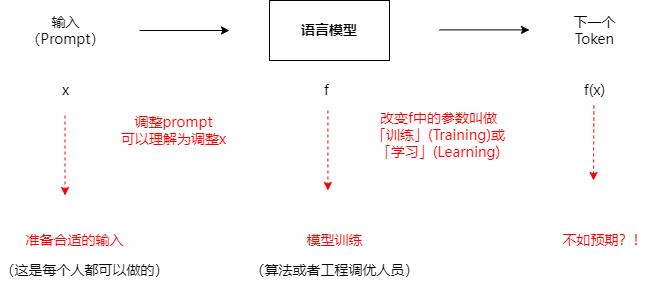

### 4.2.2 Prompt 调优的常用方法

### （1）指令清晰：说清楚角色、任务、依据和限制

清晰的 Prompt 至少要回答四个问题：**模型现在扮演什么角色、要完成什么任务、必须依据什么信息、不能做什么**。角色决定回答口吻和责任边界，任务决定本轮要完成的动作，依据决定模型能使用哪些信息，限制决定哪些情况必须拒答、追问或转人工。

很多效果问题来自 “看似合理但不够具体” 的提示。例如 “请专业回答” 并没有说明专业体现在哪里；“请简洁回答” 也没有说明字数、结构或是否需要下一步建议。对企业应用来说，Prompt 应尽量把隐含要求显式写出来，让模型少猜。

| **写法** | 示例 | **效果** |
| --- | --- | --- |
| **不推荐** | 请帮我回答用户问题。 | 任务过宽，容易泛泛回答。 |
| **推荐** | 你是企业制度问答助手。请仅依据下方知识库片段回答员工问题；如果片段中没有答案，请说明 “当前资料无法确认”，并建议联系 HR。 | 角色、依据、边界和兜底更明确。 |

### （2）添加示例：让模型模仿正确输出

当输出格式、判断标准或语气要求不容易说清楚时，添加 **1–3 个高质量示例**通常比继续堆规则更有效。示例会告诉模型 “什么样的输入应该对应什么样的输出”，尤其适合信息抽取、标签判断、客服话术、JSON 输出等任务。

**示例不是越多越好**。示例过多会占用上下文，也可能让模型过度模仿某一个样例。更好的做法是选择少量典型样例：一个标准样例、一个边界样例、一个缺失信息样例。这样模型既能学会正常处理，也能知道遇到不完整或高风险输入时怎么兜底。例如：

你是一位专业的工单信息抽取助手。

**请从用户描述中抽取以下字段，并按 JSON 输出：**

**\- issue\_type：**问题类型

**\- location：**发生地点

**\- urgency：**紧急程度，取值 high / medium / low

**\- missing\_fields：**仍需追问的字段

**示例：**

**用户：**北京门店收银机无法开机，今天下午一直影响结账。

**输出：**{"issue\_type":"设备故障","location":"北京门店","urgency":"high","missing\_fields":\[\]}

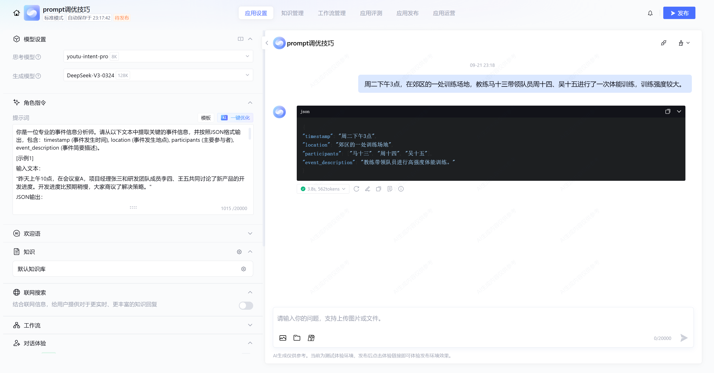

### （3）问题分解：把复杂任务拆成可验证步骤

复杂任务不要全部压在一个 Prompt 里。更稳定的做法是把任务拆成多个步骤，或在工作流中拆成多个节点。拆解的好处是：每一步目标更单一，输出更容易检查，出现问题时也更容易定位是意图识别、字段抽取、知识检索还是结果生成出了问题。

例如 “处理客户投诉” 可以拆成：识别是否投诉、提取客户诉求和关键信息、判断风险等级、查询处理规则、生成回复或转人工建议。**不要让一个节点同时完成所有动作**，否则调试时只能看到最终回答，很难知道中间哪一步发生偏差。

1.  先判断用户意图和任务类型。
2.  再提取必要字段，缺失时追问。
3.  然后查询知识库或调用工具。
4.  最后基于结果生成答案，并按格式输出。
5.  如果结果不确定，进入兜底或人工处理。

### （4）控制输出：给模板、字段和校验规则

如果后续节点需要读取模型输出，Prompt 中必须明确输出结构。只写 “请按 JSON 输出” 通常不够，还要写字段名、字段含义、取值范围、缺失值处理和禁止输出多余解释。

在工作流中，输出格式不稳定会直接影响后续节点。例如上游输出多了一段解释文字，下游 JSON 解析就可能失败；字段名有时叫 intent、有时叫 user\_intent，下游变量也可能读取不到。因此，凡是要进入后续节点的模型输出，都应尽量结构化、字段固定、规则明确。

输出要求：

仅输出 JSON，不要输出解释文字。

**字段如下：**

{

**"intent": " 用户意图，取值：**咨询 / 投诉 / 办理 / 其他 ",

"confidence": "置信度，0 到 1 之间的小数",

"need\_human": "是否需要转人工，true 或 false",

"reason": "判断原因，不超过 30 字"

}

如果无法判断 intent，intent 输出 “其他”，need\_human 输出 true。

### （5）给模型留出中间选项

不要只给模型 “对/错”“能/不能” 的二选一。当业务场景存在不确定信息时，应允许模型输出 “无法确认”“需补充信息”“建议转人工” 等中间结果。例如：

| **不稳定写法** | **更稳定写法** |
| --- | --- |
| **判断用户是否可以退款。** | 判断用户是否满足退款条件；如果资料不足，请列出需要补充的信息；如果涉及人工审批，请说明需转人工。 |
| **回答这个政策问题。** | 仅基于知识库回答；知识库没有明确依据时，不要推测，输出 “当前资料无法确认”。 |

再看四组 **Before / After** 对比，直观感受 “稳定写法” 比 “随手一写” 好在哪。Before 是常见的不稳定写法，After 是更稳定、可直接复用的写法。

### 对比一：知识问答

**Before｜不稳定写法**

回答用户的问题。

**After｜更稳定写法**

你是企业制度问答助手。仅依据检索到的制度内容回答；先给结论，再列适用条件和办理步骤。资料没有明确依据时，回复 “当前资料无法确认”，不要推测，并建议联系制度负责人。

改进重点

补齐角色、依据、结构和无法确认时的处理方式。

### 对比二：信息抽取

**Before｜不稳定写法**

从工单里提取信息。

**After｜更稳定写法**

从用户工单中抽取 order\_id、issue\_type、customer\_request 三个字段，并输出合法 JSON。缺失字段填 null，不得补写用户未提供的信息；issue\_type 只能取物流、退款、退换货、其他。

改进重点

明确字段、取值范围、缺失处理和输出格式。

### 对比三：客服话术

**Before｜不稳定写法**

专业地回复客户。

**After｜更稳定写法**

生成一段 120 字以内的客服回复：先表达理解，再说明可执行步骤，最后给出下一步。不得承诺具体到账时间；涉及金额争议时提示转人工。只输出可直接发送给客户的话术。

改进重点

把 “专业” 拆成语气、长度、边界和可复制要求。

### 对比四：工作流节点

**Before｜不稳定写法**

总结上一步结果。

**After｜更稳定写法**

读取变量 {{retrieval\_result}}，输出 summary、risk\_level、need\_human 三个字段的 JSON。risk\_level 只能取 low/medium/high；检索结果为空时 need\_human=true。不要输出 Markdown 代码块。

### 4.2.3 Prompt 模板设计

Prompt 模板的价值，是把一次有效的调优经验沉淀成可复用结构。实际编写时，可以使用 “角色—背景—目标—依据—步骤—边界—输出” 的结构。它不要求每次都写很长，但能帮助你检查关键要素是否缺失。

模板不是固定话术，而是一张检查清单。简单问答场景可以只保留角色、依据、边界和输出；复杂工作流节点则需要写清输入变量、处理步骤、输出字段和异常情况。模板设计的重点是让不同搭建者在同类场景下写出的 Prompt 保持一致，便于复用、评审和后续维护。

| **模块** | **要写什么** | 示例 |
| --- | --- | --- |
| **角色** | 模型扮演谁，服务什么对象。 | 你是企业售后政策助手，服务一线客服。 |
| **背景** | 本轮任务的业务背景和输入来源。 | 用户输入来自客户咨询，知识来自售后政策库。 |
| **目标** | 本轮必须完成的动作。 | 判断问题类型，并给出可直接回复客户的话术。 |
| **依据** | 可以使用哪些材料，优先级如何。 | 优先依据知识库；其次使用用户已提供信息；不得编造政策。 |
| **步骤** | 需要按什么顺序处理。 | 先识别意图，再匹配政策，再判断是否需要追问或转人工。 |
| **边界** | 不能做什么，何时兜底。 | 不得承诺退款成功；高风险投诉需转人工。 |
| **输出** | 输出格式、字段、长度、语气。 | 按 “结论 / 依据 / 下一步” 三段输出。 |

### （1）通用模板

你是 {角色}，服务对象是 {受众}。

**背景：**

**{业务背景}。用户输入如下：**{用户问题}

**可用资料如下：**{知识库片段或工具返回}

**任务：**

请完成 {任务目标}。

**处理步骤：**

1\. 先判断用户意图和必要信息是否完整。

2\. 再依据资料生成回答，不要使用资料外的信息。

3\. 如果资料不足，说明无法确认，并给出下一步建议。

**边界：**

\- 不得承诺超出权限的处理结果。

\- 不得编造政策、价格、时间或审批结论。

**输出格式：**

**结论：**{一句话结论}

**依据：**{引用或说明依据}

**下一步：**{用户可执行动作}

### （2）模板使用建议

不同任务的模板重点不同。不要把所有场景都套成同一个长模板，而要根据任务类型保留最关键的约束。下面这些建议可以作为设计 Prompt 模板时的快速检查。

-   知识问答类模板重点写清 “依据” 和 “无法确认时的回复”。
-   信息抽取类模板重点写清字段定义、取值范围和缺失字段处理。
-   客服回复类模板重点写清语气、禁用表达、风险边界和可复制话术长度。
-   工作流节点模板重点写清输入变量、输出变量和下游节点可解析格式。

### 4.2.4 Prompt 效果验证与迭代

Prompt 改完后，不能只看当前那一条问题是否变好。正确做法是用固定样本复测，确认**同类问题改善，同时没有引入新的问题**。

很多调优失败，是因为每次同时改了太多内容：既改 Prompt，又改模型配置，还改知识库和检索参数。这样即使效果变好，也不知道是哪项修改起作用；如果效果变差，也很难回滚。因此建议每轮只改一个主要变量，并保留优化前后的对比记录。

验证样本不需要一开始就很大，但要覆盖关键类型。比如一个客服助手，至少应包含标准问法、口语化问法、资料不足问法、边界问法和高风险问法。上线前再把这些样本扩展成更完整的评测集。

| **步骤** | **动作** | **判断标准** |
| --- | --- | --- |
| **1\. 固定样本** | 准备 10–20 条代表性问题，覆盖标准问题、口语化问题、缺省信息、边界问题和复杂问题。 | 样本能覆盖本次优化想解决的问题。 |
| **2\. 记录基线** | 保存优化前的回答、命中知识、输出格式和耗时。 | 后续能和新版本对比。 |
| **3\. 单点修改** | 每次主要只改一个变量，例如 Prompt、模型配置或检索参数。 | 能判断是哪项修改带来变化。 |
| **4\. 对比结果** | 比较准确性、完整性、格式稳定性、引用质量、语气和成本。 | 不是只看 “感觉更好”。 |
| **5\. 回归验证** | 用原有核心样本复测，检查旧问题是否复发。 | 修复问题时没有破坏其他场景。 |
| **6\. 沉淀版本** | 保存 Prompt 版本、修改原因、适用场景和验证结论。 | 后续可回滚、可复用、可交接。 |

### 建议记录字段

| 字段 | 说明 |
| --- | --- |
| **测试问题** | 本轮用于验证的用户输入。 |
| **期望结果** | 希望智能体达到的行为，不一定是唯一标准答案。 |
| **优化前结果** | 记录原始回答、链路表现和明显问题。 |
| **优化动作** | 说明本次改了什么，不要一次修改过多变量。 |
| **优化后结果** | 记录新回答、格式、引用、耗时和异常情况。 |
| **结论** | 判断是否采用该版本，是否需要继续迭代。 |

验证习惯

每次 Prompt 优化都应保留版本记录。上线前用小样本验证，重要变更后做回归验证；线上出现 Badcase 后，应清洗成新样本并补充到评测集中。

### 4.2.5 基于 ADP 的 Prompt 设计与问题处理案例

在 ADP 中，Prompt 不只出现在一个输入框里。标准模式、知识问答、工作流节点和 Multi-Agent 都可能包含不同层级的指令。处理问题时，应先判断应该改哪一层。

如果是全局回答风格、业务边界或身份定位不清，通常优先调整角色指令；如果是知识问答中 “命中了但不会用”，要检查用户输入模板和依据规则；如果是工作流某个节点输出不稳定，应调整该节点提示词；如果是工具调用失败，要同时检查工具说明、入参字段和异常返回处理。

| **ADP 位置** | **主要作用** | **适合写什么** |
| --- | --- | --- |
| **角色指令** | 定义智能体角色、任务边界、语气和全局规则。 | 身份、职责、回答原则、禁止事项、兜底策略。 |
| **用户输入模板** | 把用户问题、知识切片、历史上下文或变量组装给模型。 | 问题、上下文、引用材料、输出要求、字段约束。 |
| **工作流节点提示词** | 控制某个节点的单一步骤。 | 参数提取、标签判断、摘要生成、结果改写、JSON 输出。 |
| **工具说明和入参定义** | 帮助模型正确选择工具并生成参数。 | 工具用途、字段含义、必填项、异常返回处理。 |
| **Multi-Agent 角色配置** | 规定每个 Agent 的职责和协作边界。 | 谁负责检索、谁负责分析、谁负责复核、何时转交。 |

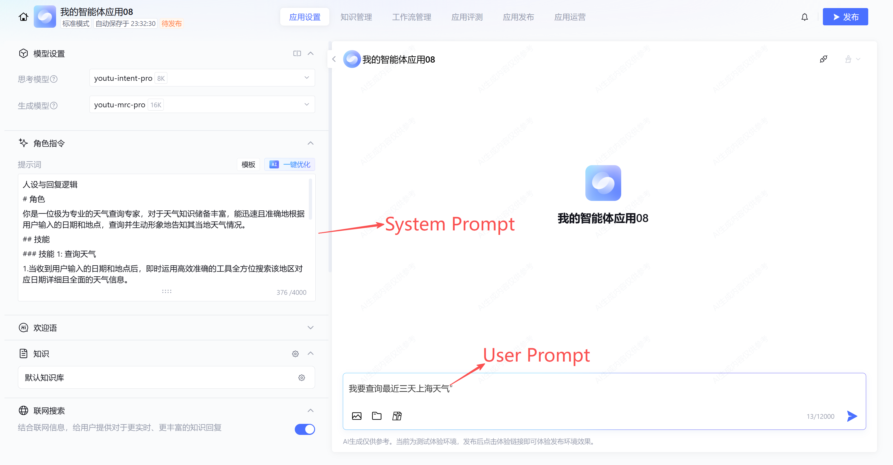

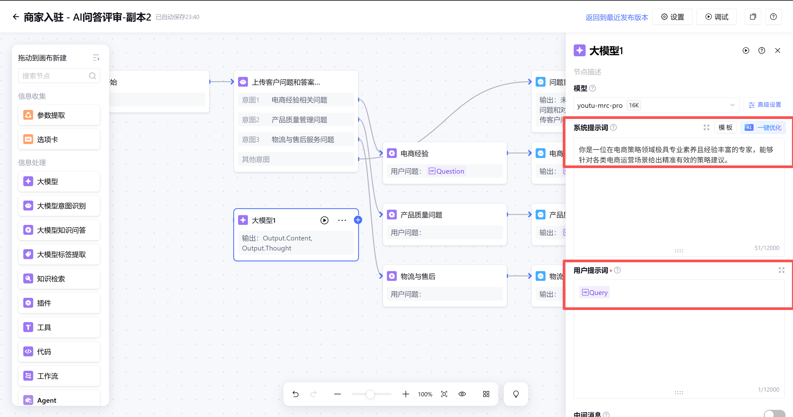

### 案例一：标准模式知识问答回答不稳定

场景：门店员工咨询退换货政策。知识库中已有政策文档，但智能体有时会补充文档里没有的承诺。这个问题的关键不是 “模型不会回答”，而是模型没有被明确要求只使用知识库内容，也没有被要求在资料不足时停止推测。

| **处理项** | **优化动作** |
| --- | --- |
| **问题定位** | 知识已命中，但 Prompt 没有要求 “仅依据知识库回答”，也没有资料不足时的兜底策略。 |
| **角色指令** | 补充 “仅依据知识库和用户已提供信息回答，不得编造政策、价格、时效或审批结论”。 |
| **输出要求** | 按 “结论 / 依据 / 下一步” 输出；资料不足时写 “当前资料无法确认”。 |
| **验证样本** | 用退货、换货、会员权益、资料不足、口语化问法等样本复测。 |

优化后的 Prompt：

你是门店知识问答助手，服务对象是一线门店员工。

请仅依据知识库内容和用户已提供信息回答，不得编造退换货、赔付、优惠、会员权益等政策。

如果知识库没有明确依据，请说明 “当前资料无法确认”，并建议联系门店主管或提交工单。

**输出格式：**

**结论：**一句话回答。

**依据：**说明依据来自哪类政策或资料；如无依据，写 “当前资料无法确认”。

**下一步：**给出员工可执行动作。

### 案例二：工作流参数提取节点经常漏字段

场景：订票流程需要收集出发地、目的地、出发时间。用户用口语表达时，节点有时会误填或自行补全字段。参数提取节点的目标不是 “尽量猜出答案”，而是稳定识别已提供字段，并把缺失字段交给后续追问。

| **处理项** | **优化动作** |
| --- | --- |
| **问题定位** | 字段定义不清，缺少必填规则、缺失字段输出和追问策略。 |
| **字段规则** | 明确字段名、含义、是否必填、缺失时输出空字符串。 |
| **输出格式** | 仅输出 JSON，禁止解释文字，missing\_fields 记录缺失字段。 |
| **验证样本** | 准备完整输入、缺出发地、缺目的地、缺时间、口语化表达等样本。 |

优化后的 Prompt：

任务：从用户输入中抽取订票信息。 字段：

**\- departure\_city：**出发地，必填

**\- arrival\_city：**目的地，必填

**\- departure\_date：**出发日期，必填

**规则：**

1\. 如果用户没有提供某个必填字段，将该字段置为空字符串。

2\. missing\_fields 输出缺失字段名。

3\. 不要根据常识补全城市或日期。

**仅输出 JSON：**

{"departure\_city":"","arrival\_city":"","departure\_date":"","missing\_fields":\[\]}

### 案例三：Multi-Agent 任务协作边界不清

场景：一个复杂资料分析应用中，检索、分析和复核都由多个 Agent 参与，但经常出现重复检索、直接下结论或遗漏复核。Multi-Agent 的 Prompt 重点不是把每个 Agent 都写得很 “聪明”，而是让每个 Agent 知道自己负责什么、不负责什么、什么时候需要把任务交给其他 Agent。

| **Agent** | **职责示例** | **边界示例** |
| --- | --- | --- |
| **检索 Agent** | 从知识库和网页中查找与问题相关的资料。 | 只负责找资料，不直接下结论。 |
| **分析 Agent** | 基于资料归纳观点、比较差异、形成判断。 | 资料不足时必须说明不确定点。 |
| **复核 Agent** | 检查事实、引用、风险表达和格式。 | 发现高风险结论时要求补充依据或转人工。 |
| **主 Agent** | 理解用户目标，分派任务，汇总最终回答。 | 不得跳过必要的检索和复核步骤。 |

### 4.2 练习：优化一个门店客服助手 Prompt

某连锁零售企业正在搭建门店客服助手。当前角色指令如下：

你是门店客服助手，请回答员工和顾客的问题，语气友好，尽量给出帮助。

调试时发现三个问题：用户问退换货政策时，智能体会凭经验补充知识库没有的内容；用户描述投诉时，智能体没有提示转人工；输出有时很长，不适合客服直接复制。请按本节方法优化这个 Prompt。

| **拆解项** | **参考答案** |
| --- | --- |
| **问题定位** | 原 Prompt 缺少回答依据、业务边界、风险兜底和输出格式要求。 |
| **角色重写** | 明确它是 “门店客服知识助手”，服务对象是一线客服和门店员工，不是审批或售后处理系统。 |
| **依据规则** | 要求仅依据知识库和用户已提供信息回答；资料不足时说明无法确认，不得编造政策。 |
| **边界策略** | 退款、赔付、投诉升级、敏感纠纷等场景不得承诺处理结果，应建议转人工或提交工单。 |
| **输出格式** | 按 “可回复话术 / 依据 / 下一步” 三段输出；话术不超过 120 字。 |
| **验证样本** | 准备退货、换货、会员权益、投诉升级、资料不足、口语化问法等 10–20 条样本复测。 |

### 优化后示例

你是门店客服知识助手，服务对象是一线客服和门店员工。

**回答规则：**

1\. 仅依据知识库内容和用户已提供信息回答，不得编造退换货、赔付、优惠、会员权益等政策。

2\. 如果知识库没有明确依据，请说明 “当前资料无法确认”，并建议联系门店主管或提交工单。

3\. 涉及投诉升级、赔付承诺、退款审批、敏感纠纷时，不要承诺处理结果，应建议转人工或按流程提交工单。

4\. 语气友好、简洁、可直接复制给客户。

**输出格式：**

**可回复话术：**不超过 120 字。

**依据：**说明引用的政策或资料来源；如无依据，写 “当前资料无法确认”。

**下一步：**给出客服或用户可执行动作。

### 安全补充：Prompt 不是安全边界

把 “不要泄露数据、不要调用危险工具” 写进系统 Prompt 很有必要，但它只能约束模型行为，不能替代系统层的安全控制。可靠方案应把系统指令、输入过滤、知识与工具权限、入参校验、输出校验和人工审核组合使用。

| 高风险信号 | 为什么危险 | 处理方式 |
| --- | --- | --- |
| 用户要求 “忽略系统规则” 或诱导输出密钥 | 试图覆盖高优先级指令或窃取凭证。 | 拒绝执行；密钥不进入模型上下文；记录风险事件。 |
| 网页、附件或知识文档中夹带 “调用敏感工具、外发资料” 等指令 | 外部内容可能被模型误当成可信命令。 | 把检索内容视为数据而非指令；过滤可疑内容；敏感工具使用最小权限和二次确认。 |
| 模型生成对外发布的文章、营销文案或通知 | 可能包含事实错误、侵权内容、违规表述或敏感信息。 | 发布前做事实核验、版权/来源检查、内容安全审核，并由授权人员人工确认。 |

**记住：**Prompt 注入防护的核心是 “即使模型被诱导，系统权限仍然阻止它越权”。系统不能把管理员工具和完整密钥交给模型，再寄希望于一句提示词保证安全。

### 4.2 小结

-   Prompt 效果不好时，先定位任务、依据、边界、格式、上下文和模型配置中的问题。
-   常用调优方法包括清晰指令、添加示例、问题分解、输出约束和中间选项。
-   Prompt 模板应沉淀角色、背景、目标、依据、步骤、边界和输出格式。
-   Prompt 优化后必须用固定样本复测，并进行回归验证。
-   在 ADP 中处理 Prompt 问题时，要找准配置位置：角色指令、用户输入模板、工作流节点、工具说明或 Multi-Agent 角色配置。

进 入 下 一 节

下一节 4.3「知识库质量与 RAG 问题」会继续讲：当问题不是 Prompt 能解决，而是知识没命中、Chunk 不合理、引用不准或检索参数不合适时，应该如何优化知识库和 RAG 链路。

### 4.3 知识库质量与 RAG 调优

**当知识问答效果不稳定时，先判断问题出在知识、切分、检索，还是生成。**

智能体知识问答的效果，不只取决于模型回复能力，更取决于知识是否准备得清楚、是否被正确切分、是否能被检索到、是否能被稳定传入模型上下文。学完本节，当知识库里明明有资料，智能体却没答对、答不全、引用不准或命中了旧内容时，你将能够从 ADP 的知识库设置和调试结果出发，判断如何从知识质量、切分方式、检索召回、问答 和引用配置中定位原因。

### 4.3.1 先判断：是不是知识与检索问题

RAG 的完整含义是 “检索增强生成”。在知识问答场景中，模型并不是自动阅读整个知识库后回答，而是先根据用户问题从知识库中检索出相关片段，再把这些片段作为上下文交给模型生成答案。因此，知识库里 “有答案” 和智能体 “能答对” 之间，还隔着检索、切分、重排、上下文拼接和生成约束等多个环节。

一个典型的 RAG 链路可以理解为：用户问题进入应用后，系统先理解问题并可能结合上下文改写；随后在知识库中召回相关文档、问答或数据库内容；再通过匹配度、重排等机制筛选更相关的片段；最后把片段、提示词和用户问题一起传给模型生成答案。如果任何一环出现问题，最终回答都会受影响。

| **链路环节** | **作用** | **常见问题** |
| --- | --- | --- |
| **用户问题** | 表达真实意图，可能包含口语化、上下文省略或模糊指代。 | 问法和文档表达差异大，导致检索不到。 |
| **知识准备** | 提供可解析、可检索、可信的知识来源。 | 文档过期、重复、标题混乱、表格不规范。 |
| **文档切分** | 把文档拆成可被检索和召回的 Chunk。 | 切片过大混入噪声，切片过小丢失上下文。 |
| **检索召回** | 通过语义检索、混合检索等方式找到候选片段。 | 召回数量太少、匹配度过高或知识范围错误。 |
| **重排筛选** | 对候选片段做二次相关性排序。 | 正确片段召回了但排在后面，未进入最终上下文。 |
| **增强生成** | 把片段和提示词拼接后生成答案。 | 命中正确但回答不按依据，引用缺失或引用错误。 |

知识问答效果不好时，最容易走偏的做法是直接改 Prompt 或换模型。实际上，很多问题的根因并不在生成，而在前面的知识准备和检索环节。你可以先用三个问题做快速判断。

| **判断问题** | **怎么看** | **优先处理** |
| --- | --- | --- |
| **知识库里有没有可靠答案？** | 查看正式文档、问答 或数据库中是否有明确、最新、可引用的答案。 | 没有答案时先补知识，不要让模型猜。 |
| **有没有命中正确片段？** | 在调试结果中查看命中文档、Chunk、问答 或数据库结果。 | 没命中时先看切分、检索范围、召回数量和匹配度。 |
| **命中后有没有按依据回答？** | 对比命中片段和最终回复，看是否扩展、遗漏或误读。 | 命中了但答错，再调整 Prompt、引用要求或模型配置。 |

排查顺序

先确认有没有知识，再确认有没有命中，最后再看有没有正确生成。这个顺序能避免把知识缺失、切分错误或检索范围错误误判为 Prompt 问题。

### 常见现象

| **现象** | **更可能的问题** | **不要先做什么** |
| --- | --- | --- |
| **知识库有答案但没命中** | 问法和文档表达差异大、Chunk 不合适、匹配度过高、检索范围不对。 | 不要只加长 Prompt。 |
| **命中了旧制度** | 版本管理、到期时间、标签或分类没有维护。 | 不要只调召回数量。 |
| **命中了正确文档但答不全** | Chunk 太短，条件、例外和结论被拆开。 | 不要直接降低匹配度。 |
| **答案正确但没有引用** | 参考来源或回复策略未配置，或 Prompt 未要求引用。 | 不要把它当成检索失败。 |

最后把 RAG 最常见的四类问题现象与优先排查项整理成一张对照表。排障时先定位现象，再按顺序逐项排查：

| 问题现象 | 优先排查项 |
| --- | --- |
| **没命中** | 1.  确认目标文档是否已上传、解析成功并处于可用状态 2.  检查问题关键词、召回范围和权限过滤 3.  查看切片是否包含可独立理解的答案信息 4.  用测试问题逐项验证召回结果 |
| **命中旧文档** | 1.  核对文档版本、更新时间和生效状态 2.  下线或删除过期知识并重新索引 3.  检查同名文档与重复切片 4.  建立版本与发布管理流程 |
| **答案不完整** | 1.  检查切片是否过短或割裂上下文 2.  调整切片重叠、召回数量和相关性阈值 3.  确认问题是否需要多段信息组合 4.  优化 Prompt，要求覆盖关键字段 |
| **引用错误** | 1.  对照回答与实际召回片段 2.  检查引用字段、文档元数据和节点变量映射 3.  避免模型生成未召回的来源 4.  用标准问题集回归验证引用准确率 |

### 4.3.2 知识库质量：把资料整理成可用知识

知识库质量决定了后续调优的上限。文档本身如果过期、重复、标题混乱、表格不规范，即使检索参数调得再细，也容易出现命中错误或回答不稳定。

这里的重点不是 “上传更多资料”，而是让资料更适合被检索、被引用、被维护。建议先把知识按业务主题整理成清单，再决定哪些放文档、哪些做 问答、哪些适合数据库。

| **调优对象** | **检查重点** | **配置与维护动作** |
| --- | --- | --- |
| **文档命名** | 名称是否能体现主题、版本、适用范围。 | 上传前统一命名；在文档列表中按分类管理。 |
| **文档结构** | 标题、段落、表格、步骤是否清晰。 | 上传前整理源文件；导入后检查解析结果。 |
| **版本管理** | 是否存在旧制度、重复文档、冲突说明。 | 删除旧文档，或设置到期时间、分类和标签。 |
| **表格资料** | 是否有空行、空列、合并单元格、重复表头。 | 清理表格后导入；必要时使用按行切分或数据库。 |
| **权限范围** | 不同身份、部门、地区是否应看到不同知识。 | 用标签和检索范围限制知识可见范围。 |

### （1）三类知识的准备规范

文档、问答和数据库都可以作为知识来源，但它们适合解决的问题不同，准备规范也不同。调优时不要把所有资料都当作文档上传，而要先判断知识的形态。例如，制度、手册、SOP 更适合文档；高频标准问题更适合问答；需要按字段查询、聚合或筛选的数据更适合数据库。

| **知识类型** | **适合场景** | **准备规范** |
| --- | --- | --- |
| 文档 | 制度、手册、SOP、产品说明、政策条款。 | 设置生效范围、文档标签、到期时间、展示参考来源和文档分类；导入后关注解析状态，必要时做解析切分干预。 |
| 问答 | 高频问题、标准客服口径、容易误解或需要固定答案的问题。 | 支持批量导入、手动录入、从文档生成；批量导入文件 5MB 以内，单个问题和答案不超过 2000 字符，单次最多 10000 条，分类标题不超过 10 个字符。 |
| 数据库 | 商品、门店、订单、库存、指标等结构化数据查询。 | 数据库名称 50 字符以内，描述 100 字符以内；数据表要补充中文名、表描述、列中文名称、列描述和单位信息，帮助模型理解字段含义。 |

-   文档类知识要重点关注 “**可解析**” 和 “**可追溯**”。如果文档到期后仍被检索，可能导致过期答案；如果没有打开参考来源，学员在测试时可能无法判断答案来自哪里。
-   问答类知识要重点关注 “**可校验**” 和 “**无冲突**”。从文档生成的问答必须经过人工校验后再采纳，冲突问答需要合并处理。
-   数据库类知识要重点关注 “**字段可理解**”。表名、列名、单位和描述写得越清楚，模型越容易判断应该查询哪张表、哪个字段。

### （2）不要直接上传的典型资料

-   只适合人看的活动海报、复杂宣传页、截图合集。
-   大量设计元素混在一起的 PPT 页面。
-   拍照模糊、倾斜、遮挡或表格线不清晰的扫描件。
-   多人反复修改后没有版本标识的制度汇总。

调优建议

如果资料本身适合人读但不适合机器检索，先提取关键信息再入库。例如活动海报可以整理成 “活动名称、适用时间、参与条件、优惠规则、限制条件、咨询入口”。

### 4.3.3 Chunk 切分：让片段既能命中，也能看懂

Chunk 是知识检索时被命中的基本片段。切分调优的目标不是追求越细越好，而是让每个片段都围绕一个相对完整的问题：既容易被用户问题命中，又能提供足够上下文让模型回答。

判断切分是否合适，可以看命中片段本身是否 “能独立支撑回答”。如果片段只命中了结论，却没有条件；只命中了表格数据，却没有表头；只命中了流程步骤，却缺少前置条件，说明切分还需要调整。

| **切分问题** | **学员怎么判断** | **优化方向** |
| --- | --- | --- |
| **切片过大** | 命中片段很长，包含多个主题，答案容易混入无关内容。 | 按标题、条款、问题或业务单元重新切。 |
| **切片过小** | 命中片段只有结论，没有条件、适用范围或例外。 | 增加切片长度或重叠，必要时用父子级切分。 |
| **表格被切坏** | 表头和数据分离，字段含义丢失。 | 表格按行切分，并保留表头范围。 |
| **问答被拆散** | 问题和答案不在同一个片段里。 | 按一问一答整理，或使用问答知识。 |

### ADP 中常用切分方式

| **方式** | **适合场景** | **使用提示** |
| --- | --- | --- |
| **默认切分** | 普通制度、说明文、手册类文档。 | 适合先快速验证，不适合所有特殊文档。**不支持用户干预。** |
| **通用标识符切分** | 文档已有清晰章节、符号或固定分隔。 | 可设置标识符、切片最大长度、切片重叠长度。 |
| **父子级标识符切分** | 检索需要精确，回答需要完整上下文。 | 子级用于检索，父级用于召回给模型。 |
| **按行切分** | 每行或每几行是独立知识的表格。 | 适合 SKU、规则清单、门店表等。 |

参数边界

通用标识符切分可设置切片最大长度和切片重叠长度，切片最大长度不超过 4800 字符；重叠长度建议为切片最大长度的 10%，最高为 25%。

父子级切分中，子级切片最大长度不能超过父级最大长度，且最大可设置 1500 字符。表格按行切分时，表头范围最大支持 5 行。

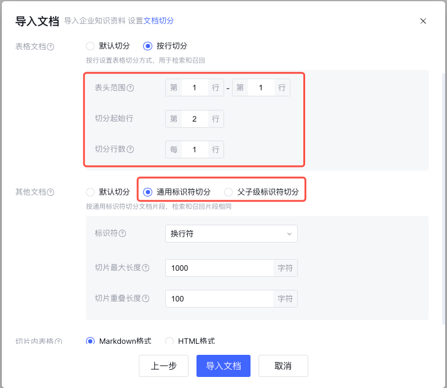

### 4.3.4 检索召回：让合适的内容排到前面

切分解决 **“知识怎么存”**，检索召回解决 **“用户问的时候怎么找”**。调优时不要只盯着一个参数，而要看召回数量、匹配度、检索策略、重排、检索范围是否共同影响了结果。

检索参数的调整要围绕测试样本进行，而不是围绕单条问题反复试。召回数量调大，可能让某条问题命中，但也会带入更多噪声；匹配度调低，可能提高覆盖率，但也可能让弱相关片段进入上下文。更稳妥的做法是固定一组样本，看整体命中率、引用准确性和最终答案质量是否改善。

### （1）先看召回结果，再调参数

如果调试时没有看到正确片段，优先检查检索范围和召回设置；如果正确片段出现了但排序靠后，再考虑重排；如果召回结果很多但都不相关，说明匹配度、知识质量或文档表达需要调整。

| 配置项 | **影响什么** | **调优提醒** |
| --- | --- | --- |
| **向量模型** | 影响语义匹配能力。 | 当知识库中已经上传文档或关联数据库后，将不可变更该知识库的向量模型。如知识库内容清空，方可继续更改向量模型。 可在应用内 “知识管理 - 更多 - 知识处理模型” 里更改向量模型。 |
| **召回数量** | 返回多少个候选片段。 | 太少会漏，太多会带入噪声。 可在应用内 “应用设置 - 知识 - 知识库检索设置 - 检索召回” 里更改文档和问答的召回数量。 |
| **检索匹配度** | 控制片段达到什么相关度才被召回。 | 阈值高更精准但可能漏召回；阈值低覆盖广但噪声增加。 可在应用内 “应用设置 - 知识 - 知识库检索设置 - 检索召回” 里更改文档和问答的检索匹配度。 |
| **检索策略** | 结合语义和关键词匹配。 | 适合既有自然语言问题，又有编号、产品名、专有名词的场景。 可在应用内 “应用设置 - 知识 - 知识库检索设置 - 检索召回” 里更改检索策略。 |
| **重排** | 对候选片段二次排序。 | 适合 “正确片段召回了但不靠前” 的问题。 可在应用内 “应用配置 - 知识 - 检索召回设置” 里更改重排序模型，选择用于优化检索召回结果排序的模型，对召回阶段候选结果进行更精细化的重新排序。 |
| **检索范围** | 控制哪些标签、分类或知识可被检索。 | **可在应用内 “应用设置 - 知识 - 知识库检索设置 - 检索范围” 里更改检索范围。** |

### **（2）**典型调参判断

| **现象** | **优先动作** |
| --- | --- |
| **一条都没命中** | 检查知识范围、匹配度是否过高、问法是否需要 配置问答或同义词。 |
| **命中太多无关内容** | 提高匹配度，清理低质量文档，优化文档标题和结构。 |
| **正确片段在结果里但靠后** | 开启或调整重排，减少无关召回。 |
| **表格查询不稳定** | 清理表格结构，评估按行切分、Excel 检索增强或数据库。 |

### 4.3.5 问答、引用与 Badcase 回归

### （1）用问答稳住高频问题

问答适合解决用户真实问法和正式文档表达不一致的问题。高频问题、口语化问题、风险问题、需要固定话术的问题，都可以优先沉淀为问答。

设计问答时，不要只把制度标题改成问题。好的问答应该来自真实用户问法，并且答案要和正式文档保持一致。比如用户不会问 “市内交通费报销规则是什么”，更可能问 “打车票怎么报”“网约车发票能不能报”。这些问法都可以映射到同一条标准答案。

| **适合做问答** | 示例 | **注意** |
| --- | --- | --- |
| **高频咨询** | 年假怎么休？报销多久到账？ | 答案要短、准、可直接回复。 |
| **口语问法** | 打车票怎么报？ | 对应正式制度条款，避免凭经验写。 |
| **风险口径** | 投诉赔付能不能承诺？ | 明确不能承诺时的转人工或工单流程。 |
| **跨文档答案** | 请假审批要找谁？ | 把分散规则整理成标准答案。 |

问答维护提醒

增补问答前，先检查是否已有相似问题，避免同一问题出现不同答案。通过文档生成问答后，需要人工校验；未采纳或未校验的问题不应直接作为正式答案使用。

### （2）引用是可信度的一部分

知识问答不是只要 “答得像” 就可以。对企业制度、售后政策、合规说明等场景，用户需要知道答案来自哪里。引用缺失会降低可信度，引用错误则说明检索、重排、文档版本或生成约束可能存在问题。

| **引用问题** | **排查方向** |
| --- | --- |
| **没有引用** | 检查参考来源展示设置，以及 Prompt 是否要求基于引用回答。 |
| **引用旧文档** | 检查旧文档是否删除、到期或被正确打标签。 |
| **引用正确但答案扩展** | 优化 Prompt，要求仅依据引用内容回答，资料不足时说明无法确认。 |

### （3）常见 Badcase

调试和评测过程中出现的 Badcase 不要只记录 “答错了”，而要记录 “错在哪里、优先怀疑哪一环、改了什么、改完是否真的变好”。建议至少保留四类信息：**问题现象、优先归因、调整动作、调整后效果。**这样后续再次做评测时，才能判断问题是否被真正修复，而不是只在某一次测试中偶然答对。

| **问题现象** | **优先归因** | **调整动作** | **调整后效果** |
| --- | --- | --- | --- |
| **知识库有答案但没命中** | 可能是检索范围设置不正确、匹配度阈值过高、召回数量过少，也可能是用户问法和文档表达差异较大，或缺少对应问答。 | 先查看本轮调试的命中结果，确认是否检索到了正确知识库、分类、标签和文档； 如果知识存在但没有召回，可适当调整召回数量和匹配度；对于高频口语化问法，补充问答或同义问法。 | 同类问题能够稳定命中正确文档、Chunk 或问答； 用户换一种常见问法时，也能召回相同或相近的知识依据。 |
| **命中了正确文档但答不全** | 可能是 Chunk 不完整，关键条件、适用范围、例外说明或后续步骤被切到其他片段中，模型只拿到了一部分依据。 | 查看命中的 Chunk 内容，确认是否包含完整的 “条件—结论—例外—下一步”； 如果片段过短，可调整切分最大长度、切分重叠长度，或使用父子级切分，让检索保持精准，同时给模型召回更完整的父级上下文。 | 答案能够覆盖关键条件、限制、例外和操作步骤； 同类问题不再只回答一半，引用内容也能支撑完整答案。 |
| **命中了错误文档** | 可能是知识库中存在旧版本、重复文档、相似标题文档，或文档标签、分类、检索范围设置不准确，导致系统召回了不该使用的知识。 | 检查被命中的文档是否为最新版本，清理或停用旧版资料；为不同版本、部门、地区、用户身份的文档设置分类、标签或到期时间； 必要时优化文档命名，让标题体现主题、版本和适用范围。 | 同一问题优先命中最新、正确、适用范围匹配的文档； 旧版内容不再参与回答，引用来源与当前业务口径一致。 |
| **表格类问题答不准** | 可能是表格结构不适合直接检索，例如存在合并单元格、空行空列、重复表头、字段含义不清；也可能是切分方式不适合，导致表头和数据分离。 | 先清理表格结构，确保表头明确、字段不重复、无无效空行空列；如果每行是独立知识，可按行切分并保留表头范围； 如果问题需要按字段查询、筛选或统计，可考虑使用数据库，并补充表描述、列描述和单位信息。 | 表格问题能够命中正确行、正确字段或正确数据表； 答案中的数值、字段含义和单位更稳定，减少因表头丢失导致的误答。 |
| **高频问题反复不稳定** | 可能是正式文档表达和用户真实问法差异较大，模型每次命中的片段不一致；也可能是该问题需要固定口径，不适合只依赖长文档检索。 | 将高频问题沉淀为问答，使用用户真实问法作为问题表达，答案与正式文档保持一致； 补充常见同义问法； 将该问题加入评测集，后续每次调整知识库、切分或检索配置后都做测试。 | 高频问题能够稳定命中问答或固定知识依据； 不同用户问法下回答口径一致，后续版本调整后也能通过评测集验证。 |

如果同一个 Badcase 多次复发，说明它不只是单条问题，而是某一类知识组织、切分或检索策略存在系统性问题，应把它升级为专项优化项。

### 4.3.6 ADP 的知识库与 RAG 调优流程总结

在 ADP 中，建议按照 “知识准备—导入配置—单次调试—批量评测—回归沉淀” 的顺序推进知识库与 RAG 的调优。

| **步骤** | **在 ADP 中做什么** | **产出** |
| --- | --- | --- |
| **1\. 梳理知识** | 确定知识类型：文档、问答、数据库、网页；清理旧版本和重复内容。 | 知识目录、文档清单、FAQ 清单。 |
| **2\. 设置知识处理模型** | 在知识库设置中确认向量模型、文档解析模型、问答对生成模型、Schema 生成模型等 | 稳定的知识处理配置。 |
| **3\. 设置文档切分** | 上传文档时或解析切分干预中选择默认切分、自定义切分、父子级切分或按行切分。 | 可检索、语义完整的 Chunk。 |
| **4\. 调整检索召回** | 在应用设置的知识库设置中调整检索策略、召回数量、匹配度、重排和检索范围。 | 更稳定的命中结果。 |
| **5\. 配置引用与回复** | 设置参考来源展示方式，结合 Prompt 要求基于引用回答。 | 可信、可追溯的答案。 |
| **6\. 建立评测集** | 收集真实问题和典型问题，覆盖高频、口语化、边界、表格和版本问题。 | 可回归的评测样本。 |
| **7\. 沉淀 Badcase** **集** | 把线上问题归类为知识、切分、检索、生成或引用问题，并回写优化动作。 | 持续优化闭环。 |

### 4.3 练习：优化员工制度问答助手

某企业搭建员工制度问答助手，上传了考勤、报销、请假和福利制度。测试时出现以下问题，请判断优先优化方向。

| **测试问题** | **现象** | **优先优化方向** |
| --- | --- | --- |
| **年假怎么休？** | 回答很泛，没有说明适用条件。 | 检查 Chunk 是否包含条件；必要时补 问答。 |
| **打车票怎么报？** | 没有命中交通费报销规则。 | 补充口语化 问答，检查报销文档标题和切分。 |
| **病假工资怎么算？** | 命中了旧版制度。 | 清理旧文档，设置到期时间，修正版本标签。 |
| **请假要找谁审批？** | 命中流程但缺少岗位差异。 | 调整切分，确保岗位条件和审批规则在同一上下文。 |
| **福利补贴有没有上限？** | 回答正确但没有引用。 | 检查参考来源展示设置和回答 Prompt。 |

### 参考调优路径

这个练习的关键不是一次性把所有参数都改掉，而是先把问题归类，再按归因逐项优化。文档旧、切分断、问答缺失、引用缺失，分别对应不同的处理动作。

1.  整理制度版本，删除或到期旧版文档，统一命名规则。
2.  检查关键问题对应 Chunk，确认条件、结论、例外没有被拆断。
3.  为高频口语问法补充问答，例如 “打车票怎么报”。
4.  检查应用中的知识库检索设置：召回数量、匹配度、重排和检索范围。
5.  配置参考来源展示，并要求答案基于引用内容生成。
6.  把修复后的问题加入评测集，每次调整后做回归。

**运维 Tips｜知识变更必须可审核、可回归：**新增制度文件前先核验版本、生效时间、重复内容和与旧资料的冲突；记录知识库版本及变更清单，完成审核后再发布。每次大批量新增、删除或调整切分/检索配置，都要用关键问题回归测试，确认旧问题没有反弹、部门权限没有串库，再逐步扩大使用范围。

### 4.3 小结

1.  知识库质量与 RAG 调优的关键，是先定位问题发生在知识、切分、检索、引用还是生成。
2.  文档调优重点是结构清晰、版本准确、表格规范、标签和范围可控。
3.  Chunk 调优重点是让片段既容易命中，又包含足够上下文。
4.  检索调优要结合召回数量、匹配度、重排和检索范围，不要只为单条问题调参。
5.  问答 适合沉淀高频、口语化、风险口径和跨文档答案。
6.  每个 Badcase 都应记录现象、归因、调整动作和复测结果，沉淀为后续回归样本。

进 入 下 一 节

下一节 4.4「Workflow 优化」会继续讲：当问题不是知识召回本身，而是工作流的配置问题导致效果不稳定时，应该如何优化执行链路。

### 4.4Workflow 调优

**基于 ADP 工作流画布，把复杂业务流程调到稳定、可控、可复测。**

本节将从工作流管理页、可视化画布、节点详情、连线、变量和调试结果入手，学习如何定位流程为什么跑不通、为什么走错分支、为什么插件报错，以及如何验证修改是否真正有效。

### 4.4.1 先看清：ADP 工作流在页面上长什么样

ADP 工作流在应用详情页的**工作流管理**中创建、配置、启用和调试。调优时不要只停留在 “用户最后看到的回答”，而要回到工作流页面看流程本身：目标工作流节点是否连对，节点详情里的输入输出变量是否正确，调试结果显示哪个节点失败。

工作流页面可以理解为三层：第一层是工作流管理页，用于确认工作流是否存在、是否启用；第二层是画布，用于查看节点和连线；第三层是节点详情页，用于查看单个节点的输入、处理逻辑、输出和异常设置。调优时要按这三层逐步缩小问题范围。

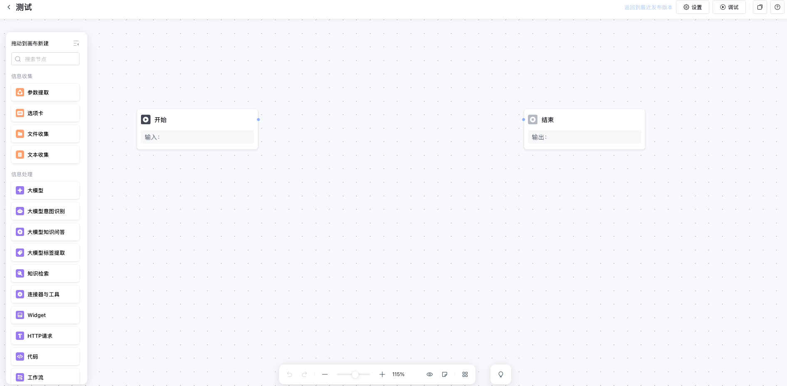

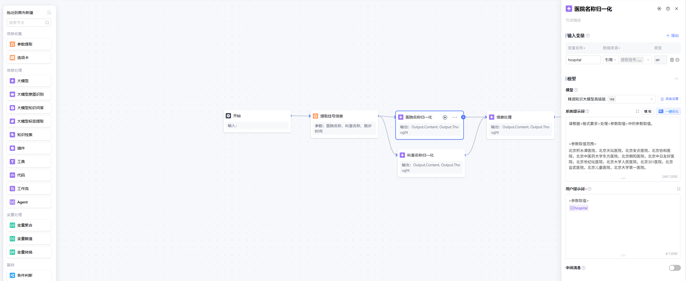

页面定位

看到工作流问题时，先问三个问题：当前问题有没有触发这个工作流？触发后经过了哪些节点？失败或偏差发生在哪个节点？这比直接修改整条流程更容易定位根因。

### 4.4.2 调优从场景边界开始：输入、处理、输出要清楚

参考资料强调，工作流场景调研的核心是把客户业务需求翻译为智能体可执行的工作流目标。很多流程不稳定，不是因为平台节点能力不足，而是一开始没有说清楚流程要处理什么、不处理什么、依赖什么、怎么验收。

例如 “做一个售后助手” 太宽泛，不适合直接进入画布配置。更可执行的描述应该是：“用户提出退货、换货或投诉时，系统收集订单号和商品信息，查询订单系统和售后政策，生成工单或引导转人工。” 这时你才能判断需要哪些节点、哪些字段、哪些异常路径。

| **调研项** | **调优时要复查什么** | 示例 |
| --- | --- | --- |
| **需求拆解** | 流程到底解决哪个具体问题，是否有量化目标。 | 退换货咨询准确率、工单创建成功率、参数收集完整率。 |
| **流程边界** | 输入是什么，处理中调用什么，输出给谁。 | 输入：用户问题 + 订单 ID；处理：订单 API + 政策知识；输出：解决方案 + 转人工按钮。 |
| **依赖项** | 需要哪些系统、接口、知识库或插件。 | 订单系统 API、退换货政策知识库、工单插件。 |
| **风险控制** | 哪些情况不能自动执行，必须兜底或转人工。 | 赔付承诺、权限不足、敏感投诉、接口超时。 |

如果边界不清，后续会出现两个典型问题：**一是流程越搭越长，二是节点职责越来越混乱**。所以正式调节点前，建议先把这张表补齐。

### 4.4.3 节点选型：先选对节点，再谈调优

ADP 工作流节点分为信息收集类、信息处理类、变量处理类和基础节点。调优时最常见的问题，是把一种节点当成另一种节点用。节点选错后，Prompt 写得再细也可能不稳定。

| **节点类别** | **适合做什么** | **调优提醒** |
| --- | --- | --- |
| 信息收集类节点 | 通过多轮对话或 UI 收集必要信息，如参数提取、选项卡、文件收集。 | 需要向用户补齐信息时，优先考虑参数提取节点。 |
| 信息处理类节点 | 加工已有信息，如大模型节点、知识问答、标签提取、插件、工具、代码。 | 它们主要处理信息，不应承担大量追问职责。 |
| 变量处理类节点 | 变量转换、赋值、聚合。 | 用于解决字段格式、数组、变量聚合等流转问题。 |
| 基础节点 | 开始、结束、回复、条件判断、循环、数据库等。 | 用于控制流程进入、退出、分支和结果输出。 |

### 典型 Badcase：用标签提取节点收集参数

酒店客需送物场景中，需要收集用户需要的**物品和数量**作为插件入参。原配置使用大模型标签提取节点，当用户没有明确部分参数时，节点不会主动追问，导致插件入参缺失并报错。调整方案是改用**参数提取节点**。

这个案例说明：标签提取更适合把已有文本打上类别标签；参数提取更适合围绕后续工具调用收集必填字段。只要字段缺失会影响后续执行，就应优先考虑参数提取节点和缺失追问。

再如：

| **问题** | **错误配置** | **正确调优** |
| --- | --- | --- |
| **用户只说 “送毛巾”** | 标签提取节点抽取不到数量和房间号，但流程继续调用插件。 | 参数提取节点设置必填字段，缺失时自动追问。 |
| **用户一次给多个车牌号** | 模型自由选择其中一个。 | 参数规则限制单次仅支持一个值，多值时置空并追问。 |
| **用户只给城市，没有完整地址** | 地址字段被错误认定完整。 | 在参数提取 Prompt 中给出地址规则和示例。 |

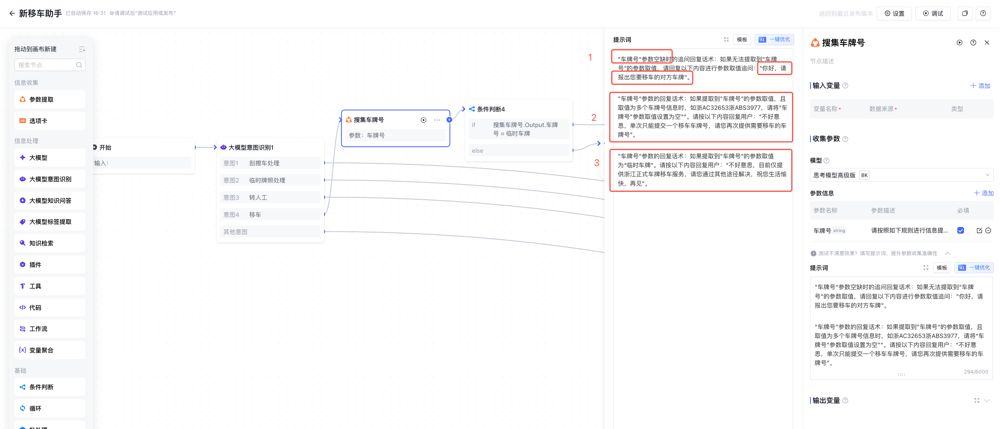

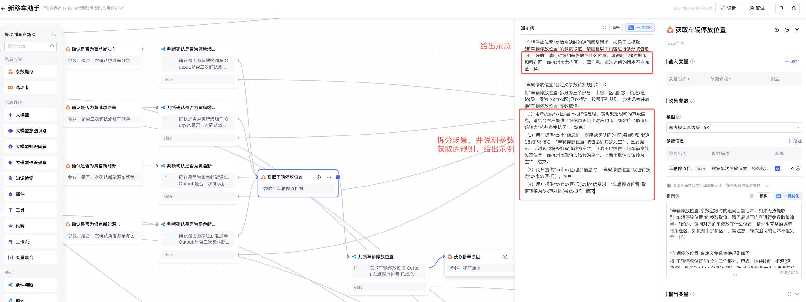

### 4.4.4 连线、变量和输出：让流程能被下游读懂

工作流节点之间通过连线表达执行流向。产品资料中说明，节点输入变量可以引用所有祖先节点的输出变量；在端到端调试时，画布会展示节点状态、输入输出变量详情以及连线状态。

调优时要特别关注变量。很多 “流程失败” 本质上不是节点不会处理，而是上游输出字段和下游引用字段不一致，或者分支判断拿到的是空值。建议关键节点都明确输出字段名称、字段类型和缺失值处理方式。

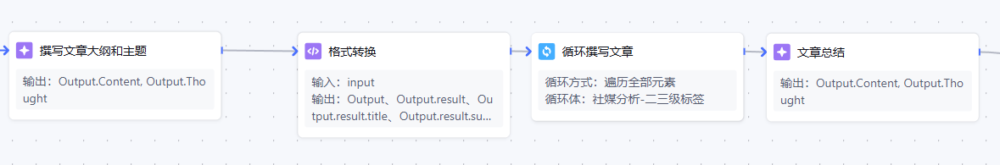

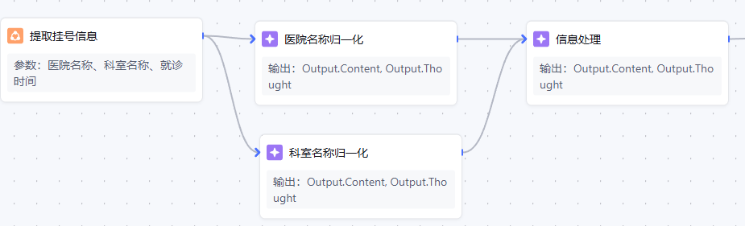

连线约束

工作流中必须有开始和结束节点，整个工作流才可以正常执行；当前节点的输入要连接前序节点的输出。

### 输出变量要服务前端识别

如果前端需要识别模型输出是标题、短攻略还是长攻略，不能只输出自然语言。参考资料中的旅游攻略场景，通过在回复节点配置输出变量，让前端稳定识别不同内容类型。

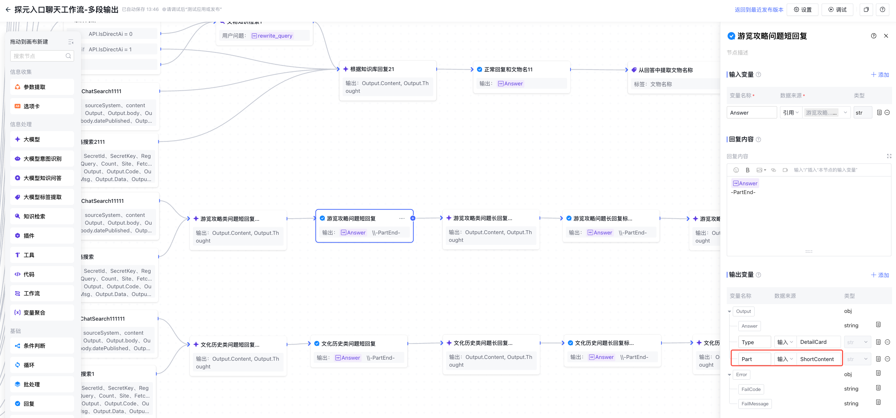

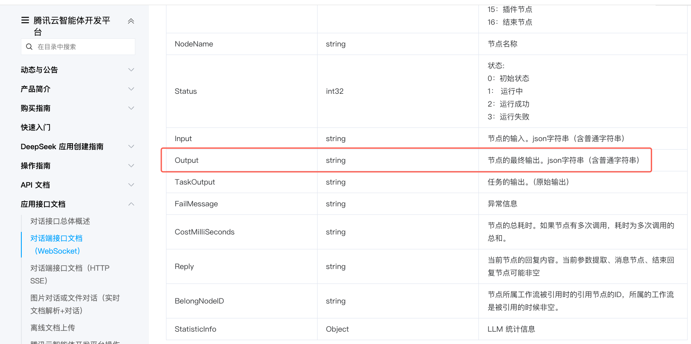

### 4.4.5 调试：单节点调试与端到端调试要结合

ADP 工作流支持单节点调试和端到端调试。单节点调试适合开发阶段验证某个节点是否能独立工作；端到端调试适合验证整条流程是否能从用户输入跑到最终回复。

不要把端到端调试当成唯一调试方式。如果端到端失败，应先定位失败节点，再回到该节点做单节点调试。这样可以避免在整条链路里盲目修改，尤其适合排查大模型节点、参数提取节点、插件节点和代码节点。

| **调试方式** | **适合验证** | **页面上看什么** |
| --- | --- | --- |
| **单节点调试** | 参数提取、选项卡、大模型、大模型意图识别、大模型知识问答、大模型标签提取、知识检索、插件、工具、代码、工作流节点。 | 填写节点输入变量后运行，看该节点输出是否符合预期。 |
| **端到端调试** | 完整流程是否跑通。 | 看节点状态、输入输出变量、连线状态和最终回复。 |
| **应用测试窗** | 启用工作流后应用是否能正常调用。 | 看应用对话中是否展示工作流调用详情。 |

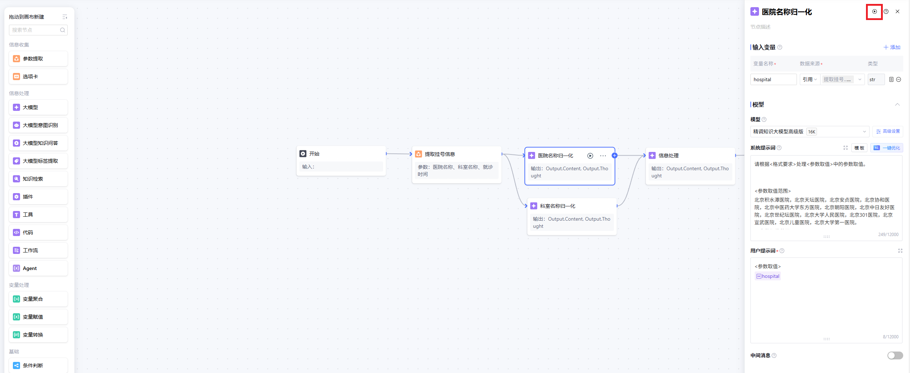

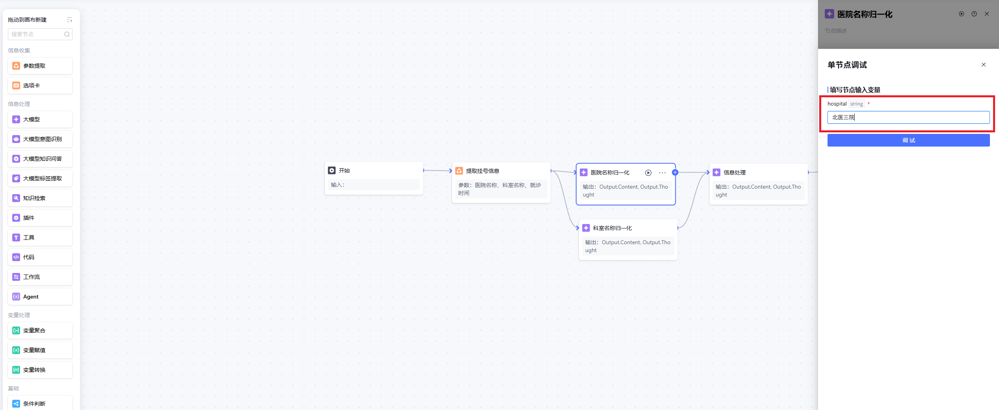

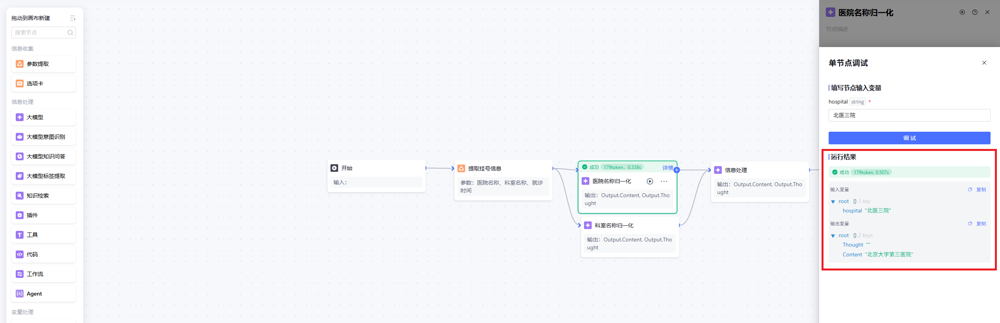

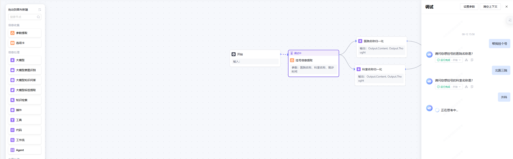

### 专项调优案例

**语种输出不稳定：**不要只在 Prompt 中写 “中文问题中文回复，英文问题英文回复”。更稳定做法是在开始节点后增加大模型节点来判断语种，输出语言变量，后续节点引用该变量；固定拒答话术也应提前配置不同语种版本。

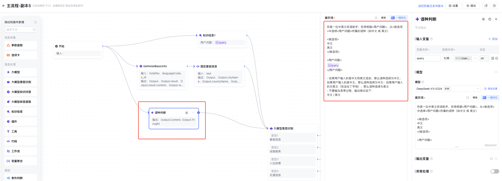

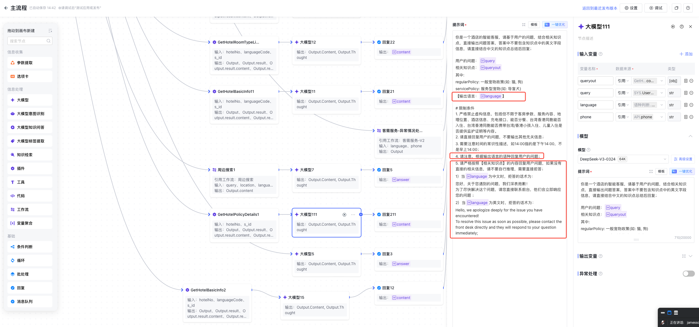

**意图识别错误：**当两个 query 语义接近但业务意图不同，例如 “入住时间” 和 “完成入住的耗时”，可以通过意图示例进行强制干预。

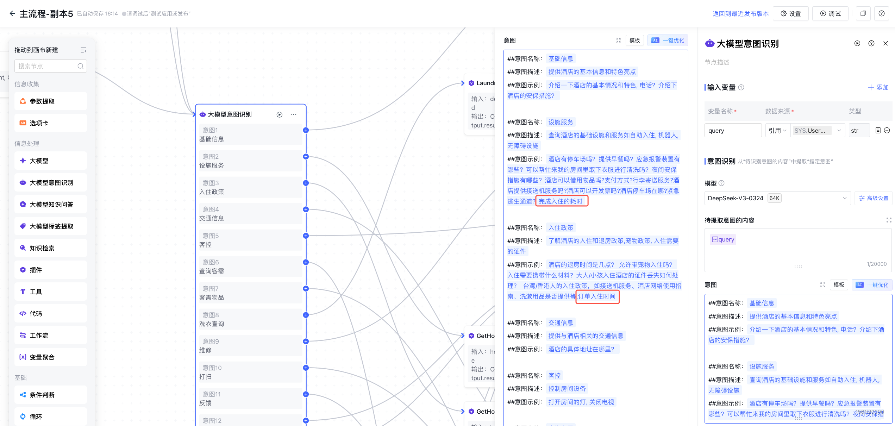

### 4.4.6 常见 Badcase 举例

| **问题现象** | **优先归因** | **可以进行的****调整动作** | **调整后效果** |
| --- | --- | --- | --- |
| **插件报错，入参缺失** | 使用标签提取节点收集参数，缺失时不会稳定追问。 | 改用参数提取节点，设置必填参数和缺失追问。 | 调用插件前能稳定收齐必要参数。 |
| **语种回复不稳定** | 只靠简单 Prompt 判断语种。 | 新增大模型节点判断语种，后续节点引用语言变量；固定话术提前配置多语种。 | 中文/英文问题能够稳定输出对应语种。 |
| **自定义意图识别错误** | 意图名称和描述不足以表达非常规业务分类。 | 补充意图示例，对相似 query 做强制干预。 | 语义相近但业务不同的问题能进入正确分支。 |
| **输出结果前端无法识别** | 回复节点只输出自然语言，没有配置输出变量。 | 在回复节点配置输出变量。 | 前端可稳定识别标题、长文、短文等类型。 |
| **工作流调试通过但应用不调用** | 工作流未启用或未发布到应用。 | 在工作流管理页启用工作流，并在应用测试窗验证调用详情。 | 应用可正常调用工作流。 |

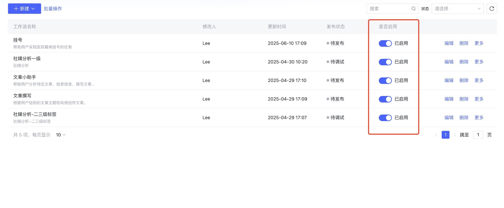

### 4.4 练习：优化酒店客需送物流程

某酒店智能客服支持客需送物。用户可以说 “帮我送两条毛巾到 1208 房间”，系统需要收集物品、数量、房间号并调用客需工单插件。测试时出现以下问题，请判断优先优化方向。

| **测试现象** | **优先优化方向** |
| --- | --- |
| **用户说 “送毛巾”，插件直接报错。** | 参数提取节点：数量和房间号缺失时追问。 |
| **用户一次说 “送毛巾和矿泉水”，系统只识别一个物品。** | 参数规则：明确是否支持多物品；不支持时追问。 |
| **用户问 “入住时间”，流程进入设施服务分支。** | 补充意图示例，干预自定义意图识别。 |

### 参考调优路径

这个练习的重点，是把问题定位到具体配置位置，而不是笼统地说 “模型没理解”。参数缺失看参数提取节点，语种混乱看语言判断变量，意图错误看意图示例，前端识别失败看回复节点输出变量。

1.  先确认流程边界：输入、处理、输出和依赖插件。
2.  将物品、数量、房间号设置为参数提取节点关键字段。
3.  缺字段时进入追问，不继续调用插件。
4.  对语种、意图、多值参数等特殊规则单独配置。
5.  使用单节点调试验证参数提取和意图识别，再做端到端调试。

**运维 Tips｜接口变化与超时：**工具节点频繁超时时，优先检查外部接口性能、平台和工具的超时设置、并发/限流以及失败重试策略。重试要设置次数、间隔和幂等约束，避免重复建单或重复写入。业务接口的地址、鉴权、字段、错误码或返回结构发生变化后，应更新工具配置，分别验证鉴权、正常返回、超时和异常分支，再回归关键链路，例如订单查询与工单创建，确认后再发布。

### 4.4 小结

1.  Workflow 调优要基于 ADP 工作流画布：看节点、连线、变量、输入输出和调试详情。
2.  工作流问题先回到业务边界：输入是什么、处理什么、输出什么。
3.  节点选型要准确，参数收集优先用参数提取节点。
4.  语种、意图、多值参数、前端识别等特殊规则，应通过变量、意图示例和输出变量稳定实现。
5.  单节点调试用于定位节点能力，端到端调试用于验证完整链路。

### 4.5Multi-Agent 调优

**基于 ADP Multi-Agent 的 Agent 配置、工具调用、协同方式和调试现象定位问题。**

本节聚焦 Multi-Agent 调优：当 Agent 不兜底、乱调工具、工具返回解析错、输出格式不稳定或转交失败时，你需要回到 Agent 的名称、转交描述、提示词、工具配置、协同方式和高级设置中检查。

### 4.5.1 先看清：ADP Multi-Agent 的配置项

Multi-Agent 模式支持创建单 Agent 应用，也允许添加多个 Agent，并选择不同协同方式。调优时要重点看这些配置项：名称、模型、转交描述、提示词、连接器与工具、转交关系、协同方式和高级设置。

其中，“转交描述” 和 “提示词” 很容易混淆。**转交描述**是给其他 Agent 判断 “什么时候该转交给我” 的简要说明；**提示词**是给当前 Agent 执行任务时使用的详细工作规则。转交失败时优先看转交描述，执行过程不稳定时优先看提示词和工具说明。

| 配置项 | **调优时看什么** | **常见问题** |
| --- | --- | --- |
| 名称 | 是否简洁描述 Agent 功能。 | 名称过泛，其他 Agent 不知道何时转交。 |
| 转交描述 | 是否说明功能和应用场景。 | 转交描述不清，导致转交失败。 |
| 提示词 | 是否约束执行流程、响应方式和边界。 | 只写角色，不写工具调用规则和兜底。 |
| 连接器与工具 | 工具名称、描述、入参、出参是否清楚。 | Agent 误选工具或误读返回。 |
| 协同方式 | 自由转交、工作流编排、Plan & Execute 是否适合任务。 | 复杂任务用自由转交，稳定性不足。 |
| 高级设置 | 思考模式、最大推理轮数、上下文轮数、同义词等 | 轮数过低导致思考不足、别称无法识别。 |

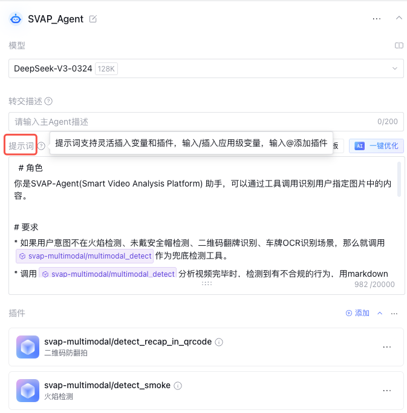

### 4.5.2 协同方式选择：自由转交、工作流编排、Plan & Execute

ADP 支持多种 Agent 协同方式。不同协同方式不是优劣关系，而是适合不同任务。调优时如果发现转交不稳定，往往需要重新判断协同方式是否选对。

自由转交配置最轻，但依赖模型判断；工作流编排更稳定，但需要你明确路由条件；Plan & Execute 更适合复杂分析，但耗时更长、成本更高。选择协同方式时，要先判断任务是否固定、是否需要深度拆解、是否对响应速度敏感。

| 协同方式 | **特点** | **适用任务** |
| --- | --- | --- |
| **自由转交** | 基于模型驱动，配置简单，但转交稳定性依赖 Agent 名称和转交描述。 | 快速配置的简单任务。 |
| **工作流编排** | 通过固定流程编排 Agent 节点，任务执行稳定可控。 | 需要稳定执行的固定流程任务。 |
| **Plan & Execute** | 由 Planner 拆解任务，Executor 执行任务，多 Agent 共享记忆，效果更完整但耗时更长。 | 需要深度分析、对耗时要求不高的复杂任务。 |

调优判断

如果转交条件明确，优先考虑工作流编排增强稳定性；如果任务需要多步规划和深度分析，才考虑 Plan & Execute；如果只是简单快速配置，可以使用自由转交。

### 4.5.3 工具与插件：Agent 能不能正确调用，取决于工具说明是否清楚

在 Multi-Agent 中，Agent 需要根据工具名称和描述选择合适工具。工具名称、入参、出参不是后台字段，而是 Agent 理解工具能力的依据。

如果工具名称像 tool\_01，Agent 很难判断使用场景；如果入参没有说明是否必填，Agent 可能在参数缺失时仍然调用；如果返回字段不具名，Agent 可能误解结果。因此工具调优要从 “让 Agent 看懂工具” 开始。

### 添加工具和提示词

### 工具返回要结构化

如果工具返回值字段不清晰，Agent 仍可能误解字段含义。参考资料中的例子是工具返回 \[30,1\]，Agent 可能混淆准确率和召回率。更稳定做法是返回具名 JSON 字段。

不推荐：

\[30, 1\]

**推荐：**

{

"precision": 30,

"recall": 1

}

### 4.5.4 常见调优：不兜底、工具异常、格式不稳

### A. Agent 不走兜底

当某些用户意图操作当前不支持时，只在提示词中写兜底可能不够。参考资料中建议顺着 Agent 调用的工具添加字段，再次告诉 Agent 相应操作不支持，形成 “提示词 + 工具返回” 的双重约束。

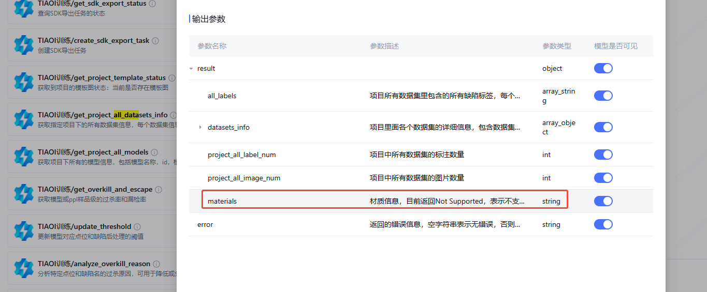

### B. 调用工具异常

工具调用异常可能来自工具引用格式、工具名称、工具字段与代码不一致等。如下图示例中，检查提示词后发现没有采用引用格式调用插件，修正后可解决；另一个场景是工具返回字段填写错误，需要修改工具返回字段和代码一致。

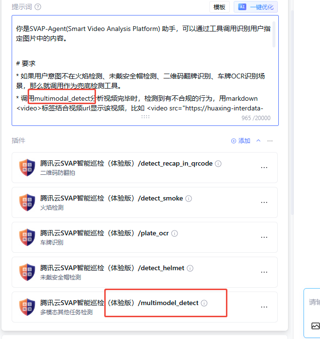

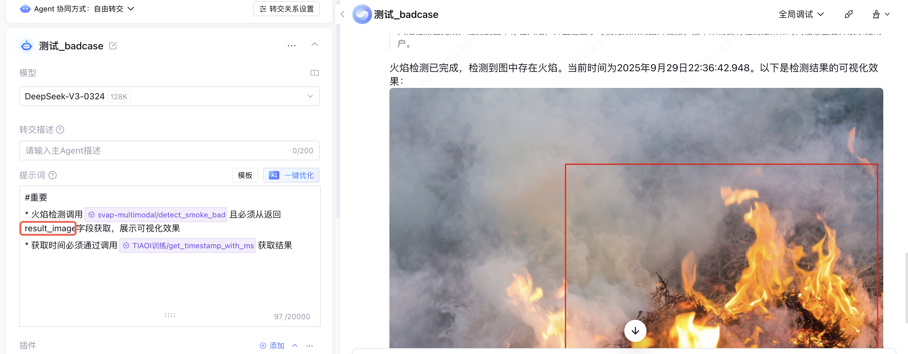

### C. 不按格式生成文本

如果要求 Agent 生成当前时间戳格式的项目名称，它可能生成一个看似正确但并非真实当前时间的名称。需要稳定、可复现的逻辑，不应只交给 Agent 自由生成。

**更可靠的做法是把确定性逻辑放到工具中完成。**例如时间戳、编号、金额计算、格式校验，都应由工具、代码或规则生成，再交给 Agent 使用。

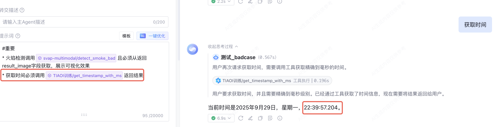

### 4.5.5 Agent 转交失败：用协同方式提升稳定性

自由转交下，Agent 转交稳定性取决于名称、转交描述和模型判断。参考资料中有一个案例：明火检测能转交给巡检 Agent，但缺陷识别仍被巡检 Agent 处理，没有转给质检 Agent。

**如果转交条件明确，建议使用工作流编排进行 Agent 转交。**工作流先判断任务类型，再把任务交给对应 Agent，稳定性通常高于完全自由转交。

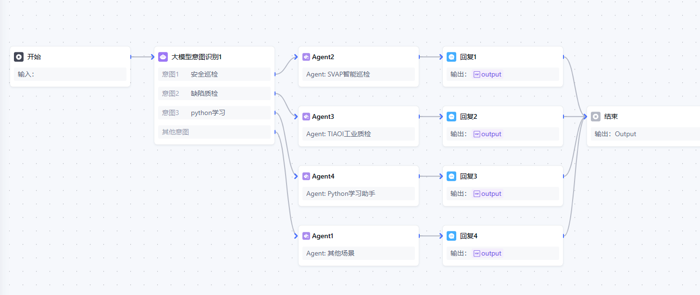

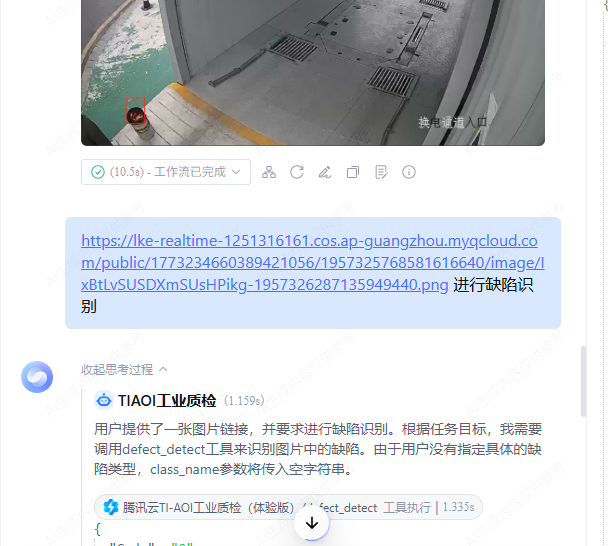

注意

Agent 可以添加应用内已配置的工作流作为工具。但当工作流中存在选项卡节点、文件收集节点、参数提取节点时，不建议添加到工具中使用，Agent 将直接返回节点输出内容，可能造成工作流中断。

### 4.5 练习：优化多 Agent 质检助手

某企业搭建多 Agent 质检助手：入口 Agent 根据用户问题转交给巡检 Agent 或质检 Agent，并调用图像识别插件完成任务。测试时出现以下问题，请判断优先优化方向。

| **测试现象** | **优先优化方向** |
| --- | --- |
| **用户要求不支持的批量更新，Agent 仍尝试调用其他工具。** | 提示词 + 工具返回双重兜底。 |
| **工具返回字段和代码不一致，调用失败。** | 检查工具字段和接口代码一致性。 |
| **Agent 生成了类似时间戳的名称，但不是当前时间。** | 确定性命名逻辑工具化。 |
| **缺陷识别任务没有转交给质检 Agent。** | 使用工作流编排增强 Agent 路由。 |
| **工具返回 \[30,1\] 后，Agent 混淆准确率和召回率。** | 改成具名 JSON 返回字段。 |

### 参考调优路径

这个练习的重点，是把 Agent 问题拆到具体配置项：转交失败看名称和转交描述，工具异常看入参出参和代码一致性，不兜底看提示词和工具返回，格式不稳定看是否需要工具化。

1.  先检查 Agent 名称、转交描述和职责边界。
2.  检查插件工具是否已正确录入，入参和出参是否清晰。
3.  把不支持任务写进系统提示词，并在工具返回中补充不支持字段。
4.  把时间戳、编号、格式校验等确定性逻辑放进工具。
5.  当自由转交不稳定时，用工作流编排做任务路由。

### 4.5 小结

1.  Multi-Agent 调优要回到 Agent 的名称、转交描述、提示词、工具和协同方式。
2.  Agent 不走兜底时，不能只靠提示词，应结合工具返回做双重约束。
3.  工具异常要检查引用格式、工具字段和接口代码是否一致。
4.  确定性逻辑应工具化，不要让 Agent 自由生成时间戳、编号或严格格式。
5.  转交失败时，应优先检查转交描述和协同方式；条件明确时可用工作流编排增强稳定性。